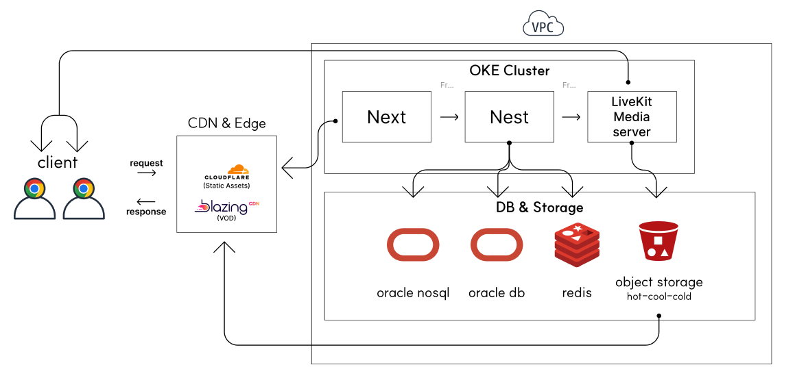
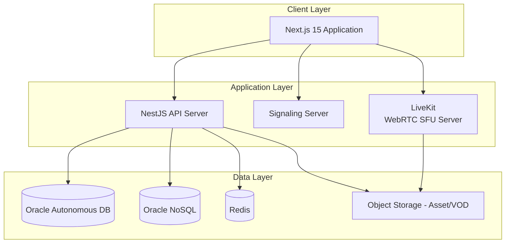
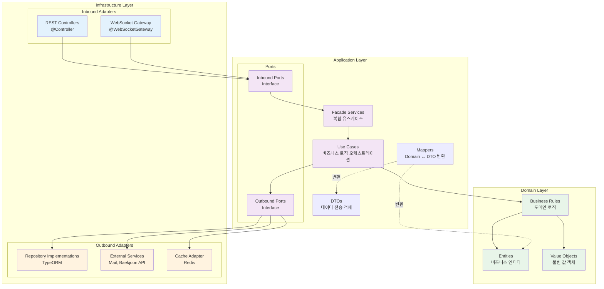
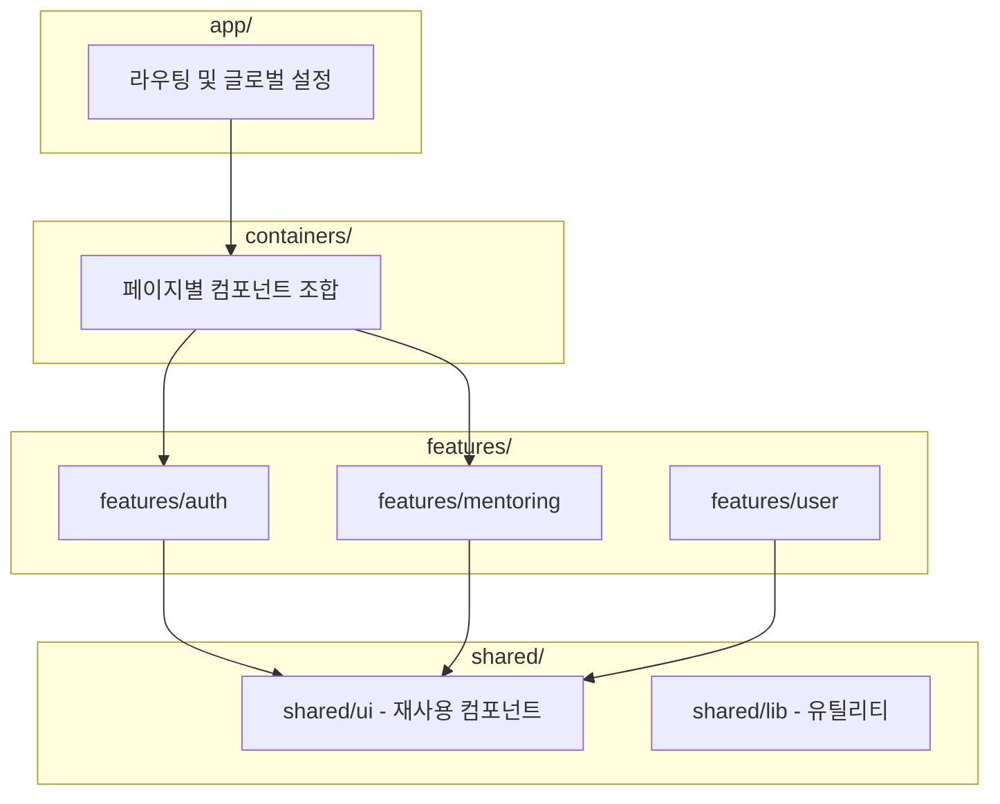
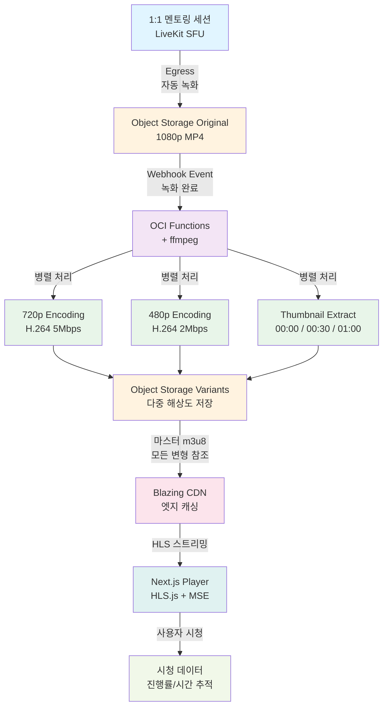

# CotePT

실시간 코드 협업 기반의 1:1 멘토링 플랫폼



## 프로젝트 개요

CotePT는 멘토와 멘티가 실시간으로 코드를 공유하며 함께 문제를 해결하는 멘토링 플랫폼입니다. WebRTC 기반 음성 통화와 동기화된 코드 에디터를 통해 효과적인 원격 1:1 멘토링 경험을 제공하며, 모든 세션은 자동 녹화되어 VOD로 제공됩니다.

---

## 프로젝트 상태

| 기능                  | 상태         | 진행률                 |
| --------------------- | ------------ | ---------------------- |
| 사용자 인증           | ✅ 완료      | 100%                   |
| 회원가입/온보딩       | ✅ 완료      | 100%                   |
| 멘토 자격 검증        | ✅ 완료      | 100%                   |
| 실시간 멘토링 세션    | 📋 진행 중   | 30%                    |
| VOD 미디어 파이프라인 | 📋 설계 완료 | 0% (관련 지식 학습 중) |
| 결제 및 구독 시스템   | 🔄 기획획 중 | 0%                     |

---

## 핵심 기능

### WebRTC 기반 실시간 멘토링

- LiveKit SFU로 저지연 음성 통신 (50ms 이하)
- Y.js 기반 실시간 협업 코드 에디터
- WebSocket으로 실시간 채팅 동기화

### 자동 미디어 처리 파이프라인

- LiveKit Egress로 세션 자동 녹화
- ffmpeg 병렬 트랜스코딩 (1080p → 720p/480p)
- CDN을 통한 글로벌 스트리밍

### 적응형 스트리밍

- HLS.js 클라이언트 적응형 비트레이트
- 네트워크 변화에 자동 화질 조절
- 모바일 환경 최적화

### 백준 티어 연동 및 분석

- 사용자의 백준 티어 및 문제 정보 수집하여 reChart 차트로 분석

---

## 아키텍처 개요

### 전체 시스템 아키텍처



### 모노레포 구조 (Turborepo)

본 프로젝트는 Turborepo를 활용한 모노레포 아키텍처로 구성되어 있습니다.

```
cotept/
├── apps/
│   ├── api/              # 백엔드 API (NestJS + 헥사고날 아키텍처)
│   └── web/              # 프론트엔드 애플리케이션 (Next.js 15 + FSD)
├── packages/
│   ├── api-client/       # 자동 생성 OpenAPI 클라이언트
│   ├── shared/           # 공유 UI 컴포넌트 및 유틸리티
│   ├── typescript-config/# 공유 TypeScript 설정
│   └── eslint-config/    # 공유 ESLint 설정
└── docs/                 # 프로젝트 문서
```

### 백엔드: 헥사고날 아키텍처



**의존성 방향**: Infrastructure → Application → Domain (단방향)

### 프론트엔드: 간소화한 FSD



**의존성 방향**: packages → shared → features → container → apps (단방향)

---

### VOD 미디어 파이프라인



---

## 주요 기술 스택

### 백엔드

| 분류             | 기술 스택             |
| ---------------- | --------------------- |
| **프레임워크**   | NestJS, TypeORM       |
| **인증/보안**    | JWT, Passport, bcrypt |
| **실시간 통신**  | Socket.IO, LiveKit    |
| **문서화**       | Swagger (OpenAPI)     |
| **클라우드 SDK** | OCI SDK               |

### 프론트엔드

| 분류           | 기술 스택                    |
| -------------- | ---------------------------- |
| **프레임워크** | Next.js 15, React 19         |
| **언어**       | TypeScript                   |
| **상태 관리**  | TanStack Query (React Query) |
| **폼/검증**    | React Hook Form, Zod         |
| **스타일링**   | Tailwind CSS, shadcn/ui      |
| **API 통신**   | Axios (자동 생성 클라이언트) |
| **인증**       | NextAuth.js                  |
| **문서화**     | Storybook                    |

### 데이터베이스 및 캐시

| 분류         | 기술 스택                  |
| ------------ | -------------------------- |
| **RDBMS**    | Oracle Autonomous Database |
| **NoSQL**    | Oracle NoSQL Database      |
| **캐시**     | Redis                      |
| **스토리지** | OCI Object Storage         |

### 인프라 및 DevOps

| 분류            | 기술 스택                         |
| --------------- | --------------------------------- |
| **클라우드**    | Oracle Cloud Infrastructure (OCI) |
| **모노레포**    | Turborepo                         |
| **패키지 관리** | pnpm                              |
| **컨테이너**    | Docker, Docker Compose            |
| **코드 품질**   | ESLint, Prettier                  |
| **CI/CD**       | GitHub Actions, oci devops        |

### 미디어 처리

| 분류           | 기술 스택                      |
| -------------- | ------------------------------ |
| **WebRTC SFU** | LiveKit                        |
| **트랜스코딩** | ffmpeg, OCI Functions          |
| **스트리밍**   | HLS.js, MediaSource Extensions |
| **CDN**        | BlazingCDN, Cloudflare         |

---

## 시작하기

### 사전 요구사항

- Node.js >= 18
- pnpm 8.15.6
- Docker 및 Docker Compose

### 설치

```bash
# 저장소 클론
git clone <repository-url>
cd cotept

# 의존성 설치
pnpm install

# 인프라 서비스 시작 (Oracle DB, Redis, NoSQL)
pnpm infra:up
# ARM64 Mac의 경우: pnpm infra:up:arm64

# 데이터베이스 마이그레이션 실행
cd apps/api && pnpm migration:run
```

### 로컬 실행

```bash
# 모든 애플리케이션을 개발 모드로 시작
pnpm dev

# 또는 개별적으로 시작
pnpm dev:api    # 백엔드 API - http://localhost:3001
pnpm dev:web    # 프론트엔드 - http://localhost:3000
```

### 테스트 실행

```bash
# 모든 테스트 실행
pnpm test

# 특정 패키지 테스트
pnpm test --filter=@repo/api
pnpm test --filter=@repo/web

# 커버리지 포함 테스트
pnpm test:cov

# E2E 테스트
cd apps/api && pnpm test:e2e
```

### API 문서

API 서버 실행 후 다음 주소에서 확인할 수 있습니다:

- Swagger UI: http://localhost:3001/api-docs

---

## 개발 워크플로우

### 백엔드 개발 (Endpoint-First Development)

```bash
# 1. 새 모듈 생성
cd apps/api
pnpm create:module <module-name>

# 2. 개발 순서
# - API 스펙 정의 (OpenAPI)
# - 테스트 작성 (TDD)
# - Domain Layer 구현
# - Application Layer 구현 (UseCase, Ports)
# - Infrastructure Layer 구현 (Controllers, Repositories)

# 3. 테스트 실행
pnpm test:module <module-name>

# 4. API 클라이언트 생성
cd ../.. && pnpm gen:api
```

상세 가이드: [백엔드 엔드포인트 개발 워크플로우](context/BACKEND_ENDPOINT_WORKFLOW.md)

### 프론트엔드 개발 (FSD 기반)

```bash
# 1. Zod 스키마 정의
# features/<domain>/schemas/<name>.schema.ts

# 2. API 호출 함수 작성
# features/<domain>/api/mutations.ts 또는 queries.ts

# 3. 커스텀 훅 작성
# features/<domain>/hooks/use<Name>.ts

# 4. 컨테이너 구현 (필요시)
# containers/<domain>/<Name>Container.tsx

# 5. 페이지 라우팅
# app/<route>/page.tsx
```

상세 가이드: [프론트엔드 개발 가이드](apps/web/README.md)

### 데이터베이스 마이그레이션

```bash
# 엔티티 변경 후 마이그레이션 생성
cd apps/api
pnpm migration:generate

# 마이그레이션 적용
pnpm migration:run

# 마이그레이션 되돌리기
pnpm migration:revert
```

---

## 개발 명령어

### 루트 레벨

```bash
# 개발 서버 시작
pnpm dev                    # 모든 앱 시작
pnpm dev:api               # API만 시작
pnpm dev:web               # 웹만 시작

# 빌드
pnpm build                 # 모든 앱 빌드
pnpm build:api             # API만 빌드
pnpm build:web             # 웹만 빌드

# 품질 검사
pnpm lint                  # 모든 패키지 린트
pnpm test                  # 모든 테스트 실행

# 인프라
pnpm infra:up              # Docker 서비스 시작
pnpm infra:down            # Docker 서비스 중지
pnpm infra:up:arm64        # ARM64용 (M1/M2 Mac)

# API 클라이언트 생성
pnpm gen:api               # OpenAPI 스펙 내보내기 및 클라이언트 생성
```

### API 개발 (apps/api/)

```bash
# 개발
pnpm dev                   # watch 모드로 시작

# 데이터베이스
pnpm migration:generate    # 마이그레이션 생성
pnpm migration:run         # 마이그레이션 적용
pnpm migration:revert      # 마이그레이션 되돌리기

# 테스트
pnpm test                  # 단위 테스트
pnpm test:watch            # watch 모드
pnpm test:cov              # 커버리지 포함
pnpm test:e2e              # E2E 테스트
pnpm test:module <name>    # 특정 모듈 테스트

# 모듈 생성
pnpm create:module <name>  # 헥사고날 모듈 자동 생성
```

### 웹 개발 (apps/web/)

```bash
pnpm dev                   # Next.js 개발 서버
pnpm build                 # 프로덕션 빌드
pnpm start                 # 프로덕션 서버 시작
pnpm lint                  # ESLint 실행
pnpm storybook             # Storybook 시작
```

---

## 프로젝트 구조

```
cotept/
├── apps/
│   ├── api/                              # 백엔드 NestJS 애플리케이션
│   │   ├── src/
│   │   │   ├── modules/                  # 기능 모듈 (헥사고날 아키텍처)
│   │   │   │   ├── user/
│   │   │   │   │   ├── domain/           # 도메인 레이어
│   │   │   │   │   │   ├── model/        # 엔티티
│   │   │   │   │   │   └── vo/           # 값 객체
│   │   │   │   │   ├── application/      # 애플리케이션 레이어
│   │   │   │   │   │   ├── dtos/         # 데이터 전송 객체
│   │   │   │   │   │   ├── ports/        # 포트 인터페이스
│   │   │   │   │   │   ├── services/     # 유스케이스 및 파사드
│   │   │   │   │   │   └── mappers/      # 도메인-DTO 매퍼
│   │   │   │   │   └── infrastructure/   # 인프라 레이어
│   │   │   │   │       └── adapter/
│   │   │   │   │           ├── in/       # 인바운드 어댑터 (컨트롤러)
│   │   │   │   │           └── out/      # 아웃바운드 어댑터 (리포지토리)
│   │   │   │   ├── auth/                 # 인증 모듈
│   │   │   │   ├── baekjoon/             # 백준 연동 모듈
│   │   │   │   └── mail/                 # 메일 모듈
│   │   │   ├── shared/                   # 공유 유틸리티 및 베이스 클래스
│   │   │   │   ├── domain/
│   │   │   │   ├── application/
│   │   │   │   └── infrastructure/
│   │   │   └── main.ts
│   │   ├── test/                         # E2E 테스트
│   │   └── migrations/                   # 데이터베이스 마이그레이션
│   │
│   └── web/                              # 프론트엔드 Next.js 애플리케이션
│       ├── src/
│       │   ├── app/                      # App Router (라우팅)
│       │   │   ├── (auth)/               # 인증 그룹
│       │   │   │   ├── login/
│       │   │   │   └── signup/
│       │   │   └── (main)/               # 메인 그룹
│       │   ├── containers/               # 페이지별 컴포넌트 조합
│       │   │   ├── auth/
│       │   │   └── mentoring/
│       │   ├── features/                 # 도메인별 비즈니스 로직
│       │   │   ├── auth/
│       │   │   │   ├── api/              # API 호출
│       │   │   │   ├── hooks/            # 커스텀 훅
│       │   │   │   ├── schemas/          # Zod 스키마
│       │   │   │   └── types/            # TypeScript 타입
│       │   │   ├── mentoring/
│       │   │   └── user/
│       │   └── shared/                   # 공유 UI 컴포넌트
│       │       ├── ui/                   # 재사용 가능한 UI 컴포넌트
│       │       ├── lib/                  # 유틸리티 함수
│       │       └── hooks/                # 공통 커스텀 훅
│       └── public/                       # 정적 자산
│
├── packages/
│   ├── api-client/                       # 자동 생성 OpenAPI 클라이언트
│   ├── shared/                           # 공유 UI 라이브러리
│   ├── typescript-config/                # 공유 TypeScript 설정
│   └── eslint-config/                    # 공유 ESLint 설정
│
├── docs/                                 # 프로젝트 문서
│   ├── architecture/                     # 아키텍처 문서
│   ├── development/                      # 개발 가이드
│   ├── auth/                             # 인증 관련 문서
│   ├── ui/                               # UI/UX 가이드
│   └── media/                            # 미디어 처리 문서
│
├── scripts/                              # 유틸리티 스크립트
│   └── create-module.sh                  # 헥사고날 모듈 생성 스크립트
│
├── turbo.json                            # Turborepo 설정
├── pnpm-workspace.yaml                   # pnpm 워크스페이스 정의
└── docker-compose.yml                    # 로컬 인프라 서비스
```
