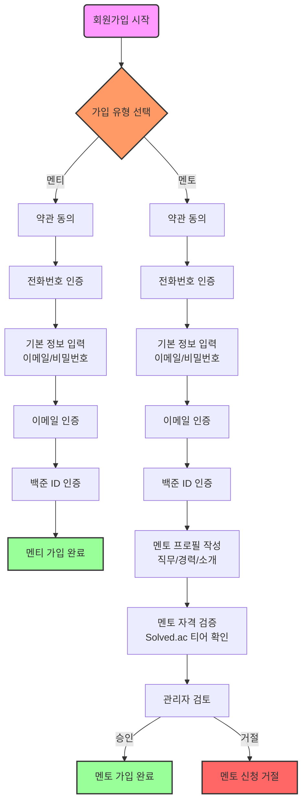
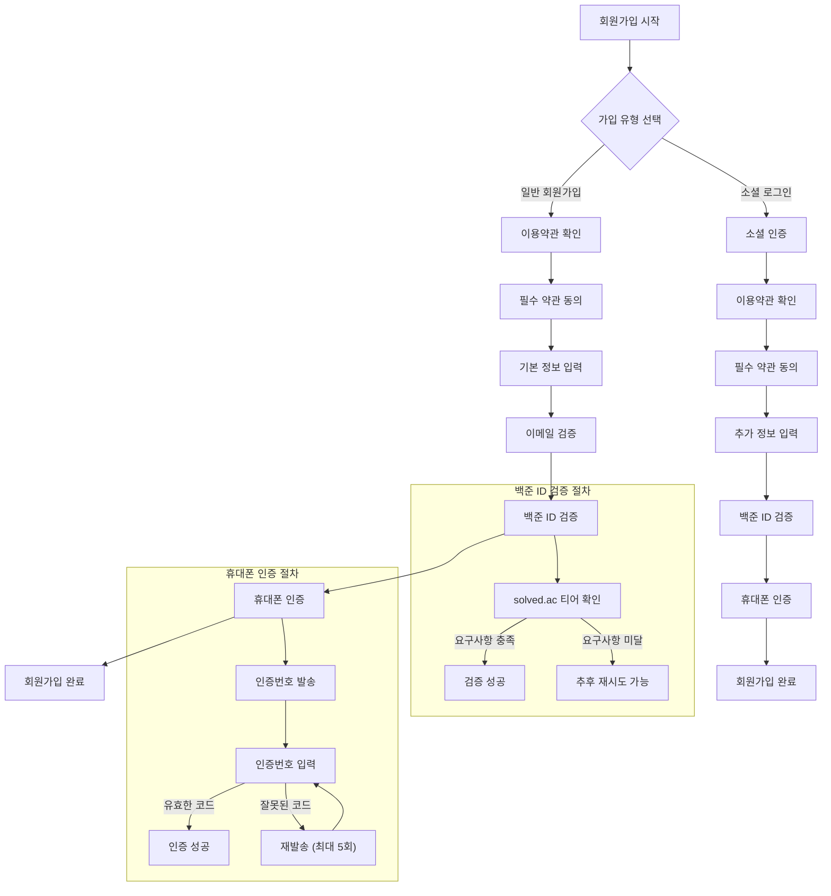

# 회원가입 프로세스 설계 문서

## 개요

우리의 인증 시스템은 일반 회원가입과 소셜 로그인이라는 두 가지 경로를 통해 멘토와 멘티의 회원가입을 처리합니다. 이 프로세스는 강력한 보안 조치, 법적 요구사항 준수, 그리고 사용자 검증 단계를 포함합니다.

## 회원가입 프로세스

회원가입 프로세스 다이어그램

회원가입 프로세스 다이어그램 (구)

## 회원가입 상태 관리

회원가입은 다음과 같은 상태로 진행됩니다:

1. INITIATED: 회원가입 요청 접수
2. TERMS_AGREED: 필수 약관 동의 완료
3. INFO_SUBMITTED: 기본 정보 입력 및 검증 완료
4. PHONE_VERIFIED: 휴대폰 인증 완료
5. COMPLETED: 회원가입 절차 완료

## 약관 관리 시스템

우리 시스템은 약관 동의에 대한 포괄적인 기록을 관리합니다:

1. 버전 관리

   - 각 약관 버전은 고유하게 식별됩니다
   - 감사를 위해 이전 버전들이 보존됩니다
   - 목적에 따라 여러 버전이 동시에 활성화될 수 있습니다

2. 약관 유형

   - 서비스 이용약관 (필수)
   - 개인정보 처리방침 (필수)
   - 마케팅 정보 수신 동의 (선택)
   - 멘토 서비스 약관 (멘토 전용 필수)

3. 동의 기록
   - 동의 시점
   - 사용자 IP 주소
   - 디바이스 정보
   - 동의한 약관 버전

## 보안 조치

회원가입 프로세스는 다음과 같은 다중 보안 계층을 포함합니다:

1. 요청 제한

   - 휴대폰 인증 최대 5회 시도
   - 실패 후 24시간 대기 기간
   - IP 기반 요청 제한

2. 검증 요구사항

   - 유효한 이메일 주소
   - 휴대폰 번호 인증
   - 백준 ID 검증 (멘토의 경우 최소 티어 요구사항)

3. 데이터 보호
   - 민감 정보 안전 저장
   - 개인정보 암호화
   - 모든 검증 시도에 대한 감사 추적

이 문서의 특정 부분에 대해 더 자세한 설명이 필요하신가요?
