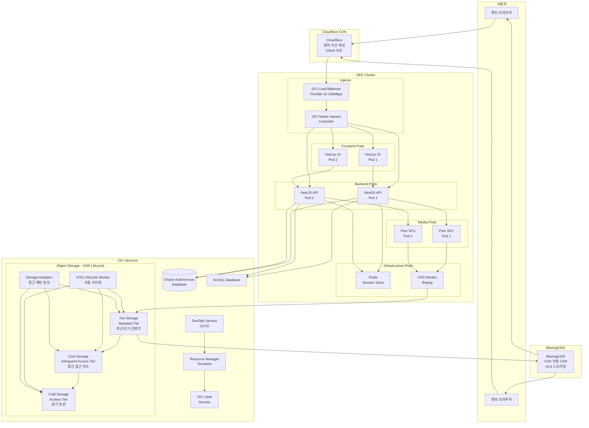

# 코테피티 프로덕션 아키텍처 설계

## 🏗️ 전체 시스템 아키텍처



---

## 🚀 OKE 클러스터 구성

### 1. Ingress Controller 선택: OCI Native Ingress

**왜 OCI Native Ingress?**

- OCI Load Balancer와 네이티브 통합
- Virtual Nodes 지원 (서버리스)
- 별도 설치 불필요 (Addon으로 제공)
- Flexible LB Shape 자동 설정

**대안: Nginx Ingress**

- 더 많은 커스터마이징 옵션
- 하지만 Pod 리소스 소비

### 2. Load Balancer 전략

```yaml
# OCI Native Ingress Configuration
apiVersion: networking.k8s.io/v1
kind: IngressClass
metadata:
  name: oci-native-ingress
  annotations:
    ingressclass.kubernetes.io/is-default-class: "true"
spec:
  controller: oci.oraclecloud.com/native-ingress-controller

---
apiVersion: networking.k8s.io/v1
kind: IngressClassParameters
metadata:
  name: native-ingress-params
spec:
  compartmentId: ocid1.compartment.oc1...
  subnetId: ocid1.subnet.oc1...
  loadBalancerName: cotept-lb
  isPrivate: false
  # Flexible Shape: 10-100Mbps 자동 조정
  minBandwidthMbps: 10
  maxBandwidthMbps: 100

---
apiVersion: networking.k8s.io/v1
kind: Ingress
metadata:
  name: cotept-ingress
  annotations:
    # HTTPS 리다이렉트
    kubernetes.io/ingress.class: "oci-native-ingress"
spec:
  ingressClassName: oci-native-ingress
  tls:
    - hosts:
        - cotept.com
        - api.cotept.com
      secretName: cotept-tls
  rules:
    # Frontend
    - host: cotept.com
      http:
        paths:
          - path: /
            pathType: Prefix
            backend:
              service:
                name: frontend-service
                port:
                  number: 3000

    # Backend API
    - host: api.cotept.com
      http:
        paths:
          - path: /api
            pathType: Prefix
            backend:
              service:
                name: backend-service
                port:
                  number: 3000

          # WebSocket (시그널링)
          - path: /ws
            pathType: Prefix
            backend:
              service:
                name: backend-service
                port:
                  number: 3000

    # WebRTC SFU
    - host: sfu.cotept.com
      http:
        paths:
          - path: /
            pathType: Prefix
            backend:
              service:
                name: pion-sfu-service
                port:
                  number: 8080
```

---

## 🎨 Frontend (Next.js 15) 배포

### Dockerfile

```dockerfile
# apps/web/Dockerfile
FROM node:20-alpine AS deps
RUN apk add --no-cache libc6-compat
WORKDIR /app

COPY package.json pnpm-lock.yaml ./
RUN npm install -g pnpm && pnpm install --frozen-lockfile

FROM node:20-alpine AS builder
WORKDIR /app
COPY --from=deps /app/node_modules ./node_modules
COPY . .

ENV NEXT_TELEMETRY_DISABLED 1

RUN npm install -g pnpm && pnpm build

FROM node:20-alpine AS runner
WORKDIR /app

ENV NODE_ENV production
ENV NEXT_TELEMETRY_DISABLED 1

RUN addgroup --system --gid 1001 nodejs
RUN adduser --system --uid 1001 nextjs

COPY --from=builder /app/public ./public
COPY --from=builder --chown=nextjs:nodejs /app/.next/standalone ./
COPY --from=builder --chown=nextjs:nodejs /app/.next/static ./.next/static

USER nextjs

EXPOSE 3000

ENV PORT 3000
ENV HOSTNAME "0.0.0.0"

CMD ["node", "server.js"]
```

### Kubernetes Deployment

```yaml
apiVersion: apps/v1
kind: Deployment
metadata:
  name: frontend
  namespace: cotept
spec:
  replicas: 2
  selector:
    matchLabels:
      app: frontend
  template:
    metadata:
      labels:
        app: frontend
    spec:
      containers:
        - name: nextjs
          image: ocir.ap-seoul-1.oci.oraclecloud.com/cotept/frontend:latest
          ports:
            - containerPort: 3000
          env:
            - name: NEXT_PUBLIC_API_URL
              value: "https://api.cotept.com"
            - name: NEXT_PUBLIC_WS_URL
              value: "wss://api.cotept.com/ws"
            - name: NEXT_PUBLIC_SFU_URL
              value: "https://sfu.cotept.com"
            - name: NEXT_PUBLIC_CDN_URL
              value: "https://vod.blazingcdn.com/cotept"
          resources:
            requests:
              memory: "256Mi"
              cpu: "250m"
            limits:
              memory: "512Mi"
              cpu: "500m"
          livenessProbe:
            httpGet:
              path: /api/health
              port: 3000
            initialDelaySeconds: 30
            periodSeconds: 10
          readinessProbe:
            httpGet:
              path: /api/health
              port: 3000
            initialDelaySeconds: 5
            periodSeconds: 5

---
apiVersion: v1
kind: Service
metadata:
  name: frontend-service
  namespace: cotept
spec:
  selector:
    app: frontend
  ports:
    - port: 3000
      targetPort: 3000
  type: ClusterIP
```

---

## 🔧 Backend Services 배포

### Backend Deployment

```yaml
apiVersion: apps/v1
kind: Deployment
metadata:
  name: backend
  namespace: cotept
spec:
  replicas: 2
  selector:
    matchLabels:
      app: backend
  template:
    metadata:
      labels:
        app: backend
    spec:
      containers:
        - name: nestjs
          image: ocir.ap-seoul-1.oci.oraclecloud.com/cotept/backend:latest
          ports:
            - containerPort: 3000
              name: http
          envFrom:
            - secretRef:
                name: backend-secrets
          env:
            - name: REDIS_HOST
              value: "redis-service"
            - name: REDIS_PORT
              value: "6379"
          resources:
            requests:
              memory: "512Mi"
              cpu: "500m"
            limits:
              memory: "1Gi"
              cpu: "1000m"

---
apiVersion: apps/v1
kind: Deployment
metadata:
  name: pion-sfu
  namespace: cotept
spec:
  replicas: 2
  selector:
    matchLabels:
      app: pion-sfu
  template:
    metadata:
      labels:
        app: pion-sfu
    spec:
      containers:
        - name: pion
          image: ocir.ap-seoul-1.oci.oraclecloud.com/cotept/pion-sfu:latest
          ports:
            - containerPort: 8080
              name: http
            - containerPort: 50000
              protocol: UDP
              name: webrtc-start
            - containerPort: 50200
              protocol: UDP
              name: webrtc-end

---
apiVersion: apps/v1
kind: StatefulSet
metadata:
  name: redis
  namespace: cotept
spec:
  serviceName: redis-service
  replicas: 1
  selector:
    matchLabels:
      app: redis
  template:
    metadata:
      labels:
        app: redis
    spec:
      containers:
        - name: redis
          image: redis:7-alpine
          ports:
            - containerPort: 6379
          volumeMounts:
            - name: redis-data
              mountPath: /data
          resources:
            requests:
              memory: "2Gi"
              cpu: "500m"
            limits:
              memory: "4Gi"
              cpu: "1000m"
  volumeClaimTemplates:
    - metadata:
        name: redis-data
      spec:
        accessModes: ["ReadWriteOnce"]
        resources:
          requests:
            storage: 10Gi
```

---

## 🌐 CDN 구성

### Cloudflare (정적 자산)

```yaml
Cloudflare 설정:
  DNS:
    - cotept.com → OKE LB IP
    - api.cotept.com → OKE LB IP
    - sfu.cotept.com → OKE LB IP

  캐싱 규칙:
    - /_next/static/* → 캐시 1년
    - /images/* → 캐시 1개월
    - /fonts/* → 캐시 1년
    - API 경로 → 캐시 안 함

  보안:
    - SSL/TLS Full (Strict)
    - DDoS Protection
    - WAF Rules
    - Bot Fight Mode
```

### BlazingCDN (VOD)

```yaml
BlazingCDN 설정:
  Origin:
    - OCI Object Storage
    - https://objectstorage.ap-seoul-1.oraclecloud.com/n/namespace/b/cotept-vod

  도메인:
    - vod.blazingcdn.com/cotept

  캐싱:
    - *.m3u8 → 캐시 1시간
    - *.ts → 캐시 1주일
    - 304 Not Modified 활용

  최적화:
    - HLS 세그먼트 프리페칭
    - Adaptive Bitrate 지원
    - 글로벌 PoP 활용
```

---

## 📹 VOD 파일 라이프사이클 관리

### OCI Object Storage 3-Tier 아키텍처

OCI Object Storage는 VOD 파일의 접근 패턴에 따라 자동으로 비용을 최적화하는 3계층 스토리지 시스템을 제공합니다.

#### 1. Storage Tier 분류

```yaml
Hot Storage (Standard Tier):
  용도: 최근 업로드된 세션 (30일 이내)
  접근 빈도: 높음 (일 1회 이상)
  비용: $0.0255/GB/월
  응답 시간: 즉시 액세스
  복제: Multi-AD (99.999% 내구성)

  예시 콘텐츠:
    - 신규 멘토링 세션 VOD
    - 인기 세션 재시청
    - 최근 1개월 내 세션

Cool Storage (Infrequent Access Tier):
  용도: 중간 접근 빈도 콘텐츠 (30일~1년)
  접근 빈도: 월 1-3회
  비용: $0.01/GB/월 (60% 절약)
  응답 시간: 1-2초 지연
  복제: Multi-AD

  예시 콘텐츠:
    - 1-12개월 전 세션
    - 특정 주제별 복습용 콘텐츠
    - 멘토별 과거 세션

Cold Storage (Archive Tier):
  용도: 장기 보관용 콘텐츠 (1년 이상)
  접근 빈도: 연 1-2회 또는 미만
  비용: $0.0025/GB/월 (90% 절약)
  응답 시간: 4-12시간 복원 시간
  복제: Multi-AD

  예시 콘텐츠:
    - 1년 이상 된 세션 아카이브
    - 법적 보관 요구사항 대응
    - 데이터 분석용 히스토리컬 데이터
```

#### 2. 자동 티어링 정책

```yaml
# OCI Object Storage Lifecycle Policy
lifecycle_policy:
  name: "cotept-vod-lifecycle"

  rules:
    # 30일 후 Cool Storage로 이동
    - name: "move-to-cool"
      is_enabled: true
      object_name_filter:
        inclusion_prefixes: ["vod/sessions/"]
      actions:
        - type: "TRANSITION"
          target: "InfrequentAccess"
      time_amount: 30
      time_unit: "DAYS"

    # 365일 후 Archive로 이동
    - name: "move-to-archive"
      is_enabled: true
      object_name_filter:
        inclusion_prefixes: ["vod/sessions/"]
      actions:
        - type: "TRANSITION"
          target: "Archive"
      time_amount: 365
      time_unit: "DAYS"

    # 7년 후 완전 삭제 (GDPR 준수)
    - name: "delete-old-content"
      is_enabled: true
      object_name_filter:
        inclusion_prefixes: ["vod/sessions/"]
      actions:
        - type: "DELETE"
      time_amount: 2555  # 7 years
      time_unit: "DAYS"
```

#### 3. 스마트 접근 패턴 분석

```yaml
Storage Analytics 기능:
  실시간 모니터링:
    - 파일별 접근 빈도 추적
    - 사용자 시청 패턴 분석
    - CDN 캐시 히트율 모니터링

  예측 알고리즘:
    - 멘토별 인기도 예측
    - 계절성 콘텐츠 식별
    - 재시청 확률 계산

  동적 최적화:
    - 인기 상승 콘텐츠 → Hot Storage 유지
    - 예상 접근량 기반 사전 티어링
    - 비용 대비 성능 최적화
```

### VOD Lifecycle Worker 구성

```yaml
apiVersion: batch/v1
kind: CronJob
metadata:
  name: vod-lifecycle-manager
  namespace: cotept
spec:
  schedule: "0 2 * * *"  # 매일 새벽 2시 실행
  jobTemplate:
    spec:
      template:
        spec:
          containers:
          - name: lifecycle-worker
            image: ocir.ap-seoul-1.oci.oraclecloud.com/cotept/vod-lifecycle:latest
            env:
            - name: OCI_NAMESPACE
              value: "cotept-namespace"
            - name: VOD_BUCKET
              value: "cotept-vod"
            - name: ANALYTICS_API
              value: "https://api.cotept.com/analytics"
            command:
            - /bin/sh
            - -c
            - |
              # 1. 접근 패턴 분석
              python3 /app/analyze_access_patterns.py

              # 2. 스마트 티어링 추천
              python3 /app/smart_tiering.py

              # 3. 비용 최적화 리포트
              python3 /app/cost_optimization.py

              # 4. 이상 파일 정리
              python3 /app/cleanup_orphaned.py

            resources:
              requests:
                memory: "256Mi"
                cpu: "250m"
              limits:
                memory: "512Mi"
                cpu: "500m"

          restartPolicy: OnFailure

---
# 실시간 모니터링을 위한 Deployment
apiVersion: apps/v1
kind: Deployment
metadata:
  name: storage-analytics
  namespace: cotept
spec:
  replicas: 1
  selector:
    matchLabels:
      app: storage-analytics
  template:
    metadata:
      labels:
        app: storage-analytics
    spec:
      containers:
      - name: analytics
        image: ocir.ap-seoul-1.oci.oraclecloud.com/cotept/storage-analytics:latest
        ports:
        - containerPort: 8080
        env:
        - name: REDIS_HOST
          value: "redis-service"
        - name: METRICS_INTERVAL
          value: "300"  # 5분마다 수집

        resources:
          requests:
            memory: "512Mi"
            cpu: "250m"
          limits:
            memory: "1Gi"
            cpu: "500m"
```

### 비용 최적화 효과

```yaml
월간 비용 시뮬레이션 (1TB VOD 데이터 기준):

기존 (Single Tier):
  - Standard Storage: 1024GB × $0.0255 = $26.11/월

최적화 후 (3-Tier):
  - Hot (100GB, 30일 이내): 100GB × $0.0255 = $2.55
  - Cool (400GB, 30일-1년): 400GB × $0.01 = $4.00
  - Archive (524GB, 1년 이상): 524GB × $0.0025 = $1.31
  - 총계: $7.86/월

절약 효과: $18.25/월 (70% 절약)

연간 예상 절약: $219/년
3년 누적 절약: $657
```

### 모니터링 및 알림

```yaml
CloudWatch 메트릭:
  스토리지 비용:
    - 일별/월별 스토리지 비용 추이
    - Tier별 데이터 분포
    - 예상 vs 실제 비용 비교

  성능 메트릭:
    - 평균 응답 시간 (Tier별)
    - CDN 캐시 미스율
    - 사용자 만족도 (로딩 시간 기준)

  운영 메트릭:
    - 자동 티어링 성공률
    - 수동 개입 필요 케이스
    - 데이터 복구 요청 빈도

알림 정책:
  비용 초과:
    - 월 예산 80% 도달 시 경고
    - 예상치 대비 120% 초과 시 긴급

  성능 저하:
    - CDN 응답 시간 3초 초과
    - Archive 복원 실패율 5% 이상

  데이터 이상:
    - 24시간 이상 접근되지 않은 Hot Storage 파일
    - 예기치 않은 대용량 파일 업로드
```

---

## 🔐 OCI DevOps + Vault 통합

### 1. OCI Vault (시크릿 관리)

```hcl
# vault.tf
resource "oci_kms_vault" "cotept" {
  compartment_id = var.compartment_id
  display_name   = "cotept-vault"
  vault_type     = "DEFAULT"
}

resource "oci_vault_secret" "database_password" {
  compartment_id = var.compartment_id
  vault_id       = oci_kms_vault.cotept.id
  secret_name    = "database-password"

  secret_content {
    content_type = "BASE64"
    content      = base64encode(var.db_password)
  }
}

resource "oci_vault_secret" "jwt_secret" {
  compartment_id = var.compartment_id
  vault_id       = oci_kms_vault.cotept.id
  secret_name    = "jwt-secret"

  secret_content {
    content_type = "BASE64"
    content      = base64encode(random_password.jwt.result)
  }
}
```

### 2. OCI DevOps (CI/CD)

```yaml
# build_spec.yaml
version: 0.1
component: build
timeoutInSeconds: 1200

steps:
  - type: Command
    name: "Setup Environment"
    command: |
      export DOCKER_REGISTRY=ocir.ap-seoul-1.oci.oraclecloud.com
      export IMAGE_TAG=${OCI_BUILD_RUN_ID}

  - type: Command
    name: "Build Frontend"
    command: |
      cd apps/web
      docker build -t ${DOCKER_REGISTRY}/cotept/frontend:${IMAGE_TAG} .
      docker push ${DOCKER_REGISTRY}/cotept/frontend:${IMAGE_TAG}

  - type: Command
    name: "Build Backend"
    command: |
      cd apps/api
      docker build -t ${DOCKER_REGISTRY}/cotept/backend:${IMAGE_TAG} .
      docker push ${DOCKER_REGISTRY}/cotept/backend:${IMAGE_TAG}

  - type: Command
    name: "Build Pion SFU"
    command: |
      cd apps/pion-sfu
      docker build -t ${DOCKER_REGISTRY}/cotept/pion-sfu:${IMAGE_TAG} .
      docker push ${DOCKER_REGISTRY}/cotept/pion-sfu:${IMAGE_TAG}

outputArtifacts:
  - name: kubernetes-manifests
    type: BINARY
    location: k8s/

---
# deploy_spec.yaml
version: 0.1
component: deployment
timeoutInSeconds: 600

steps:
  - stepType: COMPUTE_INSTANCE_GROUP_ROLLING_DEPLOYMENT
    name: "Deploy to OKE"
    description: "Rolling update to Kubernetes cluster"
    command: |
      kubectl set image deployment/frontend \
        nextjs=${DOCKER_REGISTRY}/cotept/frontend:${IMAGE_TAG} \
        -n cotept

      kubectl set image deployment/backend \
        nestjs=${DOCKER_REGISTRY}/cotept/backend:${IMAGE_TAG} \
        -n cotept

      kubectl set image deployment/pion-sfu \
        pion=${DOCKER_REGISTRY}/cotept/pion-sfu:${IMAGE_TAG} \
        -n cotept

      kubectl rollout status deployment/frontend -n cotept
      kubectl rollout status deployment/backend -n cotept
      kubectl rollout status deployment/pion-sfu -n cotept
```

### 3. Resource Manager (Terraform)

```hcl
# main.tf
terraform {
  required_providers {
    oci = {
      source  = "oracle/oci"
      version = "~> 5.0"
    }
  }

  backend "http" {
    address = "https://objectstorage.ap-seoul-1.oraclecloud.com/n/namespace/b/terraform-state/o/cotept.tfstate"
  }
}

module "oke_cluster" {
  source = "./modules/oke"

  compartment_id      = var.compartment_id
  cluster_name        = "cotept-cluster"
  kubernetes_version  = "v1.28.2"

  node_pools = {
    frontend = {
      size         = 2
      shape        = "VM.Standard.A1.Flex"
      ocpus        = 1
      memory_in_gbs = 6
    }
    backend = {
      size         = 2
      shape        = "VM.Standard.A1.Flex"
      ocpus        = 2
      memory_in_gbs = 12
    }
  }
}

module "load_balancer" {
  source = "./modules/lb"

  compartment_id = var.compartment_id
  subnet_id      = module.oke_cluster.lb_subnet_id

  shape_details {
    minimum_bandwidth_in_mbps = 10
    maximum_bandwidth_in_mbps = 100
  }
}
```

---

## 💰 예상 비용 (월별)

### OKE 클러스터

- **Control Plane**: 무료
- **Worker Nodes** (ARM A1.Flex):
  - Frontend: 2 nodes × 1 OCPU × $0.01/hr = ~$14
  - Backend: 2 nodes × 2 OCPU × $0.02/hr = ~$29
  - 총: ~$43/월

### Load Balancer

- **Flexible Shape**: 10-100Mbps = $10-100/월
  - 평균 40Mbps 사용 시: ~$40/월

### Database & Storage

- **Autonomous DB**: Free Tier (20GB)
- **NoSQL**: Free Tier
- **Object Storage** (3-Tier Optimized):
  - Hot Storage: ~$3/월 (100GB)
  - Cool Storage: ~$4/월 (400GB)
  - Archive Storage: ~$1/월 (500GB)
  - 총: ~$8/월 (1TB, 70% 절약)

### CDN

- **Cloudflare**: $20/월 (Pro Plan)
- **BlazingCDN**: ~$50/월 (500GB 전송)

### 총 예상 비용: **~$161/월**

**💰 비용 절감 효과:**
- Object Storage 3-Tier 도입으로 월 $12 절약 (스토리지 비용 70% 감소)
- 연간 $144 절약, 3년 누적 $432 절약

---

## 📊 모니터링 & 관측성

### OCI Monitoring

```yaml
메트릭 수집:
  - OKE 클러스터 상태
  - Pod CPU/Memory 사용률
  - Load Balancer 처리량
  - 데이터베이스 연결 수

알림:
  - Slack 통합
  - 임계값 초과 시 자동 알림
  - 자동 스케일링 트리거
```

### Logging

```yaml
로그 집계:
  - OCI Logging Service
  - 애플리케이션 로그
  - 감사 로그
  - 보안 이벤트
```

# 코테피티 도메인 구성 및 DNS 설정

## 🌐 최종 추천 도메인 구조

### 프로덕션 도메인

```yaml
메인 서비스:
  - www.cotept.com # 사용자 대면 웹사이트 (Next.js)
  - cotept.com # Apex → www로 리다이렉트

백엔드 서비스:
  - api.cotept.com # REST API + WebSocket 시그널링

미디어 서비스:
  - sfu.cotept.com # WebRTC SFU (Pion)
  - vod.cotept.com # VOD CDN (BlazingCDN)

관리/내부 서비스:
  - admin.cotept.com # 관리자 대시보드
  - docs.cotept.com # API 문서 (선택)
  - status.cotept.com # 서비스 상태 페이지 (선택)
```

### 개발/테스트 환경

```yaml
개발:
  - dev.cotept.com # 개발 환경 프론트
  - api-dev.cotept.com # 개발 환경 백엔드
  - sfu-dev.cotept.com # 개발 환경 SFU

스테이징:
  - staging.cotept.com # 스테이징 프론트
  - api-staging.cotept.com # 스테이징 백엔드
  - sfu-staging.cotept.com # 스테이징 SFU
```

---

## 📝 DNS 레코드 구성

### Cloudflare DNS 설정

```yaml
# 1. Apex 도메인 (루트)
Type: A
Name: @
Value: [OKE_LB_IP]
TTL: Auto
Proxy: ✅ Proxied (Cloudflare CDN)

# 2. www 서브도메인
Type: CNAME
Name: www
Value: cotept.com
TTL: Auto
Proxy: ✅ Proxied

# 3. API 백엔드
Type: A
Name: api
Value: [OKE_LB_IP]
TTL: Auto
Proxy: ✅ Proxied
Comment: REST API + WebSocket

# 4. WebRTC SFU
Type: A
Name: sfu
Value: [OKE_LB_IP]
TTL: Auto
Proxy: ⚠️ DNS Only (WebRTC는 프록시 불가)
Comment: UDP 트래픽 필요

# 5. VOD CDN
Type: CNAME
Name: vod
Value: [BLAZINGCDN_CNAME]
TTL: Auto
Proxy: ❌ DNS Only (외부 CDN)
Comment: BlazingCDN으로 직접 연결

# 6. 관리자 대시보드
Type: A
Name: admin
Value: [OKE_LB_IP]
TTL: Auto
Proxy: ✅ Proxied

# 7. 개발 환경
Type: A
Name: dev
Value: [DEV_OKE_IP]
TTL: Auto
Proxy: ✅ Proxied

Type: A
Name: api-dev
Value: [DEV_OKE_IP]
TTL: Auto
Proxy: ✅ Proxied

Type: A
Name: sfu-dev
Value: [DEV_OKE_IP]
TTL: Auto
Proxy: ❌ DNS Only
```

---

## 🔐 SSL/TLS 인증서 전략

### 1. Cloudflare SSL (프론트엔드/API)

```yaml
Cloudflare SSL 설정:
  모드: Full (Strict)

  커버리지:
    - *.cotept.com (와일드카드)
    - cotept.com (Apex)

  자동 갱신: ✅

  적용 도메인:
    - www.cotept.com
    - api.cotept.com
    - admin.cotept.com
    - dev.cotept.com
```

### 2. Let's Encrypt (SFU)

```yaml
# SFU는 Cloudflare 프록시 불가능 (UDP)
cert-manager 사용:
  apiVersion: cert-manager.io/v1
  kind: Certificate
  metadata:
    name: sfu-cotept-tls
    namespace: cotept
  spec:
    secretName: sfu-cotept-tls
    issuerRef:
      name: letsencrypt-prod
      kind: ClusterIssuer
    dnsNames:
      - sfu.cotept.com
      - sfu-dev.cotept.com
```

### 3. BlazingCDN SSL

```yaml
BlazingCDN 설정:
  - 커스텀 도메인: vod.cotept.com
  - SSL: BlazingCDN 제공 인증서
  - 또는: Let's Encrypt 통합
```

---

## 🚀 OKE Ingress 설정

### Ingress 매니페스트

```yaml
apiVersion: networking.k8s.io/v1
kind: Ingress
metadata:
  name: cotept-main-ingress
  namespace: cotept
  annotations:
    kubernetes.io/ingress.class: oci-native-ingress
    cert-manager.io/cluster-issuer: letsencrypt-prod
spec:
  tls:
    - hosts:
        - cotept.com
        - www.cotept.com
        - api.cotept.com
        - admin.cotept.com
      secretName: cotept-tls

  rules:
    # Apex → www 리다이렉트
    - host: cotept.com
      http:
        paths:
          - path: /
            pathType: Prefix
            backend:
              service:
                name: redirect-service
                port:
                  number: 80

    # 메인 프론트엔드
    - host: www.cotept.com
      http:
        paths:
          - path: /
            pathType: Prefix
            backend:
              service:
                name: frontend-service
                port:
                  number: 3000

    # REST API
    - host: api.cotept.com
      http:
        paths:
          - path: /api
            pathType: Prefix
            backend:
              service:
                name: backend-service
                port:
                  number: 3000

          # WebSocket 시그널링
          - path: /ws
            pathType: Prefix
            backend:
              service:
                name: backend-service
                port:
                  number: 3000

    # 관리자 대시보드
    - host: admin.cotept.com
      http:
        paths:
          - path: /
            pathType: Prefix
            backend:
              service:
                name: admin-service
                port:
                  number: 3000

---
# WebRTC SFU는 별도 Ingress (UDP 지원)
apiVersion: networking.k8s.io/v1
kind: Ingress
metadata:
  name: cotept-sfu-ingress
  namespace: cotept
  annotations:
    kubernetes.io/ingress.class: oci-native-ingress
    cert-manager.io/cluster-issuer: letsencrypt-prod
spec:
  tls:
    - hosts:
        - sfu.cotept.com
      secretName: sfu-cotept-tls

  rules:
    - host: sfu.cotept.com
      http:
        paths:
          - path: /
            pathType: Prefix
            backend:
              service:
                name: pion-sfu-service
                port:
                  number: 8080
```

---

## 🔄 리다이렉트 설정

### Apex → www 리다이렉트 서비스

```yaml
apiVersion: v1
kind: ConfigMap
metadata:
  name: nginx-redirect-config
  namespace: cotept
data:
  default.conf: |
    server {
      listen 80;
      server_name cotept.com;
      return 301 https://www.cotept.com$request_uri;
    }

---
apiVersion: apps/v1
kind: Deployment
metadata:
  name: redirect-service
  namespace: cotept
spec:
  replicas: 1
  selector:
    matchLabels:
      app: redirect
  template:
    metadata:
      labels:
        app: redirect
    spec:
      containers:
        - name: nginx
          image: nginx:alpine
          ports:
            - containerPort: 80
          volumeMounts:
            - name: config
              mountPath: /etc/nginx/conf.d
      volumes:
        - name: config
          configMap:
            name: nginx-redirect-config

---
apiVersion: v1
kind: Service
metadata:
  name: redirect-service
  namespace: cotept
spec:
  selector:
    app: redirect
  ports:
    - port: 80
      targetPort: 80
```

---

## 📊 CORS 설정

### Backend API CORS

```typescript
// apps/api/src/main.ts
import { NestFactory } from "@nestjs/core"
import { AppModule } from "./app.module"

async function bootstrap() {
  const app = await NestFactory.create(AppModule)

  app.enableCors({
    origin: [
      "https://www.cotept.com",
      "https://cotept.com",
      "https://admin.cotept.com",
      // 개발 환경
      "https://dev.cotept.com",
      "http://localhost:3000",
    ],
    credentials: true,
    methods: ["GET", "POST", "PUT", "DELETE", "PATCH", "OPTIONS"],
    allowedHeaders: ["Content-Type", "Authorization", "X-Requested-With", "X-CSRF-Token"],
  })

  await app.listen(3000)
}
bootstrap()
```

### WebRTC SFU CORS

```go
// apps/pion-sfu/main.go
func setupCORS(handler http.Handler) http.Handler {
    return http.HandlerFunc(func(w http.ResponseWriter, r *http.Request) {
        origin := r.Header.Get("Origin")

        allowedOrigins := []string{
            "https://www.cotept.com",
            "https://cotept.com",
            "https://dev.cotept.com",
        }

        for _, allowed := range allowedOrigins {
            if origin == allowed {
                w.Header().Set("Access-Control-Allow-Origin", origin)
                w.Header().Set("Access-Control-Allow-Credentials", "true")
                break
            }
        }

        if r.Method == "OPTIONS" {
            w.Header().Set("Access-Control-Allow-Methods", "GET, POST, OPTIONS")
            w.Header().Set("Access-Control-Allow-Headers", "Content-Type, Authorization")
            w.WriteHeader(http.StatusOK)
            return
        }

        handler.ServeHTTP(w, r)
    })
}
```

---

## 🎯 BlazingCDN 설정

### 커스텀 도메인 연동

```yaml
BlazingCDN 설정:
  1. Pull Zone 생성:
     - Origin: OCI Object Storage
     - URL: https://objectstorage.ap-seoul-1.oraclecloud.com/n/[namespace]/b/cotept-vod

  2. 커스텀 도메인:
     - vod.cotept.com

  3. DNS 설정:
     - Cloudflare에서 CNAME 생성
     - Name: vod
     - Value: [blazingcdn-pull-zone].b-cdn.net
     - Proxy: DNS Only (외부 CDN)

  4. SSL:
     - Let's Encrypt 자동 발급
     - 또는 BlazingCDN 제공 인증서
```

---

## 🔍 도메인 체크리스트

### 배포 전 확인사항

- [ ] **DNS 전파 확인** (dig 명령어)

  ```bash
  dig www.cotept.com
  dig api.cotept.com
  dig sfu.cotept.com
  dig vod.cotept.com
  ```

- [ ] **SSL 인증서 확인**

  ```bash
  curl -vI https://www.cotept.com
  curl -vI https://api.cotept.com
  curl -vI https://sfu.cotept.com
  curl -vI https://vod.cotept.com
  ```

- [ ] **리다이렉트 테스트**

  ```bash
  curl -I https://cotept.com
  # 응답: 301 → https://www.cotept.com
  ```

- [ ] **CORS 테스트**

  ```bash
  curl -H "Origin: https://www.cotept.com" \
       -H "Access-Control-Request-Method: POST" \
       -X OPTIONS https://api.cotept.com/api/health
  ```

- [ ] **WebSocket 연결 테스트**

  ```bash
  wscat -c wss://api.cotept.com/ws
  ```

- [ ] **WebRTC 연결 테스트**
  ```javascript
  // 브라우저 콘솔에서
  const pc = new RTCPeerConnection({
    iceServers: [{ urls: "stun:sfu.cotept.com:3478" }],
  })
  ```

---

## 📈 모니터링 설정

### Cloudflare Analytics

```yaml
추적 메트릭:
  - 페이지뷰 및 방문자
  - 대역폭 사용량
  - 캐시 히트율
  - 응답 시간
  - 오류율 (4xx, 5xx)

알림 설정:
  - 다운타임 감지
  - 트래픽 급증
  - SSL 인증서 만료 임박
```

### UptimeRobot

```yaml
모니터링 대상:
  - https://www.cotept.com (5분 간격)
  - https://api.cotept.com/health (5분 간격)
  - https://sfu.cotept.com/health (5분 간격)
  - https://vod.cotept.com (10분 간격)

알림:
  - Email
  - Slack
  - SMS (중요 서비스만)
```

---

## 🚨 보안 고려사항

### 1. Rate Limiting

```yaml
Cloudflare Rate Limiting:
  - API: 100 req/min per IP
  - WebSocket: 10 connections per IP
  - SFU: 20 connections per IP

OKE Level:
  - nginx-ingress-controller
  - Rate limit annotations
```

### 2. DDoS 보호

```yaml
Cloudflare:
  - DDoS Protection (자동)
  - WAF Rules
  - Bot Fight Mode
  - Challenge Page (의심스러운 트래픽)
```

### 3. 방화벽 규칙

```yaml
OCI Network Security:
  - Security List Rules
  - NSG (Network Security Group)

  허용 포트:
    - 443 (HTTPS)
    - 80 (HTTP → HTTPS 리다이렉트)
    - 50000-50200 (WebRTC UDP)
```

---

## 📝 최종 권장사항

### 즉시 수정 필요

1. ❌ `www.api.cotept.com` → ✅ `api.cotept.com`
2. ❌ `webrtc.api.cotept.com` → ✅ `sfu.cotept.com`
3. ❌ `www.vod.cotept.com` → ✅ `vod.cotept.com`

### 추가 권장사항

1. **Apex 리다이렉트**: `cotept.com` → `www.cotept.com`
2. **HTTP → HTTPS**: 모든 도메인 강제 HTTPS
3. **HSTS 헤더**: 브라우저 레벨 보안 강화
4. **CSP 헤더**: XSS 공격 방어
