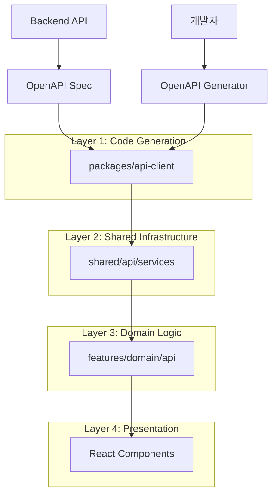

# API Integration Architecture Design

> CotePT 프로젝트의 API 통합 아키텍처 설계 결정과 그 배경을 설명하는 문서입니다.

## 📋 목차

1. [아키텍처 개요](#아키텍처-개요)
2. [설계 원칙](#설계-원칙)
3. [레이어별 설계 결정](#레이어별-설계-결정)
4. [트레이드오프 분석](#트레이드오프-분석)
5. [대안 검토](#대안-검토)
6. [성능 고려사항](#성능-고려사항)
7. [확장성 전략](#확장성-전략)

## 🏗️ 아키텍처 개요

### 전체 구조



### 핵심 설계 철학

1. **코드 생성 우선**: 수동 작업 최소화, 타입 안전성 자동 보장
2. **계층화된 추상화**: 각 레이어의 명확한 책임 분리
3. **FSD 준수**: Feature-Sliced Design 아키텍처 원칙 적용
4. **타입 안전성**: 컴파일 타임 에러 검출을 통한 런타임 안정성

## 🎯 설계 원칙

### 1. Separation of Concerns (관심사 분리)

```typescript
// ❌ 안티패턴: 모든 것이 한 곳에
export function useCreateUser() {
  return useMutation({
    mutationFn: async (data) => {
      const response = await axios.post("/api/users", data)
      if (response.status !== 200) throw new Error("Failed")
      return response.data
    },
    onSuccess: () => {
      queryClient.invalidateQueries(["users"])
      queryClient.invalidateQueries(["mentoring"])
      toast.success("생성됨")
    },
  })
}

// ✅ 권장: 계층별 책임 분리
export function useCreateUser(config?: MutationConfig) {
  const queryClient = useQueryClient()

  return useBaseMutation<CreateUserResponse, ApiError, CreateUserParams>({
    mutationFn: (data) => userApiService.createUser(...data), // API 레이어
    queryKey: userKeys.lists().queryKey, // 쿼리 키 레이어
    onSuccess: (response) => {
      userQueryUtils.invalidateLists(queryClient) // 무효화 레이어
      config?.onSuccess?.(response.data) // 비즈니스 로직 레이어
    },
  })
}
```

### 2. Type Safety First

```typescript
// 자동 생성된 타입을 기반으로 한 타입 체인
packages/api-client → UserApiCreateUserRequest
                  ↓
shared/api       → UserApiServiceMethodParameters<"createUser">
                  ↓
features/user    → CreateUserParams = UserApiServiceMethodParameters<"createUser">
                  ↓
React Component  → const mutation = useCreateUser()
```

### 3. Feature-Driven Organization

```
features/
├── user/api/
│   ├── queryKey.ts    # 도메인별 쿼리 키 + 유틸리티
│   ├── queries.ts     # 읽기 작업
│   └── mutations.ts   # 쓰기 작업
├── mentoring/api/
└── auth/api/
```

## 🔧 레이어별 설계 결정

### Layer 1: API Client (Code Generation)

**결정**: OpenAPI Generator with TypeScript-Axios 템플릿 사용

**이유**:

- ✅ **자동화**: 백엔드 스키마 변경 시 프론트엔드 타입 자동 업데이트
- ✅ **타입 안전성**: 컴파일 타임에 API 스펙 불일치 검출
- ✅ **일관성**: 모든 API 호출이 동일한 패턴 사용
- ✅ **문서화**: OpenAPI 스펙이 곧 문서

**트레이드오프**:

- ❌ **생성 코드 의존성**: 생성된 코드에 직접 의존할 수 없음
- ❌ **커스터마이징 제한**: 특별한 요구사항 반영 어려움

```typescript
// 선택한 패턴: Factory Pattern
export const UserApiFactory = function (configuration?: Configuration) {
  return {
    createUser(params: UserApiCreateUserRequest): AxiosPromise<UserResponseWrapper> {
      return UserApiFp(configuration).createUser(params)(axios, basePath)
    },
  }
}

// 대안 1: Class Based (선택하지 않은 이유: 인스턴스 관리 복잡)
// 대안 2: Functional (선택하지 않은 이유: 설정 주입 어려움)
```

### Layer 2: Shared Infrastructure

**결정**: Wrapper 패턴 + 타입 유틸리티 제공

**이유**:

- ✅ **공통 로직 집중화**: 에러 처리, 로딩 상태, 응답 변환
- ✅ **생성 코드 캡슐화**: 직접 의존성 차단
- ✅ **타입 추출 제공**: Feature 레이어에서 쉽게 타입 사용

```typescript
// 핵심 설계: createApiService 래퍼
export function createApiService<T>(apiFactory: T): T {
  const wrappedService = {} as T

  for (const [key, method] of Object.entries(apiFactory)) {
    wrappedService[key] = withErrorHandling(method)
  }

  return wrappedService
}

// 타입 유틸리티: 자동 타입 추출
export type UserApiServiceMethodReturnType<T extends keyof ReturnType<typeof UserApiFactory>> = Awaited<
  ReturnType<ReturnType<typeof UserApiFactory>[T]>
>
```

**대안 검토**:

- **대안 1**: 직접 API 클라이언트 사용 → 공통 로직 중복, 에러 처리 일관성 부족
- **대안 2**: 각 Feature에서 개별 래퍼 → 코드 중복, 유지보수 어려움

### Layer 3: Domain Logic (Features)

**결정**: 3-파일 구조 (queryKey.ts, queries.ts, mutations.ts)

**이유**:

- ✅ **단일 책임 원칙**: 각 파일이 명확한 역할
- ✅ **재사용성**: queryKey.ts를 통한 크로스 도메인 연동
- ✅ **FSD 준수**: Feature 간 의존성 명시적 관리

```typescript
// queryKey.ts: 도메인의 Single Source of Truth
export const userKeys = createQueryKeys("users", {
  /* ... */
})
export const userQueryUtils = {
  invalidateAll: (queryClient: QueryClient) => {
    /* ... */
  },
  // 크로스 도메인을 위한 인터페이스
  invalidateUserRelated: (queryClient: QueryClient, userId?: string) => {
    /* ... */
  },
}

// queries.ts: 읽기 작업 집중
export const userQueries = {
  /* ... */
}
export function useUsers() {
  /* ... */
}

// mutations.ts: 쓰기 작업 집중
export function useCreateUser() {
  /* ... */
}
```

**대안 검토**:

| 구조                                 | 장점                  | 단점                               | 선택 여부 |
| ------------------------------------ | --------------------- | ---------------------------------- | --------- |
| **1파일 (index.ts)**                 | 단순함                | 파일 크기 증가, 책임 혼재          | ❌        |
| **2파일 (queries.ts, mutations.ts)** | 읽기/쓰기 분리        | 쿼리 키 중복, 크로스 도메인 어려움 | ❌        |
| **3파일 (현재 선택)**                | 명확한 책임, 재사용성 | 파일 수 증가                       | ✅        |
| **4파일+ (types, utils 분리)**       | 극도로 세분화         | 과도한 분리, 복잡성 증가           | ❌        |

## ⚖️ 트레이드오프 분석

### 코드 생성 vs 수동 작성

| 측면               | 코드 생성  | 수동 작성  |
| ------------------ | ---------- | ---------- |
| **타입 안전성**    | ⭐⭐⭐⭐⭐ | ⭐⭐⭐     |
| **유지보수성**     | ⭐⭐⭐⭐⭐ | ⭐⭐       |
| **커스터마이징**   | ⭐⭐       | ⭐⭐⭐⭐⭐ |
| **초기 설정 비용** | ⭐⭐       | ⭐⭐⭐⭐   |
| **디버깅 편의성**  | ⭐⭐⭐     | ⭐⭐⭐⭐   |

**결론**: 타입 안전성과 유지보수성을 우선시하여 코드 생성 선택

### 중앙집중 vs 분산 관리

| 측면                   | 중앙집중 (shared) | 분산 (features) |
| ---------------------- | ----------------- | --------------- |
| **FSD 준수**           | ⭐⭐              | ⭐⭐⭐⭐⭐      |
| **코드 중복**          | ⭐⭐⭐⭐⭐        | ⭐⭐⭐          |
| **도메인 독립성**      | ⭐⭐              | ⭐⭐⭐⭐⭐      |
| **일관성**             | ⭐⭐⭐⭐⭐        | ⭐⭐⭐          |
| **크로스 도메인 연동** | ⭐⭐⭐⭐          | ⭐⭐⭐          |

**결론**: FSD 원칙과 도메인 독립성을 위해 분산 관리 선택, 단 공통 인터페이스로 일관성 유지

## 🚀 성능 고려사항

### 번들 크기 최적화

```typescript
// Tree Shaking 지원을 위한 개별 export
export { userKeys, userQueryUtils } from "./queryKey"
export { useUsers, useUser } from "./queries"
export { useCreateUser, useUpdateUser } from "./mutations"

// 대신 index.ts에서 re-export하지 않음 (번들 크기 증가 방지)
```

### 쿼리 캐싱 전략

```typescript
// 계층적 쿼리 키 구조로 효율적 무효화
userKeys = {
  all: ["users"], // 모든 사용자 관련
  lists: ["users", "list"], // 목록 쿼리들
  list: ["users", "list", filters], // 특정 필터의 목록
  detail: ["users", "detail", id], // 특정 사용자
}

// 부분 무효화로 성능 최적화
userQueryUtils.invalidateLists() // 목록만 무효화, 상세는 유지
```

### 타입 추론 최적화

```typescript
// 컴파일 타임 타입 추출로 런타임 오버헤드 제거
type CreateUserParams = UserApiServiceMethodParameters<"createUser">
// 런타임에는 실제 데이터만 전달, 타입 정보는 제거됨
```

## 📈 확장성 전략

### 새로운 도메인 추가

```typescript
// 표준 패턴을 따른 확장
features/
├── user/api/           # 기존
├── mentoring/api/      # 신규 1
│   ├── queryKey.ts     # 동일한 구조
│   ├── queries.ts
│   └── mutations.ts
└── auth/api/           # 신규 2
    ├── queryKey.ts
    ├── queries.ts
    └── mutations.ts
```

### 크로스 도메인 패턴

```typescript
// mentoring/api/mutations.ts
import { userQueryUtils } from "@/features/user/api/queryKey"

export function useCreateMentoringSession() {
  return useBaseMutation({
    onSuccess: (response, variables) => {
      // 자체 도메인 무효화
      mentoringQueryUtils.invalidateLists(queryClient)

      // 크로스 도메인 무효화 (명시적 의존성)
      userQueryUtils.invalidateUserRelated(queryClient, variables.mentorId)
    },
  })
}
```

### API 진화 대응

```typescript
// 버전별 API 지원
export const userApiServiceV1 = createApiService(UserApiV1Factory(...))
export const userApiServiceV2 = createApiService(UserApiV2Factory(...))

// Feature 레이어에서 버전 선택
const apiService = USE_API_V2 ? userApiServiceV2 : userApiServiceV1
```

## 🔍 측정 지표

### 성공 지표

1. **타입 안전성**: TypeScript 에러 0건 유지
2. **개발 속도**: 새 API 통합 시간 < 30분
3. **번들 크기**: API 관련 코드 < 전체의 15%
4. **코드 중복**: API 호출 로직 중복 < 5%

### 모니터링

```typescript
// 성능 메트릭 수집
const apiMetrics = {
  requestDuration: measureApiCall(userApiService.createUser),
  cacheHitRate: measureCachePerformance(userKeys.lists()),
  bundleSize: measureBundleImpact("@/features/user/api"),
}
```

## 🎯 결론

이 아키텍처는 다음 목표를 달성합니다:

1. **개발자 경험**: 타입 안전성과 자동완성으로 개발 효율성 극대화
2. **유지보수성**: 계층화된 구조로 변경 영향도 최소화
3. **확장성**: 표준 패턴으로 새로운 도메인 쉽게 추가
4. **성능**: 효율적인 캐싱과 번들 최적화
5. **팀 협업**: 명확한 컨벤션으로 코드 일관성 보장

앞으로의 진화 방향은 GraphQL 도입, 실시간 업데이트, 오프라인 지원 등을 고려할 수 있습니다.
