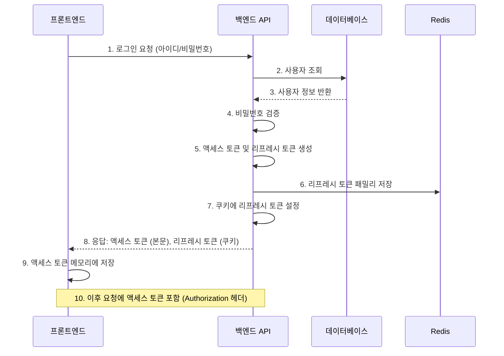
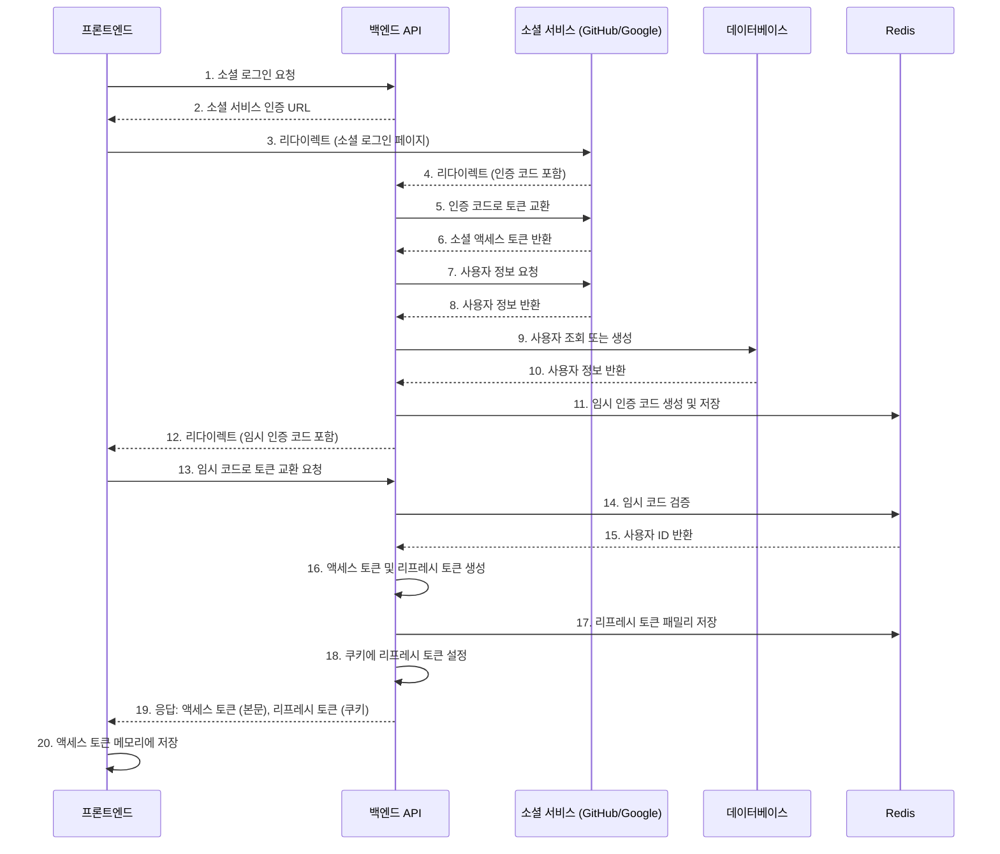

- **액세스 토큰**: 짧은 수명(15분~1시간), API 요청 승인에 사용
- **리프레시 토큰**: 긴 수명(1~2주), 새로운 액세스 토큰 발급에 사용
- **저장 위치**:
  - 액세스 토큰: HTTP-only 쿠키에 저장 next-auth
  - 리프레시 토큰: HTTP-only 쿠키에 저장 next-auth

## 일반 로그인 흐름 차트

## 소셜 로그인 흐름 차트

### 1. 컨트롤러 레이어

- `GithubAuthController`와 `GoogleAuthController`: OAuth 리다이렉트 방식 시작점
- `AuthController`: 코드 교환 및 직접적인 소셜 로그인 처리

### 2. 사용 사례 레이어 (Use Cases)

- `SocialAuthCallbackUseCase`: OAuth 콜백 처리
- `SocialLoginUseCase`: 소셜 로그인 직접 처리
- `GenerateAuthCodeUseCase`: 임시 인증 코드 생성

### 3. 전략 레이어 (Strategies)

- `GithubStrategy`와 `GoogleStrategy`: Passport.js를 활용한 OAuth 인증 처리

### 4. 서비스 레이어

- `AuthFacadeService`: 컨트롤러와 유스케이스 간의 중간 레이어

### 소셜 로그인 흐름 (OAuth 리다이렉트 방식)

1. 사용자가 `/auth/github` 또는 `/auth/google` 엔드포인트 방문
2. Passport 전략이 소셜 서비스 로그인 페이지로 리다이렉트
3. 사용자가 소셜 서비스에서 로그인 후, 콜백 엔드포인트로 리다이렉트
4. 콜백 엔드포인트에서 Passport 전략이 소셜 프로필 정보 검증
5. `SocialAuthCallbackUseCase`가 임시 인증 코드를 생성하고 클라이언트로 리다이렉트
6. 클라이언트가 임시 인증 코드를 사용해 `/auth/exchange-code` 엔드포인트를 호출
7. 서버가 인증 코드를 검증하고 액세스 토큰과 리프레시 토큰을 발급
