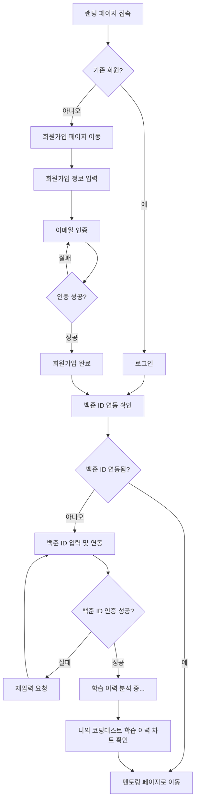

# 로그인 및 회원가입 플로우

```mermaid
flowchart TD
    A[랜딩 페이지 접속] --> B{기존 회원?}
    B -->|예| C[로그인]
    B -->|아니오| D[회원가입 페이지 이동]

    D --> E[회원가입 정보 입력]
    E --> F[이메일 인증]
    F --> G{인증 성공?}
    G -->|실패| F
    G -->|성공| H[회원가입 완료]

    C --> I[백준 ID 연동 확인]
    H --> I

    I --> J{백준 ID 연동됨?}
    J -->|아니오| K[백준 ID 입력 및 연동]
    J -->|예| L[멘토링 페이지로 이동]

    K --> M{백준 ID 인증 성공?}
    M -->|실패| N[재입력 요청]
    N --> K
    M -->|성공| O[학습 이력 분석 중...]
    O --> P[나의 코딩테스트 학습 이력 차트 확인]
    P --> L
```
