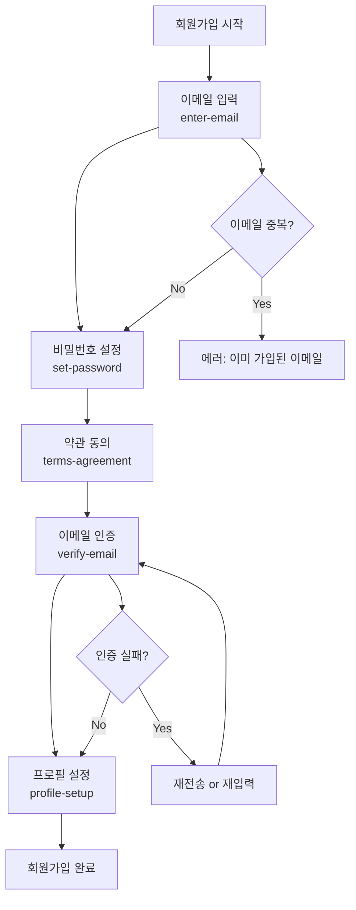

# CotePT 회원가입 스테퍼 설계 가이드

CotePT 프로젝트의 라프텔 스타일 5단계 회원가입 플로우 구현 가이드입니다.

## 🎨 shadcn/ui 컴포넌트 활용

이 가이드는 `@repo/shared` 패키지의 shadcn/ui 컴포넌트들을 적극 활용합니다:

**설치된 핵심 컴포넌트**:
- `Form`, `FormField`, `FormItem`, `FormLabel`, `FormControl`, `FormMessage` - React Hook Form 통합
- `Button`, `Input`, `Label` - 기본 폼 요소들
- `Progress`, `Badge`, `Separator` - 스테퍼 UI 구성
- `Card`, `CardHeader`, `CardContent`, `CardFooter` - 단계별 컨테이너
- `Checkbox`, `Tooltip`, `Skeleton` - UX 향상 요소
- `Dialog`, `AlertDialog`, `Sheet` - 모달/오버레이

## 📋 목차

1. [플로우 개요](#플로우-개요)
2. [URL 구조 설계](#url-구조-설계)
3. [기술 구현 전략](#기술-구현-전략)
4. [FSD 아키텍처 적용](#fsd-아키텍처-적용)
5. [컴포넌트 구조](#컴포넌트-구조)
6. [상태 관리 전략](#상태-관리-전략)
7. [보안 및 방어 로직](#보안-및-방어-로직)
8. [UX 최적화](#ux-최적화)
9. [API 연동 설계](#api-연동-설계)
10. [구현 가이드](#구현-가이드)

---

## 플로우 개요

### 🎯 라프텔 vs CotePT 플로우 매핑

| 단계 | 라프텔 | CotePT | URL Slug | 목적 |
|------|---------|---------|----------|------|
| 1 | 이메일 입력 | 이메일 입력 | `enter-email` | 계정 식별자 입력 |
| 2 | 비밀번호 설정 | 비밀번호 설정 | `set-password` | 보안 인증 설정 |
| 3 | 약관 동의 | 약관 동의 | `terms-agreement` | 법적 동의 절차 |
| 4 | 이메일 인증 | 이메일 인증 | `verify-email` | 이메일 소유권 확인 |
| 5 | 프로필 설정 | 프로필 설정 | `profile-setup` | 개인화 설정 |

### 📊 플로우 차트



---

## URL 구조 설계

### 🌐 Web Standard: kebab-case 명명 규칙

**기본 URL 패턴**:
```
/auth/signup?step={step-name}
```

**각 단계별 URL**:

#### Step 1: 이메일 입력
```
/auth/signup?step=enter-email
```
- 이메일 주소 입력 및 형식 검증
- 실시간 중복 확인
- "계정이 있으신가요?" 로그인 유도

#### Step 2: 비밀번호 설정
```
/auth/signup?step=set-password
```
- 비밀번호 입력 + 확인
- 실시간 강도 측정
- 보안 정책 안내

#### Step 3: 약관 동의
```
/auth/signup?step=terms-agreement
```
- 서비스 이용약관 (필수)
- 개인정보처리방침 (필수)
- 마케팅 수신 동의 (선택)
- 전체 동의 토글

#### Step 4: 이메일 인증
```
/auth/signup?step=verify-email
```
- 인증 코드 입력 (6자리)
- 카운트다운 타이머 (3분)
- 재전송 기능 (1분 쿨타임)

#### Step 5: 프로필 설정
```
/auth/signup?step=profile-setup
```
- 닉네임 설정 (2-20자)
- 프로필 이미지 업로드 (선택)
- 멘토/멘티 관심사 선택 (선택)

### 🎨 URL의 장점

```typescript
// 1. 의미있는 Analytics 추적
const SIGNUP_ANALYTICS = {
  'enter-email': '이메일 입력 단계 이탈률',
  'set-password': '비밀번호 설정 단계 이탈률', 
  'terms-agreement': '약관 동의 단계 이탈률',
  'verify-email': '이메일 인증 단계 이탈률',
  'profile-setup': '프로필 설정 단계 이탈률'
}

// 2. 개발자 친화적 상수
export const SIGNUP_STEPS = {
  ENTER_EMAIL: 'enter-email',
  SET_PASSWORD: 'set-password',
  TERMS_AGREEMENT: 'terms-agreement', 
  VERIFY_EMAIL: 'verify-email',
  PROFILE_SETUP: 'profile-setup'
} as const

export type SignupStep = typeof SIGNUP_STEPS[keyof typeof SIGNUP_STEPS]

// 3. 사용자 친화적 브라우저 히스토리
// 뒤로가기 시 "프로필 설정" → "이메일 인증" 순서로 표시
```

---

## 기술 구현 전략

### 🏗️ 하이브리드 렌더링 방식

**Page Level (SSR)**:
- SEO 최적화 및 초기 렌더링 성능
- 메타데이터 및 Open Graph 설정
- 서버에서 초기 스테퍼 상태 결정

**Form Level (CSR)**:
- 실시간 폼 검증 및 사용자 상호작용
- 복잡한 상태 관리 (진행률, 에러 상태)
- API 호출 및 로딩 상태 관리

```typescript
// app/auth/signup/page.tsx (SSR)
export const metadata: Metadata = {
  title: 'CotePT - 회원가입',
  description: '개발자를 위한 1:1 멘토링 서비스 CotePT에 가입하세요',
  robots: { 
    index: false, // 회원가입 페이지는 검색 노출 방지
    follow: false 
  }
}

export default function SignupPage() {
  return (
    <div className="container mx-auto max-w-md py-16">
      <Suspense fallback={<SignupSkeleton />}>
        <SignupContainer />
      </Suspense>
    </div>
  )
}

// containers/auth/SignupContainer.tsx (CSR)
'use client'
export function SignupContainer() {
  const { currentStep, isValidStep } = useSignupFlow()
  
  if (!isValidStep) {
    redirect('/auth/signup?step=enter-email')
  }
  
  return (
    <AuthFormLayout>
      <SignupProgress currentStep={currentStep} />
      <SignupStepContent step={currentStep} />
      <SignupNavigation currentStep={currentStep} />
    </AuthFormLayout>
  )
}
```

### 🔄 상태 관리: URL + sessionStorage 조합

**URL 기반 스테퍼 상태**:
- 브라우저 새로고침/뒤로가기 대응
- 북마크 가능한 명시적 URL
- SEO 친화적 구조

**sessionStorage 데이터 보존**:
- 폼 입력 데이터 임시 저장
- 페이지 이탈 시 복구 가능
- 브라우저 세션 종료 시 자동 삭제

```typescript
// features/auth/hooks/useSignupFlow.ts
export function useSignupFlow() {
  const searchParams = useSearchParams()
  const router = useRouter()
  
  const currentStep = searchParams.get('step') || SIGNUP_STEPS.ENTER_EMAIL
  
  // URL 검증
  const isValidStep = Object.values(SIGNUP_STEPS).includes(currentStep as SignupStep)
  
  // 스텝 이동
  const goToStep = (step: SignupStep) => {
    router.push(`/auth/signup?step=${step}`)
  }
  
  // 다음 단계로 이동
  const nextStep = () => {
    const stepOrder = Object.values(SIGNUP_STEPS)
    const currentIndex = stepOrder.indexOf(currentStep as SignupStep)
    const nextIndex = currentIndex + 1
    
    if (nextIndex < stepOrder.length) {
      goToStep(stepOrder[nextIndex])
    }
  }
  
  // 이전 단계로 이동  
  const prevStep = () => {
    const stepOrder = Object.values(SIGNUP_STEPS)
    const currentIndex = stepOrder.indexOf(currentStep as SignupStep)
    const prevIndex = currentIndex - 1
    
    if (prevIndex >= 0) {
      goToStep(stepOrder[prevIndex])
    }
  }
  
  return {
    currentStep,
    isValidStep,
    goToStep,
    nextStep,
    prevStep
  }
}
```

---

## FSD 아키텍처 적용

### 📁 파일 구조

```
src/
├── app/
│   └── auth/
│       └── signup/
│           ├── page.tsx              # SSR 메인 페이지
│           ├── loading.tsx           # 로딩 fallback
│           └── error.tsx             # 에러 boundary
│
├── containers/
│   └── auth/
│       ├── SignupContainer.tsx       # 메인 컨테이너 (CSR)
│       └── components/
│           ├── SignupProgress.tsx    # 진행률 표시
│           ├── SignupNavigation.tsx  # 이전/다음 버튼
│           └── SignupSkeleton.tsx    # 로딩 스켈레톤
│
├── features/
│   └── auth/
│       ├── components/
│       │   ├── EmailStep.tsx         # 이메일 입력 스텝
│       │   ├── PasswordStep.tsx      # 비밀번호 설정 스텝
│       │   ├── TermsStep.tsx         # 약관 동의 스텝
│       │   ├── VerificationStep.tsx  # 이메일 인증 스텝
│       │   ├── ProfileStep.tsx       # 프로필 설정 스텝
│       │   └── SignupStepContent.tsx # 스텝 라우터
│       ├── hooks/
│       │   ├── useSignupFlow.ts      # 플로우 관리
│       │   ├── useSignupPersistence.ts # 상태 보존
│       │   └── useSignupValidation.ts # 검증 로직
│       ├── schemas/
│       │   ├── signup-steps.schema.ts # 각 스텝별 Zod 스키마
│       │   └── index.ts
│       ├── types/
│       │   ├── signup-flow.types.ts  # 플로우 관련 타입
│       │   └── index.ts
│       └── constants/
│           ├── signup-steps.ts       # 스텝 상수
│           └── validation-messages.ts # 에러 메시지
│
└── shared/
    └── ui/
        ├── stepper/
        │   ├── Stepper.tsx          # 재사용 가능한 스테퍼
        │   ├── StepIndicator.tsx    # 스텝 인디케이터
        │   └── ProgressBar.tsx      # 진행률 바
        └── forms/
            ├── FormField.tsx        # 공통 폼 필드
            ├── PasswordInput.tsx    # 비밀번호 입력 필드
            └── CheckboxGroup.tsx    # 체크박스 그룹
```

### 🎯 레이어별 역할

#### **app/** - 라우팅 & 메타데이터 (SSR)
```typescript
// app/auth/signup/page.tsx
export const metadata: Metadata = {
  title: 'CotePT - 회원가입',
  description: '개발자를 위한 1:1 멘토링 서비스 가입',
  openGraph: {
    title: 'CotePT 회원가입',
    description: '개발자 멘토링의 새로운 경험을 시작하세요'
  }
}

export default function SignupPage() {
  return <SignupContainer />
}
```

#### **containers/** - UI 조합 & 이벤트 처리 (CSR)
```typescript
// containers/auth/SignupContainer.tsx
'use client'

export function SignupContainer() {
  const { currentStep, nextStep, prevStep } = useSignupFlow()
  const { saveStepData, canProceed } = useSignupPersistence()
  
  return (
    <AuthFormLayout>
      <SignupProgress currentStep={currentStep} />
      
      <SignupStepContent 
        step={currentStep}
        onStepComplete={(data) => {
          saveStepData(currentStep, data)
          nextStep()
        }}
      />
      
      <SignupNavigation 
        currentStep={currentStep}
        onNext={nextStep}
        onPrev={prevStep}
        canProceed={canProceed(currentStep)}
      />
    </AuthFormLayout>
  )
}
```

#### **features/** - 비즈니스 로직 & 상태 관리
```typescript
// features/auth/components/SignupStepContent.tsx
export function SignupStepContent({ step, onStepComplete }: Props) {
  switch (step) {
    case SIGNUP_STEPS.ENTER_EMAIL:
      return <EmailStep onComplete={onStepComplete} />
    case SIGNUP_STEPS.SET_PASSWORD:
      return <PasswordStep onComplete={onStepComplete} />
    case SIGNUP_STEPS.TERMS_AGREEMENT:
      return <TermsStep onComplete={onStepComplete} />
    case SIGNUP_STEPS.VERIFY_EMAIL:
      return <VerificationStep onComplete={onStepComplete} />
    case SIGNUP_STEPS.PROFILE_SETUP:
      return <ProfileStep onComplete={onStepComplete} />
    default:
      return <div>Invalid step</div>
  }
}
```

#### **shared/** - 재사용 가능한 UI 컴포넌트
```typescript
// shared/ui/stepper/Stepper.tsx
interface StepperProps {
  currentStep: number
  totalSteps: number
  stepLabels?: string[]
  className?: string
}

export function Stepper({ currentStep, totalSteps, stepLabels, className }: StepperProps) {
  return (
    <div className={cn("w-full", className)}>
      <div className="flex justify-between items-center mb-4">
        {Array.from({ length: totalSteps }, (_, i) => (
          <StepIndicator 
            key={i}
            stepNumber={i + 1}
            isActive={i + 1 <= currentStep}
            isCompleted={i + 1 < currentStep}
            label={stepLabels?.[i]}
          />
        ))}
      </div>
      
      <ProgressBar 
        progress={(currentStep / totalSteps) * 100}
        className="mb-6"
      />
    </div>
  )
}
```

---

## 컴포넌트 구조

### 📋 각 스텝별 컴포넌트 상세

#### Step 1: EmailStep.tsx
```typescript
// features/auth/components/EmailStep.tsx
'use client'

import React from 'react'
import { useForm } from 'react-hook-form'
import { zodResolver } from '@hookform/resolvers/zod'
import Link from 'next/link'

// @repo/shared 컴포넌트들
import { 
  Form,
  FormField, 
  FormItem, 
  FormLabel, 
  FormControl, 
  FormMessage 
} from '@repo/shared/components/form'
import { Input } from '@repo/shared/components/input'
import { Button } from '@repo/shared/components/button'

// 로컬 훅과 스키마
import { useCheckEmailMutation } from '@features/auth/apis/mutations'
import { EmailStepSchema } from '@features/auth/schemas/email-step.schema'
import type { EmailStepData } from '@features/auth/types'

interface EmailStepProps {
  onComplete: (data: EmailStepData) => void
}

export function EmailStep({ onComplete }: EmailStepProps) {
  const form = useForm({
    resolver: zodResolver(EmailStepSchema),
    defaultValues: { email: '' }
  })
  
  const { mutate: checkEmail, isLoading } = useCheckEmailMutation()
  
  const handleSubmit = form.handleSubmit(async (data) => {
    // 이메일 중복 확인
    checkEmail(data.email, {
      onSuccess: (result) => {
        if (result.available) {
          onComplete(data)
        } else {
          form.setError('email', { 
            message: '이미 사용 중인 이메일입니다' 
          })
        }
      }
    })
  })
  
  return (
    <div className="space-y-6">
      <div className="text-center">
        <h2 className="text-2xl font-bold">이메일로 시작</h2>
        <p className="text-muted-foreground">
          CotePT에서 사용할 이메일을 입력해주세요
        </p>
      </div>
      
      <form onSubmit={handleSubmit} className="space-y-4">
        <FormField
          control={form.control}
          name="email"
          render={({ field }) => (
            <FormItem>
              <FormLabel>이메일</FormLabel>
              <FormControl>
                <Input 
                  placeholder="이메일을 입력해주세요"
                  type="email"
                  {...field}
                />
              </FormControl>
              <FormMessage />
            </FormItem>
          )}
        />
        
        <Button 
          type="submit" 
          className="w-full" 
          disabled={isLoading}
        >
          {isLoading ? '확인 중...' : '다음'}
        </Button>
      </form>
      
      <div className="text-center text-sm">
        <span className="text-muted-foreground">이미 계정이 있으신가요? </span>
        <Link href="/auth/signin" className="text-primary hover:underline">
          로그인
        </Link>
      </div>
    </div>
  )
}
```

#### Step 2: PasswordStep.tsx  
```typescript
// features/auth/components/PasswordStep.tsx
'use client'

import React from 'react'
import { useForm } from 'react-hook-form'
import { zodResolver } from '@hookform/resolvers/zod'

// @repo/shared 컴포넌트들
import { 
  Form,
  FormField, 
  FormItem, 
  FormLabel, 
  FormControl, 
  FormMessage 
} from '@repo/shared/components/form'
import { Input } from '@repo/shared/components/input'
import { Button } from '@repo/shared/components/button'
import { Progress } from '@repo/shared/components/progress'

// 로컬 컴포넌트와 훅
import { PasswordInput } from '@containers/auth/components/PasswordInput'
import { usePasswordStrength } from '@features/auth/hooks/usePasswordStrength'
import { PasswordStepSchema } from '@features/auth/schemas/password-step.schema'
import type { PasswordStepData } from '@features/auth/types'

interface PasswordStepProps {
  onComplete: (data: PasswordStepData) => void
}

export function PasswordStep({ onComplete }: PasswordStepProps) {
  const form = useForm({
    resolver: zodResolver(PasswordStepSchema)
  })
  
  const password = form.watch('password')
  const passwordStrength = usePasswordStrength(password)
  
  return (
    <div className="space-y-6">
      <div className="text-center">
        <h2 className="text-2xl font-bold">비밀번호 설정</h2>
        <p className="text-muted-foreground">
          안전한 비밀번호를 만들어주세요
        </p>
      </div>
      
      <form onSubmit={form.handleSubmit(onComplete)} className="space-y-4">
        <FormField
          control={form.control}
          name="password"
          render={({ field }) => (
            <FormItem>
              <FormLabel>비밀번호</FormLabel>
              <FormControl>
                <PasswordInput 
                  placeholder="비밀번호를 입력해주세요"
                  {...field}
                />
              </FormControl>
              <FormMessage />
              {password && (
                <PasswordStrengthMeter strength={passwordStrength} />
              )}
            </FormItem>
          )}
        />
        
        <FormField
          control={form.control}
          name="confirmPassword"
          render={({ field }) => (
            <FormItem>
              <FormLabel>비밀번호 확인</FormLabel>
              <FormControl>
                <PasswordInput 
                  placeholder="비밀번호를 다시 입력해주세요"
                  {...field}
                />
              </FormControl>
              <FormMessage />
            </FormItem>
          )}
        />
        
        <div className="text-xs text-muted-foreground space-y-1">
          <p>• 8자 이상</p>
          <p>• 영문, 숫자, 특수문자 포함</p>
          <p>• 개인정보 포함 금지</p>
        </div>
        
        <Button type="submit" className="w-full">
          다음
        </Button>
      </form>
    </div>
  )
}
```

#### Step 3: TermsStep.tsx
```typescript
// features/auth/components/TermsStep.tsx
'use client'

import React from 'react'
import { useForm } from 'react-hook-form'
import { zodResolver } from '@hookform/resolvers/zod'
import Link from 'next/link'

// @repo/shared 컴포넌트들
import { 
  Form,
  FormField, 
  FormItem, 
  FormLabel, 
  FormControl, 
  FormMessage 
} from '@repo/shared/components/form'
import { Button } from '@repo/shared/components/button'
import { Checkbox } from '@repo/shared/components/checkbox'
import { Separator } from '@repo/shared/components/separator'

// 로컬 스키마와 타입
import { TermsStepSchema } from '@features/auth/schemas/terms-step.schema'
import type { TermsStepData } from '@features/auth/types'

interface TermsStepProps {
  onComplete: (data: TermsStepData) => void
}

export function TermsStep({ onComplete }: TermsStepProps) {
  const form = useForm({
    resolver: zodResolver(TermsStepSchema),
    defaultValues: {
      serviceTerms: false,
      privacyPolicy: false,
      marketingConsent: false,
      ageConfirmation: false
    }
  })
  
  const watchedValues = form.watch()
  const requiredTerms = [
    'serviceTerms', 
    'privacyPolicy', 
    'ageConfirmation'
  ] as const
  
  const allRequiredChecked = requiredTerms.every(
    term => watchedValues[term]
  )
  
  const toggleAll = () => {
    const newValue = !allRequiredChecked
    requiredTerms.forEach(term => {
      form.setValue(term, newValue)
    })
    // 마케팅은 선택사항이므로 필수 약관과 동일하게 처리
    form.setValue('marketingConsent', newValue)
  }
  
  return (
    <div className="space-y-6">
      <div className="text-center">
        <h2 className="text-2xl font-bold">약관에 동의해주세요</h2>
        <p className="text-muted-foreground">
          서비스 이용을 위해 필요합니다
        </p>
      </div>
      
      <form onSubmit={form.handleSubmit(onComplete)} className="space-y-4">
        {/* 전체 동의 */}
        <div className="p-4 border rounded-lg">
          <label className="flex items-center space-x-3 cursor-pointer">
            <Checkbox 
              checked={allRequiredChecked && watchedValues.marketingConsent}
              onCheckedChange={toggleAll}
            />
            <span className="font-medium">모두 동의</span>
          </label>
        </div>
        
        {/* 개별 약관 */}
        <div className="space-y-3">
          <FormField
            control={form.control}
            name="serviceTerms"
            render={({ field }) => (
              <div className="flex items-center justify-between">
                <label className="flex items-center space-x-3 cursor-pointer">
                  <Checkbox 
                    checked={field.value}
                    onCheckedChange={field.onChange}
                  />
                  <span className="text-sm">
                    서비스 이용약관 동의 <span className="text-destructive">(필수)</span>
                  </span>
                </label>
                <Button variant="ghost" size="sm">
                  보기
                </Button>
              </div>
            )}
          />
          
          <FormField
            control={form.control}
            name="privacyPolicy"
            render={({ field }) => (
              <div className="flex items-center justify-between">
                <label className="flex items-center space-x-3 cursor-pointer">
                  <Checkbox 
                    checked={field.value}
                    onCheckedChange={field.onChange}
                  />
                  <span className="text-sm">
                    개인정보처리방침 동의 <span className="text-destructive">(필수)</span>
                  </span>
                </label>
                <Button variant="ghost" size="sm">
                  보기
                </Button>
              </div>
            )}
          />
          
          <FormField
            control={form.control}
            name="ageConfirmation"
            render={({ field }) => (
              <div className="flex items-center justify-between">
                <label className="flex items-center space-x-3 cursor-pointer">
                  <Checkbox 
                    checked={field.value}
                    onCheckedChange={field.onChange}
                  />
                  <span className="text-sm">
                    만 14세 이상입니다 <span className="text-destructive">(필수)</span>
                  </span>
                </label>
              </div>
            )}
          />
          
          <FormField
            control={form.control}
            name="marketingConsent"
            render={({ field }) => (
              <div className="flex items-center justify-between">
                <label className="flex items-center space-x-3 cursor-pointer">
                  <Checkbox 
                    checked={field.value}
                    onCheckedChange={field.onChange}
                  />
                  <span className="text-sm">
                    마케팅 수신 동의 (선택)
                  </span>
                </label>
                <Button variant="ghost" size="sm">
                  보기
                </Button>
              </div>
            )}
          />
        </div>
        
        <Button 
          type="submit" 
          className="w-full" 
          disabled={!allRequiredChecked}
        >
          다음
        </Button>
      </form>
    </div>
  )
}
```

#### Step 4: VerificationStep.tsx
```typescript
// features/auth/components/VerificationStep.tsx
'use client'

import React, { useState, useEffect } from 'react'
import { useForm } from 'react-hook-form'
import { zodResolver } from '@hookform/resolvers/zod'

// @repo/shared 컴포넌트들
import { 
  Form,
  FormField, 
  FormItem, 
  FormLabel, 
  FormControl, 
  FormMessage 
} from '@repo/shared/components/form'
import { Input } from '@repo/shared/components/input'
import { Button } from '@repo/shared/components/button'
import { Badge } from '@repo/shared/components/badge'

// 로컬 훅과 스키마
import { useVerifyEmailMutation, useResendVerificationMutation } from '@features/auth/apis/mutations'
import { VerificationStepSchema } from '@features/auth/schemas/verification-step.schema'
import type { VerificationStepData } from '@features/auth/types'

interface VerificationStepProps {
  onComplete: (data: VerificationStepData) => void
  email: string
}

export function VerificationStep({ onComplete, email }: VerificationStepProps) {
  const form = useForm({
    resolver: zodResolver(VerificationStepSchema)
  })
  
  const [timeLeft, setTimeLeft] = useState(180) // 3분 = 180초
  const [canResend, setCanResend] = useState(false)
  const [resendCooldown, setResendCooldown] = useState(0)
  
  const { mutate: sendCode, isLoading: isSending } = useSendVerificationMutation()
  const { mutate: verifyCode, isLoading: isVerifying } = useVerifyCodeMutation()
  
  // 타이머 관리
  useEffect(() => {
    if (timeLeft > 0) {
      const timer = setTimeout(() => setTimeLeft(timeLeft - 1), 1000)
      return () => clearTimeout(timer)
    } else {
      setCanResend(true)
    }
  }, [timeLeft])
  
  // 재전송 쿨다운
  useEffect(() => {
    if (resendCooldown > 0) {
      const timer = setTimeout(() => setResendCooldown(resendCooldown - 1), 1000)
      return () => clearTimeout(timer)
    }
  }, [resendCooldown])
  
  const handleResend = () => {
    sendCode(undefined, {
      onSuccess: () => {
        setTimeLeft(180)
        setCanResend(false)
        setResendCooldown(60) // 1분 쿨다운
        toast.success('인증 코드를 재전송했습니다')
      }
    })
  }
  
  const handleSubmit = form.handleSubmit((data) => {
    verifyCode(data.code, {
      onSuccess: () => {
        onComplete(data)
      },
      onError: (error) => {
        form.setError('code', { 
          message: '인증 코드가 올바르지 않습니다' 
        })
      }
    })
  })
  
  const formatTime = (seconds: number) => {
    const mins = Math.floor(seconds / 60)
    const secs = seconds % 60
    return `${mins}:${secs.toString().padStart(2, '0')}`
  }
  
  return (
    <div className="space-y-6">
      <div className="text-center">
        <h2 className="text-2xl font-bold">이메일 인증</h2>
        <p className="text-muted-foreground">
          입력하신 이메일로 인증 코드를 보내드렸습니다
        </p>
        <p className="text-sm text-primary font-medium mt-2">
          example@email.com {/* 실제로는 입력된 이메일 표시 */}
        </p>
      </div>
      
      <form onSubmit={handleSubmit} className="space-y-4">
        <FormField
          control={form.control}
          name="code"
          render={({ field }) => (
            <FormItem>
              <FormLabel>인증 코드</FormLabel>
              <FormControl>
                <Input 
                  placeholder="6자리 인증 코드를 입력해주세요"
                  maxLength={6}
                  className="text-center text-lg tracking-wider"
                  {...field}
                />
              </FormControl>
              <FormMessage />
            </FormItem>
          )}
        />
        
        <div className="text-center">
          {timeLeft > 0 ? (
            <p className="text-sm text-muted-foreground">
              남은 시간: <span className="font-mono">{formatTime(timeLeft)}</span>
            </p>
          ) : (
            <p className="text-sm text-destructive">
              인증 시간이 만료되었습니다
            </p>
          )}
        </div>
        
        <Button 
          type="submit" 
          className="w-full" 
          disabled={isVerifying}
        >
          {isVerifying ? '인증 확인 중...' : '확인'}
        </Button>
      </form>
      
      <div className="text-center">
        <Button 
          variant="ghost" 
          onClick={handleResend}
          disabled={!canResend || isSending || resendCooldown > 0}
          className="text-sm"
        >
          {resendCooldown > 0 
            ? `재전송 (${resendCooldown}초 후)` 
            : isSending 
              ? '전송 중...' 
              : '인증 코드 재전송'
          }
        </Button>
      </div>
    </div>
  )
}
```

#### Step 5: ProfileStep.tsx
```typescript
// features/auth/components/ProfileStep.tsx
'use client'

import React, { useState } from 'react'
import { useForm } from 'react-hook-form'
import { zodResolver } from '@hookform/resolvers/zod'

// @repo/shared 컴포넌트들
import { 
  Form,
  FormField, 
  FormItem, 
  FormLabel, 
  FormControl, 
  FormMessage 
} from '@repo/shared/components/form'
import { Input } from '@repo/shared/components/input'
import { Button } from '@repo/shared/components/button'
import { 
  Card, 
  CardHeader, 
  CardContent 
} from '@repo/shared/components/card'

// 로컬 컴포넌트와 스키마
import { AvatarUpload } from '@containers/auth/components/AvatarUpload'
import { ProfileStepSchema } from '@features/auth/schemas/profile-step.schema'
import type { ProfileStepData } from '@features/auth/types'

interface ProfileStepProps {
  onComplete: (data: ProfileStepData) => void
}

export function ProfileStep({ onComplete }: ProfileStepProps) {
  const form = useForm({
    resolver: zodResolver(ProfileStepSchema),
    defaultValues: {
      nickname: '',
      profileImage: null,
      interests: []
    }
  })
  
  const [imagePreview, setImagePreview] = useState<string>('')
  const { mutate: uploadImage, isLoading: isUploading } = useUploadImageMutation()
  const { mutate: checkNickname, isLoading: isChecking } = useCheckNicknameMutation()
  
  const handleImageChange = (file: File) => {
    if (file) {
      const reader = new FileReader()
      reader.onload = (e) => {
        setImagePreview(e.target?.result as string)
      }
      reader.readAsDataURL(file)
      
      // 이미지 업로드
      uploadImage(file, {
        onSuccess: (url) => {
          form.setValue('profileImage', url)
        }
      })
    }
  }
  
  const handleNicknameBlur = () => {
    const nickname = form.getValues('nickname')
    if (nickname) {
      checkNickname(nickname, {
        onSuccess: (result) => {
          if (!result.available) {
            form.setError('nickname', {
              message: '이미 사용 중인 닉네임입니다'
            })
          }
        }
      })
    }
  }
  
  return (
    <div className="space-y-6">
      <div className="text-center">
        <h2 className="text-2xl font-bold">프로필 설정</h2>
        <p className="text-muted-foreground">
          거의 다 완료되었습니다!
        </p>
      </div>
      
      <form onSubmit={form.handleSubmit(onComplete)} className="space-y-6">
        {/* 프로필 이미지 */}
        <div className="flex flex-col items-center space-y-4">
          <div className="relative">
            <Avatar className="w-24 h-24">
              <AvatarImage src={imagePreview} />
              <AvatarFallback>
                <User className="w-12 h-12" />
              </AvatarFallback>
            </Avatar>
            
            <label className="absolute bottom-0 right-0 w-8 h-8 bg-primary rounded-full flex items-center justify-center cursor-pointer hover:bg-primary/90 transition-colors">
              <Camera className="w-4 h-4 text-white" />
              <input
                type="file"
                accept="image/*"
                className="hidden"
                onChange={(e) => {
                  const file = e.target.files?.[0]
                  if (file) handleImageChange(file)
                }}
              />
            </label>
          </div>
          
          <p className="text-xs text-muted-foreground text-center">
            프로필 사진을 등록해보세요 (선택)
          </p>
        </div>
        
        {/* 닉네임 */}
        <FormField
          control={form.control}
          name="nickname"
          render={({ field }) => (
            <FormItem>
              <FormLabel>닉네임 *</FormLabel>
              <FormControl>
                <div className="relative">
                  <Input 
                    placeholder="2-20자로 입력해주세요"
                    maxLength={20}
                    {...field}
                    onBlur={handleNicknameBlur}
                  />
                  {isChecking && (
                    <Loader2 className="absolute right-3 top-1/2 transform -translate-y-1/2 w-4 h-4 animate-spin" />
                  )}
                </div>
              </FormControl>
              <FormMessage />
              <FormDescription>
                다른 사용자에게 표시되는 이름입니다
              </FormDescription>
            </FormItem>
          )}
        />
        
        {/* 관심사 선택 (선택사항) */}
        <FormField
          control={form.control}
          name="interests"
          render={({ field }) => (
            <FormItem>
              <FormLabel>관심 분야 (선택)</FormLabel>
              <FormDescription>
                관심있는 개발 분야를 선택해주세요 (최대 3개)
              </FormDescription>
              <div className="grid grid-cols-2 gap-2 mt-2">
                {INTEREST_OPTIONS.map((interest) => (
                  <label key={interest.value} className="flex items-center space-x-2 cursor-pointer">
                    <Checkbox 
                      checked={field.value.includes(interest.value)}
                      onCheckedChange={(checked) => {
                        if (checked) {
                          if (field.value.length < 3) {
                            field.onChange([...field.value, interest.value])
                          }
                        } else {
                          field.onChange(field.value.filter(v => v !== interest.value))
                        }
                      }}
                      disabled={!field.value.includes(interest.value) && field.value.length >= 3}
                    />
                    <span className="text-sm">{interest.label}</span>
                  </label>
                ))}
              </div>
            </FormItem>
          )}
        />
        
        <Button type="submit" className="w-full" size="lg">
          회원가입 완료
        </Button>
      </form>
      
      <div className="text-center text-xs text-muted-foreground">
        회원가입을 완료하시면 CotePT의 모든 서비스를 이용하실 수 있습니다
      </div>
    </div>
  )
}

const INTEREST_OPTIONS = [
  { value: 'frontend', label: '프론트엔드' },
  { value: 'backend', label: '백엔드' },
  { value: 'mobile', label: '모바일' },
  { value: 'devops', label: 'DevOps' },
  { value: 'ai-ml', label: 'AI/ML' },
  { value: 'data', label: '데이터' },
  { value: 'security', label: '보안' },
  { value: 'blockchain', label: '블록체인' }
]
```

### 🎨 공통 컴포넌트

#### SignupProgress.tsx
```typescript
// containers/auth/components/SignupProgress.tsx
'use client'

import React from 'react'

// @repo/shared 컴포넌트들
import { Badge } from '@repo/shared/components/badge'
import { Progress } from '@repo/shared/components/progress'
import { Separator } from '@repo/shared/components/separator'

// 로컬 타입과 상수
import type { SignupStep } from '@features/auth/types'
import { SIGNUP_STEPS } from '@features/auth/constants'

interface SignupProgressProps {
  currentStep: SignupStep
}

export function SignupProgress({ currentStep }: SignupProgressProps) {
  const stepOrder = Object.values(SIGNUP_STEPS)
  const currentIndex = stepOrder.indexOf(currentStep) + 1
  const totalSteps = stepOrder.length
  
  const stepLabels = [
    '이메일',
    '비밀번호',
    '약관동의', 
    '이메일인증',
    '프로필'
  ]
  
  return (
    <div className="mb-8">
      {/* 단계별 진행 표시 */}
      <div className="flex items-center justify-between mb-4">
        {stepLabels.map((label, index) => (
          <div key={index} className="flex items-center">
            <div className="flex flex-col items-center">
              <Badge 
                variant={
                  index < currentIndex ? "default" : 
                  index === currentIndex ? "secondary" : "outline"
                }
                className="w-8 h-8 rounded-full flex items-center justify-center mb-2"
              >
                {index + 1}
              </Badge>
              <span className="text-xs text-muted-foreground">{label}</span>
            </div>
            {index < stepLabels.length - 1 && (
              <Separator 
                orientation="horizontal" 
                className="mx-2 flex-1" 
                decorative 
              />
            )}
          </div>
        ))}
      </div>
      
      {/* 전체 진행률 */}
      <Progress 
        value={(currentIndex / totalSteps) * 100} 
        className="mb-4"
      />
      
      <div className="text-center">
        <p className="text-sm text-muted-foreground">
          <span className="font-medium">{currentIndex}</span> / {totalSteps} 단계
        </p>
      </div>
    </div>
  )
}
```

---

## 상태 관리 전략

### 🔄 복합 상태 관리 시스템

**1. URL 기반 스테퍼 상태**
- 현재 단계 추적
- 브라우저 히스토리 활용
- 북마크 및 공유 가능

**2. SessionStorage 데이터 보존**
- 각 스텝 입력 데이터 임시 저장
- 페이지 새로고침/이탈 대응
- 브라우저 종료 시 자동 정리

**3. 서버 임시 저장 (고급)**
- 중요한 진행 상황 서버 저장
- 다른 기기에서 이어서 가능
- 보안이 중요한 데이터 관리

### 💾 상태 보존 구현

```typescript
// features/auth/hooks/useSignupPersistence.ts
interface SignupData {
  [SIGNUP_STEPS.ENTER_EMAIL]: EmailStepData
  [SIGNUP_STEPS.SET_PASSWORD]: PasswordStepData  
  [SIGNUP_STEPS.TERMS_AGREEMENT]: TermsStepData
  [SIGNUP_STEPS.VERIFY_EMAIL]: VerificationStepData
  [SIGNUP_STEPS.PROFILE_SETUP]: ProfileStepData
}

export function useSignupPersistence() {
  const [signupData, setSignupData] = useState<Partial<SignupData>>(() => {
    // 초기 로드 시 sessionStorage에서 복원
    if (typeof window !== 'undefined') {
      try {
        const saved = sessionStorage.getItem(SIGNUP_STORAGE_KEY)
        return saved ? JSON.parse(saved) : {}
      } catch {
        return {}
      }
    }
    return {}
  })
  
  // 데이터 저장 (디바운스 적용)
  const saveStepData = useCallback(
    debounce((step: SignupStep, data: any) => {
      const updated = { ...signupData, [step]: data }
      setSignupData(updated)
      
      // sessionStorage에 저장
      try {
        sessionStorage.setItem(SIGNUP_STORAGE_KEY, JSON.stringify(updated))
      } catch (error) {
        console.warn('Failed to save signup data:', error)
      }
      
      // 서버에도 임시 저장 (선택적)
      saveTempSignupData(updated).catch(console.warn)
    }, 500),
    [signupData]
  )
  
  // 특정 스텝 데이터 조회
  const getStepData = (step: SignupStep) => {
    return signupData[step] || {}
  }
  
  // 다음 단계 진행 가능 여부
  const canProceed = (currentStep: SignupStep) => {
    const stepData = getStepData(currentStep)
    return isValidStepData(currentStep, stepData)
  }
  
  // 완료된 스텝들
  const completedSteps = Object.keys(signupData) as SignupStep[]
  
  // 전체 진행률
  const progress = (completedSteps.length / Object.keys(SIGNUP_STEPS).length) * 100
  
  // 데이터 초기화 (회원가입 완료 시)
  const clearSignupData = () => {
    setSignupData({})
    sessionStorage.removeItem(SIGNUP_STORAGE_KEY)
  }
  
  return {
    signupData,
    saveStepData,
    getStepData,
    canProceed,
    completedSteps,
    progress,
    clearSignupData
  }
}

// API 서버 임시 저장
async function saveTempSignupData(data: Partial<SignupData>) {
  try {
    await fetch('/api/auth/signup/temp', {
      method: 'POST',
      headers: { 'Content-Type': 'application/json' },
      body: JSON.stringify({
        sessionId: generateSessionId(),
        data,
        timestamp: Date.now()
      })
    })
  } catch (error) {
    // 실패해도 치명적이지 않으므로 무시
    console.warn('Failed to save temp signup data:', error)
  }
}
```

### 🛡️ 상태 검증 및 무결성

```typescript
// features/auth/utils/validation.ts
function isValidStepData(step: SignupStep, data: any): boolean {
  try {
    switch (step) {
      case SIGNUP_STEPS.ENTER_EMAIL:
        return EmailStepSchema.safeParse(data).success
      case SIGNUP_STEPS.SET_PASSWORD:
        return PasswordStepSchema.safeParse(data).success
      case SIGNUP_STEPS.TERMS_AGREEMENT:
        return TermsStepSchema.safeParse(data).success
      case SIGNUP_STEPS.VERIFY_EMAIL:
        return VerificationStepSchema.safeParse(data).success
      case SIGNUP_STEPS.PROFILE_SETUP:
        return ProfileStepSchema.safeParse(data).success
      default:
        return false
    }
  } catch {
    return false
  }
}

// 손상된 데이터 복구
function sanitizeSignupData(data: any): Partial<SignupData> {
  const sanitized: Partial<SignupData> = {}
  
  Object.entries(data).forEach(([step, stepData]) => {
    if (isValidStepData(step as SignupStep, stepData)) {
      sanitized[step as SignupStep] = stepData
    }
  })
  
  return sanitized
}
```

---

## 보안 및 방어 로직

### 🛡️ 다층 보안 전략

#### 1. 클라이언트 Rate Limiting
```typescript
// features/auth/hooks/useRateLimit.ts
interface RateLimitConfig {
  maxAttempts: number
  windowMs: number
  blockDurationMs: number
}

export function useRateLimit(key: string, config: RateLimitConfig) {
  const [isBlocked, setIsBlocked] = useState(false)
  const [remainingTime, setRemainingTime] = useState(0)
  
  const checkLimit = useCallback(() => {
    const now = Date.now()
    const storageKey = `rate_limit_${key}`
    
    try {
      const data = JSON.parse(localStorage.getItem(storageKey) || '[]') as number[]
      
      // 윈도우 내 요청만 필터링
      const recentAttempts = data.filter(time => now - time < config.windowMs)
      
      // 제한 확인
      if (recentAttempts.length >= config.maxAttempts) {
        const oldestAttempt = Math.min(...recentAttempts)
        const blockUntil = oldestAttempt + config.windowMs
        
        if (now < blockUntil) {
          setIsBlocked(true)
          setRemainingTime(Math.ceil((blockUntil - now) / 1000))
          return false
        }
      }
      
      // 새 요청 기록
      const updatedAttempts = [...recentAttempts, now]
      localStorage.setItem(storageKey, JSON.stringify(updatedAttempts))
      
      setIsBlocked(false)
      return true
    } catch (error) {
      console.warn('Rate limit check failed:', error)
      return true // 에러 시 허용
    }
  }, [key, config])
  
  // 타이머 관리
  useEffect(() => {
    if (remainingTime > 0) {
      const timer = setTimeout(() => {
        setRemainingTime(prev => {
          const next = prev - 1
          if (next <= 0) {
            setIsBlocked(false)
          }
          return next
        })
      }, 1000)
      
      return () => clearTimeout(timer)
    }
  }, [remainingTime])
  
  return {
    isBlocked,
    remainingTime,
    checkLimit,
    formatRemainingTime: () => {
      const minutes = Math.floor(remainingTime / 60)
      const seconds = remainingTime % 60
      return minutes > 0 
        ? `${minutes}분 ${seconds}초`
        : `${seconds}초`
    }
  }
}
```

#### 2. 이메일 인증 스팸 방지
```typescript
// features/auth/hooks/useEmailVerification.ts
export function useEmailVerification() {
  // 이메일 전송 제한 (1분에 1회, 시간당 5회)
  const sendLimit = useRateLimit('email_send', {
    maxAttempts: 1,
    windowMs: 60 * 1000, // 1분
    blockDurationMs: 60 * 1000
  })
  
  // 시간당 제한
  const hourlyLimit = useRateLimit('email_hourly', {
    maxAttempts: 5,
    windowMs: 60 * 60 * 1000, // 1시간
    blockDurationMs: 60 * 60 * 1000
  })
  
  // 인증 시도 제한 (5분에 10회)
  const verifyLimit = useRateLimit('email_verify', {
    maxAttempts: 10,
    windowMs: 5 * 60 * 1000, // 5분
    blockDurationMs: 5 * 60 * 1000
  })
  
  const sendVerificationCode = async (email: string) => {
    if (!sendLimit.checkLimit()) {
      throw new Error(`잠시 후 다시 시도해주세요 (${sendLimit.formatRemainingTime()}`)
    }
    
    if (!hourlyLimit.checkLimit()) {
      throw new Error(`시간당 발송 한도를 초과했습니다 (${hourlyLimit.formatRemainingTime()})`)
    }
    
    // API 호출
    return await authApi.sendVerificationCode({ email })
  }
  
  const verifyCode = async (code: string) => {
    if (!verifyLimit.checkLimit()) {
      throw new Error(`너무 많은 시도입니다. ${verifyLimit.formatRemainingTime()} 후 다시 시도해주세요`)
    }
    
    // API 호출
    return await authApi.verifyCode({ code })
  }
  
  return {
    sendVerificationCode,
    verifyCode,
    canSend: !sendLimit.isBlocked && !hourlyLimit.isBlocked,
    canVerify: !verifyLimit.isBlocked,
    sendLimit,
    hourlyLimit,
    verifyLimit
  }
}
```

#### 3. 서버 사이드 보안
```typescript
// Backend API 예시 (참고용)

// Rate Limiting Middleware
const createRateLimiter = (windowMs: number, max: number) => {
  return rateLimit({
    windowMs,
    max,
    message: { error: '요청이 너무 많습니다. 잠시 후 다시 시도해주세요.' },
    standardHeaders: true,
    legacyHeaders: false
  })
}

// 이메일 전송 제한
const emailSendLimiter = createRateLimiter(60 * 1000, 1) // 1분에 1회
const emailHourlyLimiter = createRateLimiter(60 * 60 * 1000, 5) // 1시간에 5회

// 인증 시도 제한
const verifyLimiter = createRateLimiter(5 * 60 * 1000, 10) // 5분에 10회

// CAPTCHA 트리거 (연속 실패 시)
const shouldRequireCaptcha = (failures: number) => failures >= 3

// 의심스러운 패턴 감지
const detectSuspiciousPattern = (
  ip: string, 
  email: string, 
  attempts: AttemptRecord[]
) => {
  const recentAttempts = attempts.filter(
    attempt => Date.now() - attempt.timestamp < 10 * 60 * 1000
  )
  
  // 같은 IP에서 다른 이메일로 많은 시도
  const ipAttempts = recentAttempts.filter(a => a.ip === ip)
  const uniqueEmails = new Set(ipAttempts.map(a => a.email)).size
  
  if (ipAttempts.length >= 20 || uniqueEmails >= 10) {
    return { suspicious: true, reason: 'bulk_signup' }
  }
  
  // 같은 이메일로 다른 IP에서 많은 시도  
  const emailAttempts = recentAttempts.filter(a => a.email === email)
  const uniqueIps = new Set(emailAttempts.map(a => a.ip)).size
  
  if (emailAttempts.length >= 15 || uniqueIps >= 5) {
    return { suspicious: true, reason: 'distributed_attack' }
  }
  
  return { suspicious: false }
}
```

#### 4. 세션 보안
```typescript
// features/auth/utils/session-security.ts

// 세션 무결성 검증
export function validateSessionIntegrity() {
  const sessionData = sessionStorage.getItem(SIGNUP_STORAGE_KEY)
  
  if (!sessionData) return true
  
  try {
    const data = JSON.parse(sessionData)
    const now = Date.now()
    
    // 세션 만료 확인 (30분)
    if (data.timestamp && now - data.timestamp > 30 * 60 * 1000) {
      sessionStorage.removeItem(SIGNUP_STORAGE_KEY)
      return false
    }
    
    // 데이터 무결성 확인
    if (!isValidSignupSession(data)) {
      sessionStorage.removeItem(SIGNUP_STORAGE_KEY)
      return false
    }
    
    return true
  } catch {
    sessionStorage.removeItem(SIGNUP_STORAGE_KEY)
    return false
  }
}

// 비정상적인 세션 패턴 감지
export function detectAnomalousSession(data: any) {
  const patterns = [
    // 너무 빠른 진행 (각 스텝에 최소 시간 필요)
    () => {
      const timestamps = Object.values(data).map((step: any) => step.timestamp).filter(Boolean)
      if (timestamps.length >= 2) {
        const totalTime = Math.max(...timestamps) - Math.min(...timestamps)
        const minExpectedTime = timestamps.length * 30 * 1000 // 각 스텝 최소 30초
        return totalTime < minExpectedTime
      }
      return false
    },
    
    // 의심스러운 데이터 패턴
    () => {
      return (
        data.email?.includes('test') ||
        data.nickname?.match(/^test\d+$/) ||
        data.password === 'password123!'
      )
    }
  ]
  
  return patterns.some(pattern => pattern())
}
```

---

## UX 최적화

### 🎨 사용자 경험 향상 전략

#### 1. 진행률 시각화
```typescript
// containers/auth/components/SignupProgress.tsx
export function SignupProgress({ currentStep }: SignupProgressProps) {
  const stepOrder = Object.values(SIGNUP_STEPS)
  const currentIndex = stepOrder.indexOf(currentStep)
  const progress = ((currentIndex + 1) / stepOrder.length) * 100
  
  return (
    <div className="mb-8">
      {/* 스텝 인디케이터 */}
      <div className="flex justify-between items-center mb-4">
        {stepOrder.map((step, index) => {
          const isActive = index <= currentIndex
          const isCompleted = index < currentIndex
          
          return (
            <div 
              key={step}
              className="flex flex-col items-center"
            >
              <div className={cn(
                "w-8 h-8 rounded-full flex items-center justify-center text-sm font-medium transition-all duration-300",
                isCompleted 
                  ? "bg-green-500 text-white" 
                  : isActive 
                    ? "bg-primary text-white"
                    : "bg-muted text-muted-foreground"
              )}>
                {isCompleted ? (
                  <Check className="w-4 h-4" />
                ) : (
                  index + 1
                )}
              </div>
              
              <span className="text-xs mt-2 text-center max-w-16">
                {STEP_LABELS[index]}
              </span>
            </div>
          )
        })}
      </div>
      
      {/* 프로그레스 바 */}
      <div className="w-full bg-gray-200 rounded-full h-2 mb-4">
        <div 
          className="bg-primary h-2 rounded-full transition-all duration-500 ease-out"
          style={{ width: `${progress}%` }}
        />
      </div>
      
      <div className="text-center">
        <p className="text-sm text-muted-foreground">
          <span className="font-medium">{currentIndex + 1}</span> / {stepOrder.length} 단계 완료
        </p>
      </div>
    </div>
  )
}

const STEP_LABELS = ['이메일', '비밀번호', '약관', '인증', '프로필']
```

#### 2. 스무스한 페이지 전환
```typescript
// features/auth/hooks/useStepTransition.ts
export function useStepTransition() {
  const [isTransitioning, setIsTransitioning] = useState(false)
  const [direction, setDirection] = useState<'forward' | 'backward'>('forward')
  
  const transitionToStep = (newStep: SignupStep, currentStep: SignupStep) => {
    const stepOrder = Object.values(SIGNUP_STEPS)
    const currentIndex = stepOrder.indexOf(currentStep)
    const newIndex = stepOrder.indexOf(newStep)
    
    setDirection(newIndex > currentIndex ? 'forward' : 'backward')
    setIsTransitioning(true)
    
    // 전환 애니메이션 후 실제 스텝 변경
    setTimeout(() => {
      router.push(`/auth/signup?step=${newStep}`)
      setIsTransitioning(false)
    }, 150)
  }
  
  return {
    isTransitioning,
    direction,
    transitionToStep
  }
}

// CSS 애니메이션과 함께 사용
const stepTransitionVariants = {
  enter: (direction: 'forward' | 'backward') => ({
    x: direction === 'forward' ? 300 : -300,
    opacity: 0
  }),
  center: {
    x: 0,
    opacity: 1
  },
  exit: (direction: 'forward' | 'backward') => ({
    x: direction === 'forward' ? -300 : 300,
    opacity: 0
  })
}
```

#### 3. 스마트 폼 검증
```typescript
// features/auth/hooks/useSmartValidation.ts
export function useSmartValidation<T extends FieldValues>(
  schema: ZodSchema<T>,
  options?: {
    mode?: 'onChange' | 'onBlur' | 'onSubmit'
    delayMs?: number
  }
) {
  const form = useForm<T>({
    resolver: zodResolver(schema),
    mode: options?.mode || 'onBlur'
  })
  
  const [isValidating, setIsValidating] = useState(false)
  const [validationProgress, setValidationProgress] = useState(0)
  
  // 점진적 검증 (사용자가 입력하는 동안)
  const validateField = useDebouncedCallback(
    async (name: keyof T, value: any) => {
      setIsValidating(true)
      
      try {
        // 개별 필드 검증
        const fieldSchema = schema.shape[name as string]
        if (fieldSchema) {
          await fieldSchema.parseAsync(value)
          form.clearErrors(name)
        }
      } catch (error) {
        if (error instanceof ZodError) {
          form.setError(name, {
            message: error.errors[0]?.message
          })
        }
      } finally {
        setIsValidating(false)
      }
    },
    options?.delayMs || 500
  )
  
  // 전체 폼 진행률 계산
  useEffect(() => {
    const values = form.getValues()
    const errors = form.formState.errors
    
    const fields = Object.keys(schema.shape)
    const completedFields = fields.filter(field => {
      const value = values[field as keyof T]
      const hasError = errors[field as keyof T]
      return value && !hasError
    })
    
    setValidationProgress((completedFields.length / fields.length) * 100)
  }, [form.formState, schema])
  
  return {
    form,
    isValidating,
    validationProgress,
    validateField
  }
}
```

#### 4. 접근성 최적화
```typescript
// shared/ui/forms/AccessibleFormField.tsx
interface AccessibleFormFieldProps {
  name: string
  label: string
  description?: string
  required?: boolean
  error?: string
  children: React.ReactElement
}

export function AccessibleFormField({ 
  name, 
  label, 
  description, 
  required, 
  error, 
  children 
}: AccessibleFormFieldProps) {
  const fieldId = `field-${name}`
  const descriptionId = description ? `${fieldId}-description` : undefined
  const errorId = error ? `${fieldId}-error` : undefined
  
  // 자식 컴포넌트에 접근성 속성 주입
  const childWithA11y = React.cloneElement(children, {
    id: fieldId,
    'aria-labelledby': `${fieldId}-label`,
    'aria-describedby': [descriptionId, errorId].filter(Boolean).join(' '),
    'aria-invalid': error ? 'true' : 'false',
    'aria-required': required ? 'true' : 'false'
  })
  
  return (
    <div className="space-y-2">
      <label 
        id={`${fieldId}-label`}
        htmlFor={fieldId}
        className="text-sm font-medium"
      >
        {label}
        {required && (
          <span 
            className="text-destructive ml-1" 
            aria-label="필수 입력"
          >
            *
          </span>
        )}
      </label>
      
      {description && (
        <p 
          id={descriptionId}
          className="text-sm text-muted-foreground"
        >
          {description}
        </p>
      )}
      
      {childWithA11y}
      
      {error && (
        <p 
          id={errorId}
          className="text-sm text-destructive"
          role="alert"
          aria-live="polite"
        >
          {error}
        </p>
      )}
    </div>
  )
}
```

#### 5. 키보드 내비게이션
```typescript
// features/auth/hooks/useKeyboardNavigation.ts
export function useKeyboardNavigation() {
  const { currentStep, nextStep, prevStep } = useSignupFlow()
  const { canProceed } = useSignupPersistence()
  
  useEffect(() => {
    const handleKeyDown = (event: KeyboardEvent) => {
      // Ctrl/Cmd + Enter: 다음 단계
      if ((event.ctrlKey || event.metaKey) && event.key === 'Enter') {
        if (canProceed(currentStep)) {
          event.preventDefault()
          nextStep()
        }
      }
      
      // Ctrl/Cmd + Backspace: 이전 단계
      if ((event.ctrlKey || event.metaKey) && event.key === 'Backspace') {
        if (currentStep !== SIGNUP_STEPS.ENTER_EMAIL) {
          event.preventDefault()
          prevStep()
        }
      }
      
      // ESC: 회원가입 취소 확인
      if (event.key === 'Escape') {
        const shouldCancel = confirm('회원가입을 취소하시겠습니까?')
        if (shouldCancel) {
          router.push('/')
        }
      }
    }
    
    document.addEventListener('keydown', handleKeyDown)
    return () => document.removeEventListener('keydown', handleKeyDown)
  }, [currentStep, canProceed, nextStep, prevStep])
}
```

---

## API 연동 설계

### 🔗 RESTful API 설계

#### 엔드포인트 구조
```
POST   /api/auth/signup/check-email      # 이메일 중복 확인
POST   /api/auth/signup/send-code        # 인증 코드 전송  
POST   /api/auth/signup/verify-code      # 인증 코드 확인
POST   /api/auth/signup/check-nickname   # 닉네임 중복 확인
POST   /api/auth/signup/upload-image     # 프로필 이미지 업로드
POST   /api/auth/signup/complete         # 회원가입 완료

POST   /api/auth/signup/temp             # 임시 데이터 저장
GET    /api/auth/signup/temp/:sessionId  # 임시 데이터 조회
```

#### API 서비스 구현
```typescript
// features/auth/apis/signup-api.service.ts
export class SignupApiService {
  private baseUrl = '/api/auth/signup'
  
  // 이메일 중복 확인
  async checkEmail(email: string): Promise<{ available: boolean }> {
    const response = await fetch(`${this.baseUrl}/check-email`, {
      method: 'POST',
      headers: { 'Content-Type': 'application/json' },
      body: JSON.stringify({ email })
    })
    
    if (!response.ok) {
      throw new Error('이메일 확인 중 오류가 발생했습니다')
    }
    
    return response.json()
  }
  
  // 인증 코드 전송
  async sendVerificationCode(email: string): Promise<{ sent: boolean }> {
    const response = await fetch(`${this.baseUrl}/send-code`, {
      method: 'POST',
      headers: { 'Content-Type': 'application/json' },
      body: JSON.stringify({ email })
    })
    
    if (!response.ok) {
      const error = await response.json()
      throw new Error(error.message || '인증 코드 전송 중 오류가 발생했습니다')
    }
    
    return response.json()
  }
  
  // 인증 코드 확인
  async verifyCode(email: string, code: string): Promise<{ valid: boolean }> {
    const response = await fetch(`${this.baseUrl}/verify-code`, {
      method: 'POST',
      headers: { 'Content-Type': 'application/json' },
      body: JSON.stringify({ email, code })
    })
    
    if (!response.ok) {
      throw new Error('인증 코드가 올바르지 않습니다')
    }
    
    return response.json()
  }
  
  // 닉네임 중복 확인
  async checkNickname(nickname: string): Promise<{ available: boolean }> {
    const response = await fetch(`${this.baseUrl}/check-nickname`, {
      method: 'POST',
      headers: { 'Content-Type': 'application/json' },
      body: JSON.stringify({ nickname })
    })
    
    if (!response.ok) {
      throw new Error('닉네임 확인 중 오류가 발생했습니다')
    }
    
    return response.json()
  }
  
  // 프로필 이미지 업로드
  async uploadProfileImage(file: File): Promise<{ url: string }> {
    const formData = new FormData()
    formData.append('image', file)
    
    const response = await fetch(`${this.baseUrl}/upload-image`, {
      method: 'POST',
      body: formData
    })
    
    if (!response.ok) {
      throw new Error('이미지 업로드 중 오류가 발생했습니다')
    }
    
    return response.json()
  }
  
  // 회원가입 완료
  async completeSignup(data: CompleteSignupData): Promise<{ success: boolean, user: User }> {
    const response = await fetch(`${this.baseUrl}/complete`, {
      method: 'POST',
      headers: { 'Content-Type': 'application/json' },
      body: JSON.stringify(data)
    })
    
    if (!response.ok) {
      const error = await response.json()
      throw new Error(error.message || '회원가입 중 오류가 발생했습니다')
    }
    
    return response.json()
  }
}

export const signupApiService = new SignupApiService()
```

#### React Query 통합
```typescript
// features/auth/apis/signup-mutations.ts
export function useCheckEmailMutation() {
  return useMutation({
    mutationFn: signupApiService.checkEmail,
    onError: (error) => {
      toast.error(error.message)
    }
  })
}

export function useSendVerificationMutation() {
  return useMutation({
    mutationFn: signupApiService.sendVerificationCode,
    onSuccess: () => {
      toast.success('인증 코드를 전송했습니다')
    },
    onError: (error) => {
      toast.error(error.message)
    }
  })
}

export function useVerifyCodeMutation() {
  return useMutation({
    mutationFn: ({ email, code }: { email: string, code: string }) => 
      signupApiService.verifyCode(email, code),
    onError: (error) => {
      toast.error(error.message)
    }
  })
}

export function useCheckNicknameMutation() {
  return useMutation({
    mutationFn: signupApiService.checkNickname,
    onError: (error) => {
      toast.error(error.message)
    }
  })
}

export function useUploadImageMutation() {
  return useMutation({
    mutationFn: signupApiService.uploadProfileImage,
    onError: (error) => {
      toast.error(error.message)
    }
  })
}

export function useCompleteSignupMutation() {
  const router = useRouter()
  
  return useMutation({
    mutationFn: signupApiService.completeSignup,
    onSuccess: (data) => {
      toast.success('회원가입이 완료되었습니다!')
      
      // 임시 데이터 정리
      sessionStorage.removeItem(SIGNUP_STORAGE_KEY)
      
      // 로그인 처리 및 리다이렉트
      router.push('/dashboard')
    },
    onError: (error) => {
      toast.error(error.message)
    }
  })
}
```

---

## 구현 가이드

### 📂 단계별 구현 순서

#### Phase 1: 기본 구조 설정
1. **URL 라우팅 시스템 구축**
   ```bash
   # 파일 생성 순서
   touch src/app/auth/signup/page.tsx
   touch src/containers/auth/SignupContainer.tsx
   touch src/features/auth/constants/signup-steps.ts
   touch src/features/auth/hooks/useSignupFlow.ts
   ```

2. **기본 스테퍼 UI 컴포넌트**
   ```bash
   mkdir -p src/shared/ui/stepper
   touch src/shared/ui/stepper/Stepper.tsx
   touch src/shared/ui/stepper/StepIndicator.tsx
   touch src/shared/ui/stepper/ProgressBar.tsx
   ```

#### Phase 2: 각 스텝 구현
3. **Step 1 - 이메일 입력**
   ```bash
   touch src/features/auth/components/EmailStep.tsx
   touch src/features/auth/schemas/email-step.schema.ts
   ```

4. **Step 2 - 비밀번호 설정**
   ```bash
   touch src/features/auth/components/PasswordStep.tsx
   touch src/features/auth/schemas/password-step.schema.ts
   touch src/shared/ui/forms/PasswordInput.tsx
   touch src/features/auth/hooks/usePasswordStrength.ts
   ```

5. **Step 3 - 약관 동의**
   ```bash
   touch src/features/auth/components/TermsStep.tsx
   touch src/features/auth/schemas/terms-step.schema.ts
   ```

6. **Step 4 - 이메일 인증**
   ```bash
   touch src/features/auth/components/VerificationStep.tsx
   touch src/features/auth/schemas/verification-step.schema.ts
   touch src/features/auth/hooks/useEmailVerification.ts
   ```

7. **Step 5 - 프로필 설정**
   ```bash
   touch src/features/auth/components/ProfileStep.tsx
   touch src/features/auth/schemas/profile-step.schema.ts
   ```

#### Phase 3: 고급 기능 구현
8. **상태 관리 시스템**
   ```bash
   touch src/features/auth/hooks/useSignupPersistence.ts
   touch src/features/auth/utils/validation.ts
   ```

9. **보안 및 Rate Limiting**
   ```bash
   touch src/features/auth/hooks/useRateLimit.ts
   touch src/features/auth/utils/session-security.ts
   ```

10. **API 연동**
    ```bash
    touch src/features/auth/apis/signup-api.service.ts
    touch src/features/auth/apis/signup-mutations.ts
    ```

### 🎯 구현 체크리스트

#### ✅ 필수 구현 사항
- [ ] URL 기반 스테퍼 네비게이션
- [ ] 각 스텝별 Zod 스키마 검증
- [ ] sessionStorage 상태 보존
- [ ] 실시간 폼 검증
- [ ] 이메일 중복 확인 API
- [ ] 이메일 인증 시스템
- [ ] 닉네임 중복 확인
- [ ] 프로필 이미지 업로드
- [ ] Rate limiting (클라이언트)
- [ ] 에러 처리 및 토스트 알림

#### 🎨 UX 향상 사항
- [ ] 진행률 표시 및 애니메이션
- [ ] 스무스한 페이지 전환
- [ ] 로딩 상태 관리
- [ ] 스켈레톤 UI
- [ ] 키보드 내비게이션
- [ ] 접근성 (ARIA, 스크린 리더)
- [ ] 모바일 반응형 디자인

#### 🛡️ 보안 고려사항
- [ ] 클라이언트 rate limiting
- [ ] 세션 무결성 검증
- [ ] 의심스러운 패턴 감지
- [ ] CSRF 보호
- [ ] XSS 방지
- [ ] 민감 정보 노출 방지

#### ⚡ 성능 최적화
- [ ] 컴포넌트 lazy loading
- [ ] 이미지 최적화
- [ ] API 응답 캐싱
- [ ] 번들 크기 최적화
- [ ] Core Web Vitals 최적화

### 🧪 테스트 전략

#### Unit Tests
```typescript
// features/auth/components/__tests__/EmailStep.test.tsx
describe('EmailStep', () => {
  it('should validate email format', async () => {
    render(<EmailStep onComplete={jest.fn()} />)
    
    const emailInput = screen.getByLabelText('이메일')
    await user.type(emailInput, 'invalid-email')
    
    expect(screen.getByText('올바른 이메일 형식이 아닙니다')).toBeInTheDocument()
  })
  
  it('should check email availability', async () => {
    const mockCheckEmail = jest.fn().mockResolvedValue({ available: false })
    jest.spyOn(signupApiService, 'checkEmail').mockImplementation(mockCheckEmail)
    
    render(<EmailStep onComplete={jest.fn()} />)
    
    const emailInput = screen.getByLabelText('이메일')
    await user.type(emailInput, 'existing@example.com')
    await user.click(screen.getByRole('button', { name: '다음' }))
    
    expect(screen.getByText('이미 사용 중인 이메일입니다')).toBeInTheDocument()
  })
})
```

#### Integration Tests
```typescript
// features/auth/__tests__/signup-flow.integration.test.tsx
describe('Signup Flow Integration', () => {
  it('should complete full signup flow', async () => {
    const user = userEvent.setup()
    
    render(<SignupContainer />)
    
    // Step 1: Email
    await user.type(screen.getByLabelText('이메일'), 'test@example.com')
    await user.click(screen.getByRole('button', { name: '다음' }))
    
    // Step 2: Password
    await user.type(screen.getByLabelText('비밀번호'), 'Password123!')
    await user.type(screen.getByLabelText('비밀번호 확인'), 'Password123!')
    await user.click(screen.getByRole('button', { name: '다음' }))
    
    // Step 3: Terms
    await user.click(screen.getByLabelText('모두 동의'))
    await user.click(screen.getByRole('button', { name: '다음' }))
    
    // Step 4: Verification
    await user.type(screen.getByLabelText('인증 코드'), '123456')
    await user.click(screen.getByRole('button', { name: '확인' }))
    
    // Step 5: Profile
    await user.type(screen.getByLabelText('닉네임'), 'testnickname')
    await user.click(screen.getByRole('button', { name: '회원가입 완료' }))
    
    expect(screen.getByText('회원가입이 완료되었습니다!')).toBeInTheDocument()
  })
})
```

#### E2E Tests (Playwright)
```typescript
// e2e/signup.spec.ts
test('complete signup flow', async ({ page }) => {
  await page.goto('/auth/signup')
  
  // Step 1: Email
  await page.fill('[data-testid="email-input"]', 'test@example.com')
  await page.click('button:has-text("다음")')
  
  // Check URL navigation
  await expect(page).toHaveURL('/auth/signup?step=set-password')
  
  // Step 2: Password
  await page.fill('[data-testid="password-input"]', 'Password123!')
  await page.fill('[data-testid="confirm-password-input"]', 'Password123!')
  await page.click('button:has-text("다음")')
  
  // Continue through all steps...
  
  // Final verification
  await expect(page).toHaveURL('/dashboard')
  await expect(page.locator('text=환영합니다')).toBeVisible()
})
```

---

## 마무리

### 🎯 핵심 포인트

1. **라프텔 벤치마킹**: 검증된 UX 패턴을 CotePT 특성에 맞게 적용
2. **URL 기반 설계**: 의미있는 kebab-case URL로 사용자 친화적 경험 제공
3. **FSD 아키텍처**: 확장 가능하고 유지보수가 용이한 구조
4. **다층 보안**: 클라이언트와 서버 모두에서 악의적 사용 방어
5. **점진적 향상**: 기본 기능부터 고급 UX까지 단계적 구현

### 🚀 예상 효과

- **사용자 경험**: 직관적이고 부드러운 회원가입 플로우
- **개발 효율성**: 체계적인 컴포넌트 구조로 빠른 개발
- **유지보수성**: FSD 아키텍처 기반의 확장 가능한 설계
- **보안성**: 다층 방어로 안전한 사용자 등록 프로세스
- **성능**: 최적화된 렌더링과 API 호출

### 📈 개선 방향

1. **A/B 테스트**: 각 스텝별 이탈률 분석 및 개선
2. **다국어 지원**: i18n을 통한 글로벌 서비스 대응
3. **소셜 회원가입**: 기존 소셜 로그인과 연동
4. **Progressive Web App**: 모바일 앱 수준의 경험 제공

---

*문서 작성일: 2025년 1월*  
*버전: 1.0*  
*작성자: CotePT Development Team*