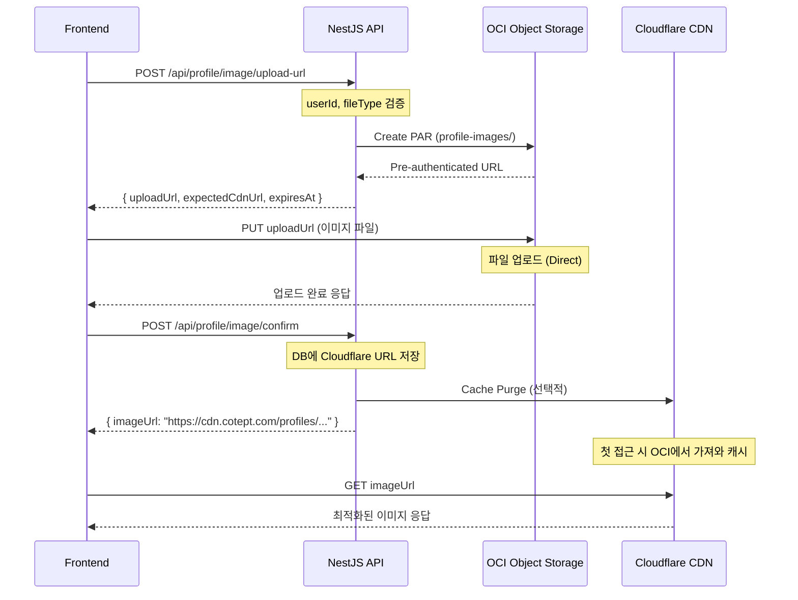
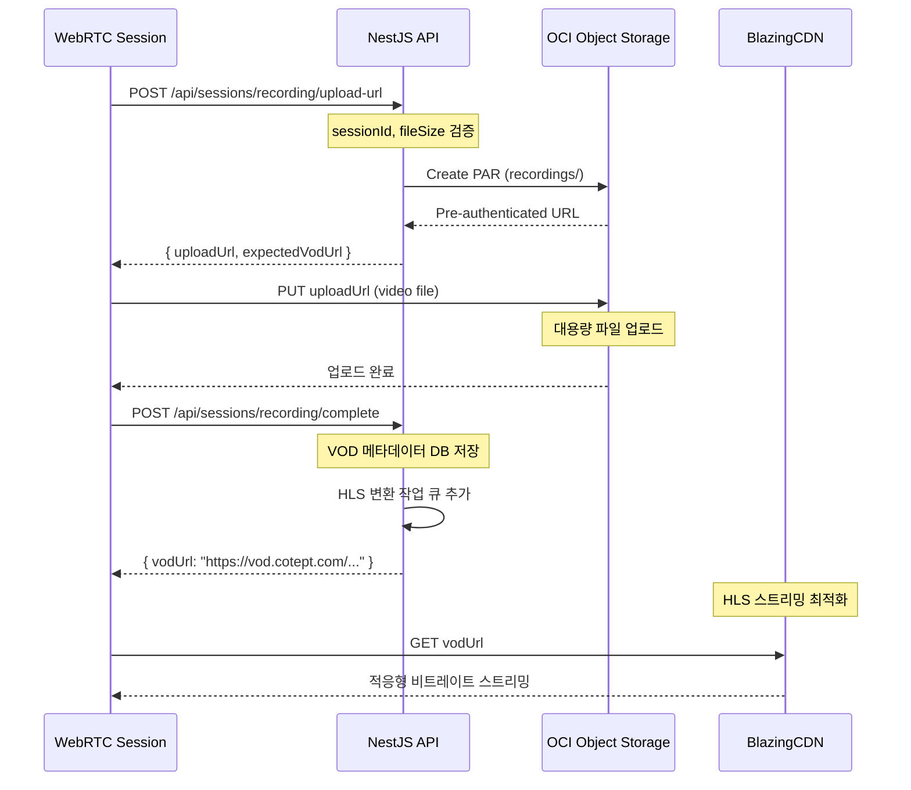

# CDN 및 Object Storage 아키텍처

## 📋 개요

CotePT 서비스의 파일 업로드 및 배포를 위한 멀티 CDN 아키텍처 설계 문서입니다. OCI Object Storage를 Origin으로 하여 BlazingCDN(VOD)과 Cloudflare(정적 에셋)를 활용하는 하이브리드 구조를 제안합니다.

## 🎯 핵심 원칙

- **전문화된 CDN 전략**: 각 CDN의 강점에 맞는 콘텐츠 배포
- **비용 최적화**: 대용량 비디오는 저렴한 BlazingCDN, 정적 에셋은 Cloudflare 무료/저가 플랜
- **보안 강화**: Private Object Storage + PAR 기반 안전한 업로드
- **성능 최적화**: 글로벌 캐싱과 지역별 최적화

## 🌐 멀티 CDN 전략

### CDN 역할 분담

#### **BlazingCDN (VOD 전용)**

- **용도**: WebRTC 세션 녹화 파일, 멘토링 영상, 대용량 미디어
- **장점**:
  - 대용량 비디오 스트리밍 최적화
  - 저렴한 대역폭 비용 (TB당 $3-5)
  - HLS/DASH 스트리밍 지원
  - 적응형 비트레이트 스트리밍
- **Origin**: OCI Object Storage (`cotept-session-recordings` 버킷)
- **파일 타입**: `.mp4`, `.webm`, `.m3u8` (HLS), `.mpd` (DASH)

#### **Cloudflare (정적 에셋)**

- **용도**: 프로필 이미지, UI 에셋, 문서 파일, 썸네일
- **장점**:
  - 글로벌 엣지 로케이션 (한국 성능 우수)
  - 무료 플랜 (월 100GB)
  - 이미지 최적화 (WebP, AVIF 변환)
  - 고급 캐시 제어
- **Origin**: OCI Object Storage (`cotept-profile-images` 버킷)
- **파일 타입**: `.jpg`, `.png`, `.webp`, `.svg`, `.pdf`, `.ico`

## 🏗️ 하이브리드 인프라 아키텍처

```
┌─────────────────┐    ┌─────────────────┐    ┌─────────────────┐
│   Frontend      │    │   Cloudflare    │    │ OCI Object      │
│   (Next.js)     │───▶│   (Images)      │───▶│ Storage         │
└─────────────────┘    └─────────────────┘    │ (Private)       │
         │                                     │                 │
         │              ┌─────────────────┐    │ profile-images/ │
         │              │   BlazingCDN    │───▶│ recordings/     │
         │              │   (Videos)      │    │ temp/           │
         │              └─────────────────┘    └─────────────────┘
         │                                              │
         ▼                                              │
┌─────────────────┐                                    │
│   NestJS API    │───────────────────────────────────▶│
│   (Backend)     │    PAR 생성 및 Object Storage 관리   │
└─────────────────┘                                    │
         │                                              │
         ▼                                              │
┌─────────────────┐                                    │
│ Oracle Database │                                    │
│   + NoSQL       │                                    │
└─────────────────┘                                    │
```

### Object Storage 버킷 구조

```yaml
OCI Object Storage:
  cotept-profile-images:
    visibility: Private
    versioning: Enabled
    encryption: AES-256
    structure:
      - profiles/
        - {userId}/
        - avatar_{timestamp}.jpg
        - cover_{timestamp}.jpg
      - temp/
        - {sessionId}_{timestamp}.jpg
    lifecycle_policy:
      - rule: "delete-temp-uploads"
        days: 1
        prefix: "temp/"

  cotept-session-recordings:
    visibility: Private
    versioning: Enabled
    encryption: AES-256
    structure:
      - recordings/
        - {sessionId}/
        - video_{timestamp}.mp4
        - hls/
        - playlist.m3u8
        - segment_001.ts
        - segment_002.ts
      - thumbnails/
        - {sessionId}_thumb.jpg
    lifecycle_policy:
      - rule: "archive-old-recordings"
        days: 90
        action: "transition-to-archive"
```

## 🔄 파일별 업로드 및 배포 플로우

### 프로필 이미지 업로드 플로우



### VOD 녹화 파일 업로드 플로우



## ⚙️ CDN 별 설정 전략

### Cloudflare 최적화 설정

```typescript
// Cloudflare 설정 (개념적 구성)
const cloudflareConfig = {
  // 캐시 정책
  cacheRules: {
    profileImages: {
      pattern: "/profiles/*",
      ttl: "7d", // 7일 캐시
      browserTtl: "1d", // 브라우저 캐시 1일
      bypassCookieHeader: true,
    },
    staticAssets: {
      pattern: "/assets/*",
      ttl: "30d", // 30일 캐시
      browserTtl: "7d",
    },
  },

  // 이미지 최적화
  imageOptimization: {
    enabled: true,
    formats: ["webp", "avif"], // 자동 포맷 변환
    quality: 85, // 품질 85%
    compression: "auto", // 자동 압축
    resizing: {
      enabled: true,
      allowedSizes: [150, 300, 600, 1200], // 반응형 크기
    },
  },

  // 보안 설정
  security: {
    hotlinkProtection: true,
    allowedDomains: ["cotept.com", "app.cotept.com"],
    rateLimiting: {
      requests: 1000,
      window: "1m",
    },
  },

  // 압축
  compression: {
    gzip: true,
    brotli: true,
  },
}
```

### BlazingCDN 비디오 스트리밍 설정

```typescript
// BlazingCDN 설정 (개념적 구성)
const blazingCdnConfig = {
  // 비디오 최적화
  videoSettings: {
    adaptiveBitrate: true, // 적응형 비트레이트
    formats: ["mp4", "webm"], // 지원 포맷
    hlsEnabled: true, // HLS 스트리밍
    dashEnabled: true, // DASH 스트리밍
    resolutions: [
      { width: 1920, height: 1080, bitrate: "5000k" },
      { width: 1280, height: 720, bitrate: "2500k" },
      { width: 854, height: 480, bitrate: "1000k" },
      { width: 640, height: 360, bitrate: "500k" },
    ],
  },

  // 캐시 정책 (대용량 파일 최적화)
  cachePolicy: {
    videos: {
      ttl: "30d", // 30일 캐시
      compressionEnabled: false, // 이미 압축된 비디오
      prefetchEnabled: true, // 인기 콘텐츠 사전 캐시
    },
    thumbnails: {
      ttl: "7d",
      compressionEnabled: true,
    },
  },

  // 지역별 최적화
  regions: {
    primary: "asia-pacific", // 주 타겟 지역
    fallback: "europe", // 백업 지역
    bandwidth: {
      guaranteed: "100Mbps", // 보장 대역폭
      burstable: "1Gbps", // 버스트 가능 대역폭
    },
  },

  // 분석 및 모니터링
  analytics: {
    realTimeStats: true,
    detailedLogs: true,
    performanceMetrics: true,
  },
}
```

## 🔧 백엔드 구현 가이드

### CDN URL 생성 서비스

```typescript
// infrastructure/services/cdn-url.service.ts
import { Injectable } from "@nestjs/common"
import { ConfigService } from "@nestjs/config"

@Injectable()
export class CdnUrlService {
  constructor(private configService: ConfigService) {}

  // 프로필 이미지 URL 생성 (Cloudflare)
  generateProfileImageUrl(objectName: string): string {
    const cdnDomain = this.configService.get("CDN_DOMAIN") // cdn.cotept.com
    return `https://${cdnDomain}/profiles/${objectName}`
  }

  // VOD URL 생성 (BlazingCDN)
  generateVodUrl(objectName: string): string {
    const vodDomain = this.configService.get("VOD_DOMAIN") // vod.cotept.com
    return `https://${vodDomain}/recordings/${objectName}`
  }

  // HLS 스트리밍 URL 생성
  generateHlsUrl(objectName: string): string {
    const vodDomain = this.configService.get("VOD_DOMAIN")
    const baseName = objectName.replace(/\.[^/.]+$/, "") // 확장자 제거
    return `https://${vodDomain}/hls/${baseName}/playlist.m3u8`
  }

  // 썸네일 URL 생성
  generateThumbnailUrl(sessionId: string): string {
    const cdnDomain = this.configService.get("CDN_DOMAIN")
    return `https://${cdnDomain}/thumbnails/${sessionId}_thumb.jpg`
  }

  // PAR 생성 시 예상 CDN URL 반환
  async createUploadUrlWithCdn(
    bucketType: "profiles" | "recordings",
    fileName: string,
    userId?: string,
  ): Promise<{
    uploadUrl: string
    expectedCdnUrl: string
    expiresAt: Date
  }> {
    // 객체명 생성 (경로 포함)
    const timestamp = Date.now()
    const objectName =
      bucketType === "profiles" ? `profiles/${userId}/${timestamp}_${fileName}` : `recordings/${timestamp}_${fileName}`

    // OCI PAR 생성
    const par = await this.ociObjectStorage.createPreAuthenticatedRequest({
      namespaceName: this.configService.get("OCI_NAMESPACE"),
      bucketName: this.getBucketName(bucketType),
      createPreAuthenticatedRequestDetails: {
        name: `upload-${timestamp}`,
        objectName,
        accessType: "ObjectWrite",
        timeExpires: new Date(Date.now() + 60 * 60 * 1000), // 1시간 만료
      },
    })

    // CDN URL 생성
    const expectedCdnUrl =
      bucketType === "profiles" ? this.generateProfileImageUrl(objectName) : this.generateVodUrl(objectName)

    return {
      uploadUrl: par.preAuthenticatedRequest.fullPath,
      expectedCdnUrl,
      expiresAt: par.preAuthenticatedRequest.timeExpires,
    }
  }

  private getBucketName(bucketType: "profiles" | "recordings"): string {
    return bucketType === "profiles" ? "cotept-profile-images" : "cotept-session-recordings"
  }
}
```

### 이미지 업로드 API 예시

```typescript
// modules/profile/infrastructure/adapter/in/controllers/profile-image.controller.ts
@Controller("profile/image")
@UseGuards(JwtAuthGuard)
@ApiTags("Profile Image")
export class ProfileImageController {
  constructor(
    private readonly cdnUrlService: CdnUrlService,
    private readonly profileImageFacade: ProfileImageFacadeService,
  ) {}

  @Post("upload-url")
  @ApiOperation({ summary: "프로필 이미지 업로드 URL 생성" })
  async generateUploadUrl(
    @GetUser() user: User,
    @Body() dto: GenerateImageUploadUrlRequestDto,
  ): Promise<ImageUploadUrlResponseDto> {
    // 파일 타입 및 크기 검증
    this.validateImageUpload(dto)

    // PAR 생성 및 예상 CDN URL 반환
    const uploadInfo = await this.cdnUrlService.createUploadUrlWithCdn("profiles", dto.fileName, user.getUserId())

    // 임시 업로드 정보 저장 (Redis 등)
    await this.profileImageFacade.saveTemporaryUploadInfo({
      userId: user.getUserId(),
      objectName: this.extractObjectName(uploadInfo.uploadUrl),
      expiresAt: uploadInfo.expiresAt,
    })

    return {
      uploadUrl: uploadInfo.uploadUrl,
      expectedImageUrl: uploadInfo.expectedCdnUrl,
      expiresAt: uploadInfo.expiresAt,
      maxFileSize: 5 * 1024 * 1024, // 5MB
      allowedTypes: ["image/jpeg", "image/png", "image/webp"],
    }
  }

  @Post("confirm")
  @ApiOperation({ summary: "프로필 이미지 업로드 완료 확인" })
  async confirmImageUpload(
    @GetUser() user: User,
    @Body() dto: ConfirmImageUploadRequestDto,
  ): Promise<ProfileImageResponseDto> {
    return await this.profileImageFacade.confirmImageUpload({
      userId: user.getUserId(),
      imageUrl: dto.imageUrl,
    })
  }

  private validateImageUpload(dto: GenerateImageUploadUrlRequestDto): void {
    const allowedExtensions = ["jpg", "jpeg", "png", "webp"]
    const maxFileSize = 5 * 1024 * 1024 // 5MB

    const extension = dto.fileName.split(".").pop()?.toLowerCase()
    if (!extension || !allowedExtensions.includes(extension)) {
      throw new BadRequestException("지원하지 않는 이미지 형식입니다.")
    }

    if (dto.fileSize > maxFileSize) {
      throw new BadRequestException("파일 크기는 5MB를 초과할 수 없습니다.")
    }
  }
}
```

## 🔒 보안 및 접근 제어

### Origin 접근 제어

```typescript
// OCI Object Storage 버킷 정책 (개념적)
const bucketSecurityPolicy = {
  // 직접 접근 차단
  blockPublicAccess: true,

  // 허용된 CDN만 접근 가능
  allowedOrigins: [
    "cdn.cotept.com", // Cloudflare 도메인
    "vod.cotept.com", // BlazingCDN 도메인
    "api.cotept.com", // Backend API 도메인
  ],

  // CORS 설정
  corsConfiguration: {
    allowedMethods: ["GET", "PUT", "POST"],
    allowedHeaders: ["Content-Type", "Authorization"],
    allowedOrigins: ["https://app.cotept.com"],
    maxAgeSeconds: 3600,
  },

  // 암호화
  encryption: {
    type: "AES-256",
    kmsKeyId: "ocid1.key.region.sea.xxxxx",
  },
}
```

### Hotlink Protection

```typescript
// Cloudflare 워커를 통한 Hotlink Protection (개념적)
const hotlinkProtection = {
  allowedReferers: ["https://cotept.com", "https://app.cotept.com", "https://admin.cotept.com"],

  blockDirectAccess: true,

  // 토큰 기반 접근 제어 (선택적)
  tokenValidation: {
    enabled: false, // 필요시 활성화
    algorithm: "HS256",
    expirationTime: "1h",
  },
}
```

## 💰 비용 최적화 전략

### 스토리지 비용 최적화

```yaml
OCI Object Storage 라이프사이클:
  profile-images:
    Standard: 0-30일 (자주 접근)
    Infrequent Access: 30-90일 (가끔 접근)
    Archive: 90일+ (장기 보관)

  session-recordings:
    Standard: 0-7일 (최근 녹화)
    Infrequent Access: 7-30일 (리뷰용)
    Archive: 30일+ (백업용)
```

### CDN 비용 분석

#### **Cloudflare (정적 에셋)**

- **무료 플랜**: 월 100GB (예상 커버리지: 80%)
- **Pro 플랜**: $20/월 (이미지 최적화, 고급 캐시)
- **예상 월 비용**: $0-20 (서비스 초기)

#### **BlazingCDN (VOD)**

- **대용량 비디오**: TB당 $3-5
- **HLS 스트리밍**: 추가 비용 없음
- **예상 월 비용**: $50-200 (세션 수에 따라)

#### **OCI Object Storage**

- **Standard Tier**: GB당 $0.0255/월
- **Infrequent Access**: GB당 $0.01/월
- **Archive**: GB당 $0.0017/월
- **예상 월 비용**: $10-50 (데이터 증가에 따라)

### 비용 모니터링

```typescript
// 비용 추적을 위한 메트릭스
const costMetrics = {
  // 스토리지 사용량
  storage: {
    profileImages: "GB/월",
    sessionRecordings: "GB/월",
    totalStorage: "GB/월",
  },

  // CDN 트래픽
  cdn: {
    cloudflareTraffic: "GB/월",
    blazingCdnTraffic: "GB/월",
    cacheHitRatio: "%",
  },

  // API 호출
  api: {
    parRequests: "횟수/월",
    uploadRequests: "횟수/월",
  },
}
```

## 📊 모니터링 및 알림

### 성능 메트릭스

```typescript
// 성능 모니터링 대시보드
const performanceMetrics = {
  // 업로드 성능
  upload: {
    averageUploadTime: "ms",
    successRate: "%",
    errorRate: "%",
  },

  // CDN 성능
  cdn: {
    cacheHitRatio: "%",
    averageResponseTime: "ms",
    bandwidth: "Mbps",
  },

  // 사용자 경험
  userExperience: {
    imageLoadTime: "ms",
    videoStartTime: "ms",
    bufferingEvents: "count",
  },
}
```

### 알림 설정

```yaml
Alerts:
  high_error_rate:
    condition: error_rate > 5%
    action: email + slack

  low_cache_hit_ratio:
    condition: cache_hit_ratio < 80%
    action: slack

  high_storage_usage:
    condition: storage_growth > 50GB/day
    action: email

  cdn_performance:
    condition: avg_response_time > 2000ms
    action: slack
```

## 🚀 향후 개선 계획

### 단계별 구현 로드맵

#### **Phase 1 (기본 구현)**

- OCI Object Storage 버킷 설정
- PAR 기반 업로드 API 구현
- Cloudflare CDN 연동 (프로필 이미지)

#### **Phase 2 (VOD 연동)**

- BlazingCDN 연동 (비디오 파일)
- HLS 스트리밍 구현
- 썸네일 자동 생성

#### **Phase 3 (최적화)**

- 이미지 자동 압축 및 포맷 변환
- 적응형 비트레이트 스트리밍
- 고급 캐시 전략

#### **Phase 4 (고도화)**

- AI 기반 콘텐츠 분석
- 실시간 스트리밍 (WebRTC → CDN)
- 글로벌 배포 최적화

### 기술 부채 관리

```typescript
// 기술 부채 항목들
const technicalDebtItems = [
  {
    item: "Legacy 이미지 URL 마이그레이션",
    priority: "High",
    effort: "2 weeks",
  },
  {
    item: "CDN 캐시 무효화 자동화",
    priority: "Medium",
    effort: "1 week",
  },
  {
    item: "비용 최적화 자동 스케일링",
    priority: "Low",
    effort: "3 weeks",
  },
]
```

---

이 문서는 CotePT 온보딩 시스템 구현 전에 필요한 인프라 아키텍처를 명확히 정의하여, 안정적이고 확장 가능한 파일 관리 시스템 구축의 기반을 제공합니다.
