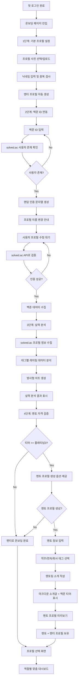

# CotePT 온보딩 플로우

## 📋 개요

CotePT의 사용자 온보딩은 **단순함**과 **자동화**를 핵심 원칙으로 하여, 사용자 입력을 최소화하면서도 개인화된 서비스를 제공합니다.

## 🎯 핵심 원칙

- **단순함**: 사용자 입력 최소화 (프로필 사진 + 닉네임만)
- **자동화**: 백준 연동 후 시스템이 프로필 데이터 자동 채움
- **조건부 확장**: 실력 기반 멘토 자격 검증 (플래티넘3 이상)
- **시각화**: 방사형 차트로 실력 분석 표현

## 🔄 온보딩 플로우



## 📋 단계별 상세 설명

### 1단계: 기본 프로필 설정

**목표**: 최소한의 사용자 입력으로 기본 프로필 생성

**사용자 입력**:
- 프로필 사진 (업로드 또는 기본 이미지 선택)
- 닉네임 (중복 검사 포함)

**시스템 처리**:
- 멘티 프로필 자동 생성
- 기본 프로필 정보 저장

### 2단계: 백준 ID 연동

**목표**: solved.ac API를 통한 백준 계정 소유권 인증

**인증 프로세스**:
1. 백준 ID 입력
2. solved.ac 사용자 존재 확인
3. 랜덤 인증 문자열 생성 (예: "배부른고양이223")
4. 사용자에게 프로필 이름 변경 요청
5. solved.ac API로 프로필 이름 검증
6. 인증 성공시 백준 데이터 수집

**사용 API**:
- `https://solved.ac/api/v3/user/show?handle={userId}`
- `https://solved.ac/api/v3/user/tag_ratings?handle={userId}`

### 3단계: 실력 분석 및 시각화

**목표**: 백준 데이터를 통한 사용자 실력 분석 및 시각화

**분석 데이터**:
- 기본 프로필: 티어, 레이팅, 해결 문제 수
- 태그별 분석: 알고리즘 유형별 실력 분포
- 성장 지표: 클래스, 스트릭, 경쟁 참여 이력

**시각화**:
- **방사형 차트**: 알고리즘 유형별 강약점 표시
- **티어 진행률**: 현재 티어 및 다음 티어까지 진행도
- **해결 문제 통계**: 난이도별 해결 현황

### 4단계: 조건부 멘토 자격 확인

**목표**: 실력 기반 멘토 자격 검증 및 멘토 프로필 생성

**멘토 자격 조건**:
- **티어**: 플래티넘3 (Platinum III) 이상
- **solved.ac tier 값**: 16 이상

**멘토 온보딩 (조건 충족시)**:
- **F4**: 직무/연차/회사 태그 선택 (각 1개씩 필수)
- **F5**: 마크다운 형식 멘토링 소개글 작성 + 백준 티어 자동 표시
- **F6**: 멘토 프로필 미리보기 및 최종 확인

### 멘토 프로필 구조 (인프런 분석 기반)

**목표**: 인프런 멘토 프로필 분석을 바탕으로 한 실용적인 멘토 프로필 구성

#### 📊 인프런 프로필 구조 분석

**기본 프로필 요소**:
- 프로필 이미지 + 닉네임 (기존 user-profile에서 가져오기)
- 한 줄 자기소개 (선택사항)
- 프로필 URL: `cotept.com/mentor/@username`

**멘토 전용 정보**:
- **역할 태그** (각 카테고리에서 1개씩 선택):
  - 직무: "프론트엔드 개발자", "백엔드 개발자", "풀스택 개발자", "데브옵스 엔지니어", "프로덕트 디자이너"
  - 연차: "주니어 레벨", "미들 레벨", "시니어 레벨", "Lead 레벨"
  - 회사: "네카라쿠배", "스타트업", "외국계", "기타"
- **백준 티어**: 자동 표시 (플래티넘3 이상 보장)
- **멘토링 소개**: 마크다운 형식 자유 작성 (제한 없음)

**자동 생성 통계** (사용자 입력 불가):
- 멘티 수, 리뷰 수, 평점 (서비스 운영 중 자동 누적)

#### 📋 F4-F6 단계별 상세

**F4: 멘토 정보 입력**
- 직무 태그 선택 (라디오 버튼, 필수)
- 연차 태그 선택 (라디오 버튼, 필수)
- 회사 태그 선택 (라디오 버튼, 필수)

**F5: 멘토링 소개 작성**
- 백준 티어 자동 표시 (읽기 전용)
- 마크다운 에디터로 소개글 작성
- 실시간 미리보기 제공
- 글자 수 제한 없음 (합리적 범위 내)

**F6: 멘토 프로필 완성**
- 최종 프로필 미리보기
- 모든 입력 정보 확인
- 멘토 프로필 생성 완료

### 5단계: 프로필 선택 시스템

**목표**: 역할별 맞춤 서비스 제공

**프로필 선택 화면**:
```
┌─────────────────────────────────────────┐
│             프로필 선택                    │
├─────────────────────────────────────────┤
│  📚 멘티 프로필        🎓 멘토 프로필      │
│  배우고 성장하기        가르치고 도움주기    │
│                                         │
│  [항상 사용 가능]      [조건 충족시 활성화] │
└─────────────────────────────────────────┘
```

## 🛠️ 기술 구현 요구사항

### Frontend

**온보딩 컴포넌트**:
- `OnboardingLayout`: 전체 온보딩 레이아웃
- `ProfileSetupStep`: 기본 프로필 설정 단계
- `BaekjoonVerifyStep`: 백준 ID 인증 단계
- `SkillAnalysisStep`: 실력 분석 결과 표시
- `MentorTagSelectionStep`: 멘토 태그 선택 (F4)
- `MentorIntroEditorStep`: 멘토 소개글 마크다운 에디터 (F5)
- `MentorProfilePreviewStep`: 멘토 프로필 미리보기 (F6)
- `ProfileSelectPage`: 프로필 선택 화면

**차트 컴포넌트**:
- `RadarChart`: 방사형 차트 (알고리즘 유형별 실력)
- `TierProgressBar`: 티어 진행률 표시
- `ProblemStatsChart`: 문제 해결 통계

**폼 관리**:
- React Hook Form + Zod 검증
- 이미지 업로드 처리 (기존 user-profile 활용)
- 실시간 닉네임 중복 검사
- 마크다운 에디터 및 실시간 미리보기
- 태그 선택 UI (라디오 버튼 그룹)

### Backend

**API 엔드포인트**:
```typescript
// 온보딩 관련
POST /api/v1/onboarding/profile          // 기본 프로필 생성
POST /api/v1/onboarding/baekjoon/verify  // 백준 ID 인증
GET  /api/v1/onboarding/baekjoon/status  // 인증 상태 확인
POST /api/v1/onboarding/mentor/info      // 멘토 정보 입력 (F4: 태그 선택)
POST /api/v1/onboarding/mentor/intro     // 멘토 소개글 저장 (F5: 마크다운)
POST /api/v1/onboarding/mentor/complete  // 멘토 프로필 완성 (F6: 최종 확인)
GET  /api/v1/onboarding/mentor/tags      // 사용 가능한 태그 목록

// 프로필 관리
GET  /api/v1/profiles                    // 사용자 프로필 목록
POST /api/v1/profiles/select             // 프로필 선택
```

**데이터 모델**:
```typescript
// 기본 사용자 정보
type User = {
  id: string
  email: string
  onboardingCompleted: boolean
  currentProfileId?: string
}

// 사용자 프로필
type UserProfile = {
  id: string
  userId: string
  profileType: 'MENTOR' | 'MENTEE'
  nickname: string
  profileImageUrl: string
  bio?: string
  isActive: boolean
  createdAt: Date
}

// 백준 연동 정보
type BaekjoonData = {
  userId: string
  baekjoonId: string
  tier: number
  rating: number
  solvedCount: number
  tagRatings: TagRating[]
  lastSyncAt: Date
}

// 멘토 전용 정보
type MentorProfile = {
  profileId: string
  // 역할 태그 (각 1개씩)
  jobTag: string              // 직무 태그 (예: "프론트엔드 개발자")
  levelTag: string            // 연차 태그 (예: "시니어 레벨")
  companyTag: string          // 회사 태그 (예: "네카라쿠배")
  // 멘토링 정보
  introduction: string        // 마크다운 형식 소개글
  baekjoonTier: number       // 백준 티어 (자동 표시용)
  // 통계 정보 (자동 생성)
  menteeCount: number        // 멘티 수
  reviewCount: number        // 리뷰 수
  rating: number             // 평점
  isActive: boolean          // 멘토 활성 상태
}

// 온보딩 진행 상태
type OnboardingState = {
  userId: string
  currentStep: number
  profileCreated: boolean
  baekjoonVerified: boolean
  skillAnalysisCompleted: boolean
  mentorProfileCreated?: boolean
  completedAt?: Date
}

// 멘토 태그 시스템
type MentorTags = {
  jobTags: string[]           // ["프론트엔드 개발자", "백엔드 개발자", "풀스택 개발자", ...]
  levelTags: string[]         // ["주니어 레벨", "미들 레벨", "시니어 레벨", "Lead 레벨"]
  companyTags: string[]       // ["네카라쿠배", "스타트업", "외국계", "기타"]
}

// API DTO 타입들
type MentorInfoRequestDto = {
  jobTag: string
  levelTag: string
  companyTag: string
}

type MentorIntroRequestDto = {
  introduction: string        // 마크다운 형식
}

type MentorProfileResponseDto = {
  profileId: string
  nickname: string
  profileImageUrl: string
  jobTag: string
  levelTag: string
  companyTag: string
  baekjoonTier: number
  introduction: string
  menteeCount: number
  reviewCount: number
  rating: number
  profileUrl: string          // cotept.com/mentor/@username
}
```

## 🎨 UI/UX 가이드라인

### 디자인 원칙

1. **진행률 표시**: 각 단계마다 진행률을 명확히 표시
2. **스킵 옵션**: 복잡한 과정은 "나중에 하기" 옵션 제공
3. **피드백**: 각 액션에 대한 즉시 피드백 제공
4. **일관성**: 기존 CotePT 디자인 시스템 활용

### 스테퍼 UI

```
1. 프로필 설정 → 2. 백준 연동 → 3. 실력 분석 → 4. 완료
   [완료]         [진행중]      [대기]       [대기]
```

### 방사형 차트 구성

**알고리즘 카테고리 (8개 축)**:
- 구현 (Implementation)
- 그래프 (Graph)
- 동적 계획법 (Dynamic Programming)
- 수학 (Mathematics)
- 자료구조 (Data Structures)
- 문자열 (String)
- 기하학 (Geometry)
- 그리디 (Greedy)

## 📱 반응형 고려사항

- **모바일**: 단계별 풀스크린 표시
- **태블릿**: 사이드 네비게이션 + 메인 콘텐츠
- **데스크톱**: 좌측 스테퍼 + 우측 콘텐츠 영역

## 🔄 예외 처리

### 백준 ID 인증 실패
- 사용자 존재하지 않음 → 다시 입력 요청
- 프로필 이름 불일치 → 재시도 안내
- API 호출 실패 → 나중에 다시 시도 옵션

### 네트워크 오류
- 자동 재시도 (최대 3회)
- 오프라인 상태 감지
- 로컬 저장소 활용한 임시 저장

## 📊 성공 지표

- **완료율**: 온보딩 시작 대비 완료율 80% 이상
- **소요 시간**: 평균 온보딩 완료 시간 5분 이내
- **이탈률**: 각 단계별 이탈률 15% 이하
- **멘토 전환율**: 자격 충족 사용자 중 멘토 프로필 생성률 60% 이상

## 🚀 향후 개선 계획

- **소셜 인증**: GitHub, Google 연동 추가
- **개인화**: AI 기반 맞춤 학습 경로 제안
- **가이드 투어**: 인터랙티브 서비스 소개
- **프로그레시브 온보딩**: 서비스 사용 중 점진적 정보 수집