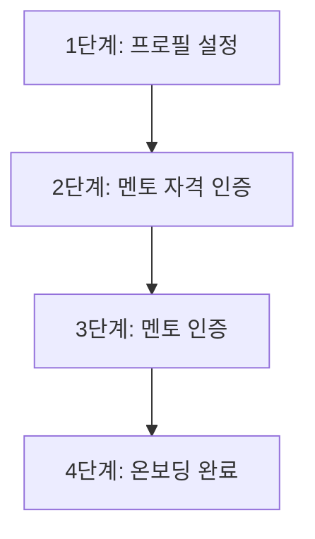

# CotePT 온보딩 플로우

## 온보딩 플로우 다이어그램

```mermaid

flowchart TD
    A[1단계: 프로필 설정]
    B[2단계: 멘토 자격 인증]
    C[3단계: 멘토 인증]
    D[4단계: 온보딩 완료]

    A --> B
    B --> C
    C --> D
```

## 단계별 요약

### 1단계: 프로필 설정

- 프로필 사진 선택 또는 업로드
- 닉네임 입력 및 중복 검사
- 기본 멘티 프로필 자동 생성

### 2단계: 멘토 자격 인증

- 백준 티어 인증 (플래티넘 3 이상)
- 추가 자격 인증 옵션 (기업 코딩 테스트 합격 이메일, 경력이 인증된 LinkedIn 프로필 등 예정)
- 자격 충족 여부 확인

### 3단계: 멘토 인증 (조건부)

- 자격 충족자에 한해 멘토 프로필 생성 옵션 제공
- 직무, 연차, 회사 태그 선택
- 멘토링 소개글 작성 및 프로필 미리보기

### 4단계: 온보딩 완료

- 대시보드로 이동
