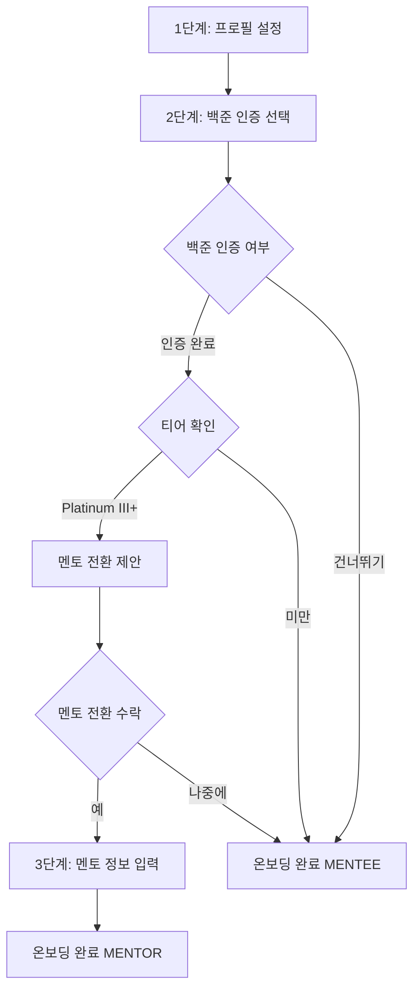

# CotePT 온보딩 플로우

> **설계 철학**: 권한 확장(Permission Extension) 기반 - 멘토는 멘티의 모든 기능 + 추가 기능을 가집니다.

## 온보딩 플로우 다이어그램


```mermaid
flowchart TD
    A[1단계: 프로필 설정]
    B[2단계: 백준 인증 선택]
    C{백준 인증 여부}
    D{티어 확인}
    E[멘토 전환 제안]
    F{멘토 전환 수락}
    G[3단계: 멘토 정보 입력]
    H[온보딩 완료 MENTEE]
    I[온보딩 완료 MENTOR]

    A --> B
    B --> C
    C -->|건너뛰기| H
    C -->|인증 완료| D
    D -->|Platinum III+| E
    D -->|미만| H
    E --> F
    F -->|예| G
    F -->|나중에| H
    G --> I
```

## 단계별 상세 설명

### 1단계: 프로필 설정 (필수)

**목적**: 기본 사용자 정보 수집

**입력 항목**:

- 프로필 사진 선택 또는 업로드
- 닉네임 입력 및 중복 검사
- 기본 사용자 프로필 생성

**완료 조건**: 모든 필수 항목 입력

**구현 상태**: ✅ 완료

---

### 2단계: 백준 인증 (선택적)

**목적**: 실력 확인 및 멘토 자격 검증

**사용자 선택**:

1. **인증하기**
   - 백준 ID 입력
   - solved.ac 프로필 인증 (랜덤 문자열 방식)
   - 티어 정보 자동 수집

2. **건너뛰기**
   - 온보딩 완료 (MENTEE 역할)
   - 메인 페이지로 이동

**티어별 분기**:

- **Platinum III 이상**: 멘토 전환 제안 표시
- **Platinum III 미만**: 온보딩 완료 (MENTEE)

**구현 참조**: [helpers.ts:34-63](apps/web/src/features/onboarding/lib/validations/helpers.ts#L34-L63) `checkMentorEligibility()`

**구현 상태**: ✅ 완료 (멘토 전환 제안 로직 추가 필요)

---

### 멘토 전환 제안 (Platinum III+ 사용자만)

**제안 화면 구성**:

```
🎉 멘토 자격을 충족하셨습니다!

현재 티어: Platinum III

멘토로 활동하시면 다음 기능을 사용할 수 있습니다:
- 멘토링 포스트 작성 및 세션 개설
- 멘티 관리 및 일정 관리
- 수익 정산 및 통계 확인

[멘토 프로필 설정하기]  [나중에 하기]
```

**사용자 선택**:

1. **멘토 프로필 설정하기**
   - 3단계 멘토 정보 입력으로 이동

2. **나중에 하기**
   - 온보딩 완료 (MENTEE 역할)
   - 마이페이지에서 나중에 멘토 전환 가능

**구현 상태**: 🔨 구현 예정

---

### 3단계: 멘토 정보 입력 (조건부)

**진입 조건**: Platinum III+ 사용자가 멘토 전환 수락 시만

**입력 항목**:

1. **멘토링 가능 분야 태그** (필수)
   - 직무: Backend, Frontend, Algorithm, 등
   - 연차: 신입, 1-3년차, 3-5년차, 5년 이상
   - 회사명 (선택)

2. **멘토링 소개글** (필수)
   - 최소 200자
   - 멘토링 스타일 및 강점 소개
   - 프로필 미리보기 제공

**완료 처리**:

- `User.role = MENTOR` 업데이트
- `MENTOR_PROFILE` 생성
- 온보딩 완료 (MENTOR)

**구현 상태**: 🔨 구현 예정

---

### 온보딩 완료

**MENTEE 역할**:

- `/main` 페이지로 리다이렉트
- 기본 위젯 표시:
  - [추천 멘토]
  - [실력 분석]
  - [인기 문제]

**MENTOR 역할**:

- `/main` 페이지로 리다이렉트
- 기본 위젯 + 멘토 전용 위젯 표시:
  - **기본**: [추천 멘토] [실력 분석] [인기 문제]
  - **멘토 전용**: [예정된 세션] [멘토링 포스트 작성] [정산 대시보드]

---

## 제거된 단계

### ❌ 실력 분석 단계 (제거됨)

**기존 위치**: 3단계 (백준 인증과 멘토 인증 사이)

**제거 사유**:

- 온보딩 시간 단축 (3-4분 목표)
- 점진적 공개(Progressive Disclosure) 원칙 적용
- 첫 사용자 경험의 마찰 최소화

**이동 위치**:

- 메인 페이지 위젯으로 제공
- 마이 페이지에서 언제든지 접근 가능
- 백준 인증 완료 후 언제든 사용 가능

---

## 권한 확장 모델

**핵심 개념**: 멘토 = 멘티 + 확장 권한

| 역할       | 기본 기능                                         | 멘토 전용 기능                                                 |
| ---------- | ------------------------------------------------- | -------------------------------------------------------------- |
| **MENTEE** | ✅ 멘토 검색/예약<br>✅ 실력 분석<br>✅ 문제 추천 | ❌ 없음                                                        |
| **MENTOR** | ✅ **모든 멘티 기능**                             | ✅ 멘토링 포스트 작성<br>✅ 세션 개설/관리<br>✅ 정산 대시보드 |

**장점**:

- 역할 전환 메커니즘 불필요
- 단일 메인 페이지에서 모든 기능 접근
- SSR 기반 조건부 렌더링으로 간단한 구현
- UX 마찰 최소화 (역할 선택 단계 제거)

---

## 구현 체크리스트

### Phase 1: 온보딩 플로우 간소화

- [x] 1단계: 프로필 설정 스텝
- [x] 2단계: 백준 인증 스텝
- [ ] 멘토 전환 제안 로직 (`checkMentorEligibility()` 활용)
- [ ] 3단계: 멘토 정보 입력 스텝 (조건부)
- [ ] User.role 업데이트 API 연동

### Phase 2: 메인 페이지 연동

- [ ] 온보딩 완료 후 `/main` 리다이렉트
- [ ] 역할별 메인 페이지 위젯 SSR 렌더링
- [ ] 실력 분석 위젯 구현 (온보딩에서 이동)

---

## 참고 문서

- [로그인 및 메인 페이지 플로우 설계](/.claude/plans/melodic-humming-starfish.md)
- [비즈니스 규칙](../business-rules.md)
- [온보딩 헬퍼 함수](../../apps/web/src/features/onboarding/lib/validations/helpers.ts)
