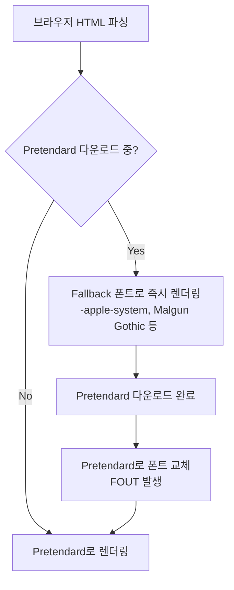

# 프론트엔드 폰트 최적화 가이드

> **CotePT 프로젝트에서 Pretendard Variable Font를 Next.js 15와 Tailwind CSS v4로 적용한 경험 기반 문서**

---

## 목차

1. [웹 폰트 기초](#1-웹-폰트-기초)
2. [폰트 포맷 선택](#2-폰트-포맷-선택)
3. [Next.js 폰트 최적화](#3-nextjs-폰트-최적화)
4. [Variable Font (가변 폰트)](#4-variable-font-가변-폰트)
5. [font-display 전략](#5-font-display-전략)
6. [CotePT 프로젝트 적용 사례](#6-cotept-프로젝트-적용-사례)
7. [성능 최적화 체크리스트](#7-성능-최적화-체크리스트)
8. [트러블슈팅](#8-트러블슈팅)

---

## 1. 웹 폰트 기초

### 1.1 폰트 로딩 방식 비교

| 방식 | 장점 | 단점 | 사용 예시 |
|------|------|------|-----------|
| **System Font** | 로딩 불필요, 즉시 렌더링 | 플랫폼별 차이, 디자인 제한 | `-apple-system`, `BlinkMacSystemFont` |
| **CDN (Google Fonts 등)** | 설치 간편, 캐싱 공유 | 외부 의존성, GDPR 이슈, 느린 로딩 | `<link href="https://fonts.googleapis.com/...">` |
| **Self-hosting** | 빠른 로딩, 제어 가능, 개인정보 보호 | 수동 관리 필요 | Next.js `localFont()` |

**권장**: Self-hosting (Next.js 환경에서는 `next/font/local`)

---

## 2. 폰트 포맷 선택

### 2.1 포맷별 특징

| 포맷 | 압축률 | 브라우저 지원 | 사용 권장 |
|------|--------|---------------|-----------|
| **WOFF2** | 최고 (30% 압축) | 모던 브라우저 (IE 제외) | ✅ **1순위** |
| **WOFF** | 양호 | IE9+ 포함 전체 | Fallback용 |
| **TTF/OTF** | 낮음 | 전체 | 레거시 지원용 |
| **EOT** | - | IE 전용 | ❌ 사용 안 함 |

**CotePT 선택**: **WOFF2 단독 사용** (2024년 기준 IE 지원 불필요)

### 2.2 브라우저 지원률

- **WOFF2**: Chrome 36+, Firefox 39+, Safari 12+, Edge 14+ (2024년 기준 **98% 지원**)
- 레거시 브라우저는 시스템 폰트로 Fallback

---

## 3. Next.js 폰트 최적화

### 3.1 `next/font` 기능

Next.js는 두 가지 폰트 모듈을 제공합니다:

#### A. `next/font/google` (Google Fonts)

```tsx
import { Inter } from 'next/font/google'

const inter = Inter({
  subsets: ['latin'],
  display: 'swap',
})
```

**장점**:
- Google Fonts API 자동 호출
- 자동 subsetting (필요한 문자만 포함)

**단점**:
- 빌드 타임에 Google 서버 요청 필요
- 한글 폰트 선택지 제한적

#### B. `next/font/local` (Self-hosting)

```tsx
import localFont from 'next/font/local'

const pretendard = localFont({
  src: '../fonts/PretendardVariable.woff2',
  display: 'swap',
  weight: '45 920',
  variable: '--font-pretendard',
})
```

**장점**:
- 완전한 제어권
- 빌드 타임 외부 요청 없음
- 한글 폰트 자유롭게 사용 가능

**CotePT 선택**: `next/font/local` (Pretendard 적용)

---

### 3.2 Next.js 자동 최적화 항목

Next.js가 `localFont()`를 사용하면 자동으로 처리하는 최적화:

#### ✅ 1. **Preload 자동 삽입**

```html
<link
  rel="preload"
  href="/_next/static/media/abc123-PretendardVariable.woff2"
  as="font"
  type="font/woff2"
  crossorigin="anonymous"
/>
```

**효과**: 브라우저가 폰트를 최우선으로 다운로드 (렌더링 블로킹 방지)

---

#### ✅ 2. **Layout Shift 방지 (size-adjust)**

폰트 로딩 전후 텍스트 크기 변화를 최소화:

```css
@font-face {
  font-family: '__Pretendard_abc123';
  src: url(...);
  size-adjust: 102.5%; /* Next.js 자동 계산 */
}
```

**효과**: CLS (Cumulative Layout Shift) 점수 개선 → Core Web Vitals 향상

---

#### ✅ 3. **CSS 변수 자동 생성**

```tsx
const pretendard = localFont({
  variable: '--font-pretendard', // 이 옵션으로 CSS 변수 생성
})

// 생성되는 HTML
<body class="__variable_abc123" style="--font-pretendard: '__Pretendard_abc123';">
```

**사용처**: Tailwind CSS나 일반 CSS에서 `var(--font-pretendard)` 참조 가능

---

#### ✅ 4. **Subsetting (선택적)**

```tsx
const font = localFont({
  src: './font.woff2',
  adjustFontFallback: 'Arial', // Fallback 메트릭 매칭
})
```

**효과**: 폰트 메트릭을 Fallback 폰트에 맞춰 조정 (Layout Shift 추가 방지)

---

## 4. Variable Font (가변 폰트)

### 4.1 개념

**일반 폰트 (Static Font)**:
- 굵기별 파일 필요: `Regular.woff2`, `Medium.woff2`, `Bold.woff2`...
- HTTP 요청 수 증가 → 성능 저하

**Variable Font**:
- **단일 파일**에 모든 굵기 포함
- 굵기 범위 내 **연속적인 값** 사용 가능 (예: `font-weight: 457`)

### 4.2 Pretendard Variable 스펙

| 속성 | 값 |
|------|-----|
| Weight 범위 | 45 (ExtraLight) ~ 920 (Black) |
| 파일 크기 | ~2MB (전체 굵기 포함) |
| 지원 문자 | 한글(KS X 1001) + 라틴 + 숫자 + 기호 |

**비교**:

```
[일반 폰트]
Pretendard-Regular.woff2     (400kb)
Pretendard-Medium.woff2      (400kb)
Pretendard-SemiBold.woff2    (400kb)
Pretendard-Bold.woff2        (400kb)
--------------------------------------------
Total: 1.6MB (4 requests)

[Variable Font]
PretendardVariable.woff2     (2MB, 1 request)
```

**장점**:
- HTTP 요청 1회로 감소
- 다양한 굵기 사용 가능 (`font-weight: 350`, `font-weight: 680` 등)
- 애니메이션 가능 (`font-weight` transition)

---

### 4.3 Variable Font 적용

```tsx
const pretendard = localFont({
  src: '../fonts/PretendardVariable.woff2',
  weight: '45 920', // 범위 지정 (min max)
  variable: '--font-pretendard',
})
```

**Tailwind CSS 사용**:

```tsx
<h1 className="font-black">      {/* 900 */}
<h2 className="font-bold">       {/* 700 */}
<p className="font-normal">      {/* 400 */}
<span className="font-[550]">    {/* 커스텀 550 굵기 */}
```

---

## 5. font-display 전략

### 5.1 옵션별 비교

| 값 | 동작 | 사용 사례 |
|----|------|----------|
| **`auto`** | 브라우저 기본값 (보통 `block`) | - |
| **`block`** | 폰트 로딩 완료까지 텍스트 숨김 (FOIT) | 브랜드 로고 등 폰트가 필수인 경우 |
| **`swap`** | 시스템 폰트로 먼저 표시 후 교체 (FOUT) | ✅ **일반적으로 권장** (UX 최우선) |
| **`fallback`** | 100ms 대기 → 시스템 폰트 → 3초 내 교체 | 폰트와 Fallback이 유사한 경우 |
| **`optional`** | 네트워크 상태에 따라 결정 (빠르면 사용) | 폰트가 선택사항인 경우 |

### 5.2 용어 정리

- **FOIT** (Flash of Invisible Text): 폰트 로딩 중 텍스트 숨김
- **FOUT** (Flash of Unstyled Text): 폰트 로딩 중 Fallback 폰트 표시

### 5.3 CotePT 선택: `swap`

```tsx
const pretendard = localFont({
  display: 'swap', // ← 즉시 읽기 가능한 텍스트 제공
})
```

**이유**:
1. **접근성**: 텍스트가 즉시 보임 (시각 장애인 스크린 리더도 읽기 가능)
2. **UX**: 느린 네트워크에서도 콘텐츠 소비 가능
3. **SEO**: 검색 엔진이 텍스트를 빠르게 인덱싱

---

## 6. CotePT 프로젝트 적용 사례

### 6.1 디렉토리 구조

```
apps/web/
├── src/
│   ├── app/
│   │   └── layout.tsx          # 폰트 로드 및 전역 적용
│   └── fonts/
│       └── PretendardVariable.woff2  # 2MB Variable Font
└── package.json                # pretendard@1.3.9 설치

packages/shared/
└── src/
    └── styles/
        └── globals.css         # Tailwind v4 폰트 토큰 정의
```

---

### 6.2 설치 과정

#### Step 1: npm 패키지 설치

```bash
pnpm add pretendard --filter web
```

**패키지 방식 선택 이유**:
- 버전 관리 (`package.json`에 명시)
- CI/CD 자동화 (`pnpm install`로 일괄 설치)
- Git 저장소 경량화 (2MB 폰트 파일을 Git에 커밋하지 않음)

---

#### Step 2: 폰트 파일 복사

```bash
cp node_modules/.pnpm/pretendard@1.3.9/node_modules/pretendard/dist/web/variable/woff2/PretendardVariable.woff2 \
   apps/web/src/fonts/
```

**위치 선택**:
- `src/fonts/` (권장): 간결한 구조, `next/font/local` 기본 위치
- `public/fonts/`: 정적 자산으로 직접 서빙 (Next.js 최적화 미적용)

---

#### Step 3: `layout.tsx`에서 로드

**파일**: `apps/web/src/app/layout.tsx`

```tsx
import localFont from "next/font/local"
import "@repo/shared/globals.css"

// Pretendard Variable Font 로드
const pretendard = localFont({
  src: "../fonts/PretendardVariable.woff2",
  display: "swap",
  weight: "45 920",
  variable: "--font-pretendard",
})

export default function RootLayout({ children }: Readonly<{ children: React.ReactNode }>) {
  return (
    <html lang="ko" suppressHydrationWarning>
      <body className={pretendard.variable}>
        {children}
      </body>
    </html>
  )
}
```

**주요 설정**:

| 옵션 | 값 | 설명 |
|------|-----|------|
| `src` | `"../fonts/PretendardVariable.woff2"` | layout.tsx 기준 상대 경로 |
| `display` | `"swap"` | FOUT 전략 (즉시 텍스트 표시) |
| `weight` | `"45 920"` | Variable Font 굵기 범위 |
| `variable` | `"--font-pretendard"` | CSS 변수 이름 |

**적용 방법**:
- `className={pretendard.variable}`: CSS 변수를 `<body>`에 주입
- 생성되는 HTML: `<body class="__variable_abc123" style="--font-pretendard: '__Pretendard_abc123';">`

---

#### Step 4: Tailwind CSS v4 토큰 정의

**파일**: `packages/shared/src/styles/globals.css`

```css
@theme {
  /* === Typography === */
  --font-display: var(--font-pretendard), "Pretendard Variable", "Pretendard",
                  -apple-system, BlinkMacSystemFont, system-ui,
                  "Segoe UI", "Malgun Gothic", sans-serif;
}
```

**Fallback 폰트 순서**:

1. `var(--font-pretendard)` ← Next.js가 주입한 최적화된 폰트
2. `"Pretendard Variable"` ← 직접 설치한 경우 (Fallback)
3. `"Pretendard"` ← Static 버전 Fallback
4. `-apple-system` ← macOS/iOS 시스템 폰트 (San Francisco)
5. `BlinkMacSystemFont` ← 구 macOS 시스템 폰트
6. `system-ui` ← 플랫폼 기본 UI 폰트
7. `"Segoe UI"` ← Windows 기본 폰트
8. `"Malgun Gothic"` ← Windows 한글 폰트
9. `sans-serif` ← 최종 Fallback

---

#### Step 5: 컴포넌트에서 사용

**Tailwind v4에서 자동 적용**:

```tsx
// globals.css의 @layer base에서 body에 적용되므로
// 별도 클래스 없이 전역 적용됨
export const LandingHero = () => {
  return (
    <h1 className="text-5xl font-black">  {/* Pretendard 자동 적용 */}
      검증된 실력의 멘토와
    </h1>
  )
}
```

**특정 요소에만 적용하려면**:

```css
/* globals.css */
@theme {
  --font-pretendard-token: var(--font-pretendard), sans-serif;
}
```

```tsx
<div className="font-[family-name:var(--font-pretendard-token)]">
  Pretendard 적용
</div>
```

---

### 6.3 생성되는 HTML 구조

```html
<!DOCTYPE html>
<html lang="ko" class="dark">
<head>
  <!-- Next.js가 자동 생성 -->
  <link
    rel="preload"
    href="/_next/static/media/12ab34cd-PretendardVariable.woff2"
    as="font"
    type="font/woff2"
    crossorigin="anonymous"
  />
  <style data-href="...">
    @font-face {
      font-family: '__Pretendard_abc123';
      src: url(/_next/static/media/12ab34cd-PretendardVariable.woff2) format('woff2');
      font-display: swap;
      font-weight: 45 920;
    }
  </style>
</head>
<body class="__variable_abc123" style="--font-pretendard: '__Pretendard_abc123';">
  <!-- 앱 콘텐츠 -->
</body>
</html>
```

---

### 6.4 실제 렌더링 플로우



**사용자 경험**:
1. 페이지 로드 즉시 텍스트 표시 (시스템 폰트)
2. ~100-300ms 후 Pretendard로 부드럽게 전환
3. Layout Shift 최소화 (Next.js `size-adjust` 적용)

---

## 7. 성능 최적화 체크리스트

### 7.1 빌드 타임 최적화

- [x] **WOFF2 포맷 사용** (최대 30% 압축)
- [x] **Variable Font 도입** (HTTP 요청 1회로 감소)
- [x] **npm 패키지 관리** (버전 일관성, CI/CD 자동화)
- [ ] **Subsetting** (한글 완성형만 포함 시 ~60% 크기 감소, 필요시 적용)

### 7.2 런타임 최적화

- [x] **`preload` 자동 삽입** (Next.js `localFont()` 자동 처리)
- [x] **`font-display: swap`** (FOUT 전략, 즉시 읽기 가능)
- [x] **CSS 변수 활용** (Tailwind 통합, 재사용성)
- [x] **Fallback 폰트 체인** (다단계 대체 폰트)

### 7.3 Core Web Vitals 영향

| 지표 | 개선 방법 | 결과 |
|------|----------|------|
| **LCP** (Largest Contentful Paint) | `preload` + WOFF2 압축 | ✅ 빠른 폰트 로드 |
| **CLS** (Cumulative Layout Shift) | `size-adjust` + Fallback 매칭 | ✅ 레이아웃 시프트 최소화 |
| **FCP** (First Contentful Paint) | `font-display: swap` | ✅ 즉시 텍스트 렌더링 |

---

## 8. 트러블슈팅

### 8.1 폰트가 적용되지 않는 경우

**증상**: 시스템 폰트(기본 sans-serif)로만 표시

**체크리스트**:

1. **파일 경로 확인**
   ```bash
   # 파일 존재 여부 확인
   ls apps/web/src/fonts/PretendardVariable.woff2
   ```

2. **Next.js 빌드 로그 확인**
   ```bash
   pnpm build:web
   # ✅ "Compiled successfully" 메시지 확인
   # ❌ Font file not found 에러가 있는지 확인
   ```

3. **개발자 도구 Network 탭**
   - `PretendardVariable.woff2` 파일이 `200 OK`로 로드되는지 확인
   - `404 Not Found`인 경우 경로 오류

4. **CSS 변수 주입 확인**
   ```tsx
   // layout.tsx
   <body className={pretendard.variable}>  // ← 이 부분 누락 확인
   ```

5. **Tailwind CSS 설정 확인**
   ```css
   /* globals.css */
   --font-display: var(--font-pretendard), ...;  // ← 변수명 일치 확인
   ```

---

### 8.2 FOUT가 과도하게 눈에 띄는 경우

**증상**: 폰트 전환 시 시각적으로 튀는 현象

**해결 방법**:

1. **Fallback 폰트를 Pretendard와 유사하게 조정**
   ```tsx
   const pretendard = localFont({
     src: '../fonts/PretendardVariable.woff2',
     adjustFontFallback: 'Arial', // Arial 메트릭에 맞춰 조정
   })
   ```

2. **`font-display: optional` 고려**
   ```tsx
   // 빠른 네트워크에서만 Pretendard 사용
   display: 'optional'
   ```

3. **CSS Transition 추가**
   ```css
   body {
     transition: font-family 0.2s ease-in-out;
   }
   ```

---

### 8.3 빌드 크기가 너무 큰 경우

**증상**: `PretendardVariable.woff2`가 ~2MB로 번들 크기 증가

**해결 방법**:

1. **Subsetting (글자 범위 제한)**
   - 한글 완성형 11,172자만 포함 (KS X 1001)
   - 도구: [Glyphhanger](https://github.com/zachleat/glyphhanger), [Fonttools](https://github.com/fonttools/fonttools)

   ```bash
   # 예시: 한글 완성형만 추출
   pyftsubset PretendardVariable.woff2 \
     --unicodes="U+AC00-D7A3" \  # 한글 완성형
     --output-file=PretendardVariable-subset.woff2
   ```

2. **Static Font로 대체**
   - 자주 사용하는 굵기(400, 700)만 별도 파일로 로드

   ```tsx
   const pretendard = localFont({
     src: [
       { path: '../fonts/Pretendard-Regular.woff2', weight: '400' },
       { path: '../fonts/Pretendard-Bold.woff2', weight: '700' },
     ],
   })
   ```

---

### 8.4 Monorepo에서 공유 폰트 설정

**문제**: 여러 앱에서 동일 폰트를 사용하고 싶은 경우

**해결 방법**:

1. **폰트를 공유 패키지로 이동**
   ```
   packages/shared/
   └── fonts/
       └── PretendardVariable.woff2
   ```

2. **각 앱의 layout.tsx에서 참조**
   ```tsx
   // apps/web/src/app/layout.tsx
   const pretendard = localFont({
     src: '../../../../packages/shared/fonts/PretendardVariable.woff2',
   })
   ```

3. **TypeScript Path Alias 활용**
   ```json
   // tsconfig.json
   {
     "compilerOptions": {
       "paths": {
         "@fonts/*": ["../../packages/shared/fonts/*"]
       }
     }
   }
   ```

   ```tsx
   const pretendard = localFont({
     src: '@fonts/PretendardVariable.woff2',
   })
   ```

---

## 요약

### CotePT 프로젝트 폰트 전략

| 항목 | 선택 | 이유 |
|------|------|------|
| **폰트** | Pretendard Variable | 한글 최적화, 무료, Inter 호환 |
| **포맷** | WOFF2 | 최고 압축률, 모던 브라우저 지원 |
| **로딩 방식** | Self-hosting (`next/font/local`) | 성능, 제어권, 개인정보 보호 |
| **font-display** | `swap` | UX 최우선 (즉시 읽기 가능) |
| **관리 방식** | npm 패키지 | 버전 관리, CI/CD 자동화 |

### 핵심 Best Practices

1. ✅ **WOFF2 + Variable Font** 조합으로 성능 극대화
2. ✅ **`next/font/local`** 사용으로 Next.js 자동 최적화 활용
3. ✅ **`font-display: swap`**으로 접근성 우선
4. ✅ **CSS 변수 패턴**으로 디자인 시스템 통합
5. ✅ **Fallback 폰트 체인**으로 안정적인 렌더링

---

## 참고 자료

- [Next.js Font Optimization 공식 문서](https://nextjs.org/docs/app/building-your-application/optimizing/fonts)
- [Pretendard 공식 GitHub](https://github.com/orioncactus/pretendard)
- [MDN: @font-face](https://developer.mozilla.org/en-US/docs/Web/CSS/@font-face)
- [Web.dev: Font Best Practices](https://web.dev/font-best-practices/)
- [Variable Fonts 가이드](https://web.dev/variable-fonts/)

---

**작성일**: 2026-01-06
**프로젝트**: CotePT (cotept)
**작성자**: AI Assistant (Claude Code)
