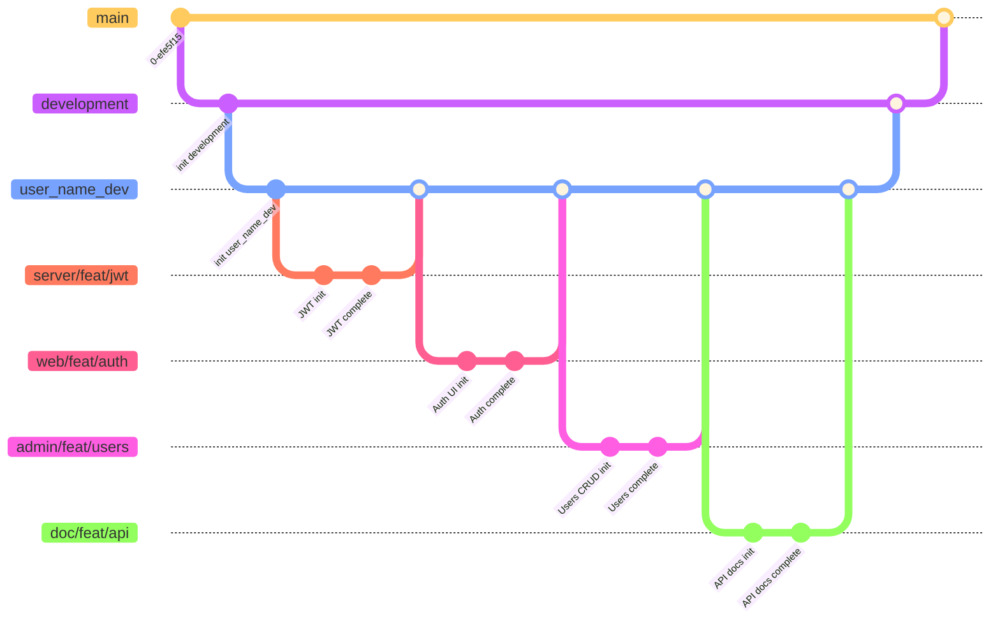

# 브랜치 전략 예시

```mermaid
%%{init: { 'logLevel': 'debug', 'theme': 'base' } }%%
gitGraph
  commit
  branch development
  checkout development
  commit id: "init development"
  branch user_name_dev
  checkout user_name_dev
  commit id: "init user_name_dev"

  branch "server/feat/jwt"
  checkout "server/feat/jwt"
  commit id: "JWT init"
  commit id: "JWT complete"
  checkout user_name_dev
  merge "server/feat/jwt"

  branch "web/feat/auth"
  checkout "web/feat/auth"
  commit id: "Auth UI init"
  commit id: "Auth complete"
  checkout user_name_dev
  merge "web/feat/auth"

  branch "admin/feat/users"
  checkout "admin/feat/users"
  commit id: "Users CRUD init"
  commit id: "Users complete"
  checkout user_name_dev
  merge "admin/feat/users"

  branch "doc/feat/api"
  checkout "doc/feat/api"
  commit id: "API docs init"
  commit id: "API docs complete"
  checkout user_name_dev
  merge "doc/feat/api"

  checkout development
  merge user_name_dev

  checkout main
  merge development
```
