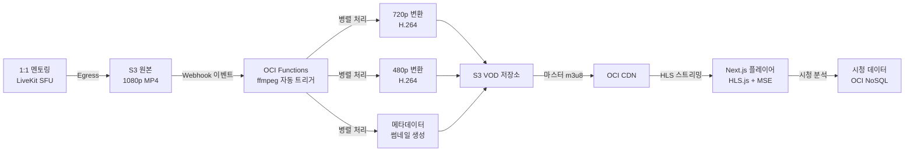

# VOD 미디어 파이프라인 설계 문서

## 개요

코테피티는 멘토링 세션을 자동으로 녹화하고,
다중 해상도로 트랜스코딩하여 적응형 스트리밍을 제공합니다.

## 아키텍처



## 기술 선택 이유

### LiveKit Egress

- ✅ SFU 기반이므로 서버에서 녹화 가능
- ✅ 안정적인 MP4 출력
- ⚠️ 다중 해상도 미지원 → ffmpeg 보완

### ffmpeg (서버리스 트랜스코딩)

- ✅ 오픈소스, 안정적 (10년+ 검증)
- ✅ H.264/H.265 지원
- ✅ 배치 처리 가능

### OCI Functions (비용 효율)

- ✅ 종량 과금 (실행한 시간만 비용)
- ✅ 자동 스케일링 (여러 영상 동시 인코딩)
- ✅ 예측 가능한 비용

### HLS.js (프론트엔드)

- ✅ 광범위한 브라우저 호환성
- ✅ 적응형 비트레이트 자동 선택
- ✅ 오프라인 캐싱 가능

## 구현 로드맵

| 단계 | 작업                     | 예상 기간 | 상태 |
| ---- | ------------------------ | --------- | ---- |
| 1    | LiveKit 세션 녹화 설정   | 3-4일     | 예정 |
| 2    | ffmpeg 인코딩 파이프라인 | 4-5일     | 예정 |
| 3    | OCI Functions 배포       | 2-3일     | 예정 |
| 4    | Next.js HLS.js 플레이어  | 5-6일     | 예정 |
| 5    | 시청 분석 대시보드       | 3-4일     | 예정 |
| 6    | 통합 테스트 & 최적화     | 5-7일     | 예정 |

## 성능 목표

- 1시간 세션 트랜스코딩: 20분 이내 (병렬 처리)
- 원본 저장: 1GB당 약 $0.02/월
- CDN 캐시 히트율: 95% 이상 (반복 시청)
- 플레이어 버퍼링 없이 재생: 95% 이상

## 트러블슈팅 (LiveKit 기반)\*\*

이제 LiveKit 쓰는 상황에서 더 현실적인 포트폴리오 주제는:

### **#1 - LiveKit Egress 안정성 & 에러 핸들링**

```
문제: Egress 프로세스 중 네트워크 끊김 → 녹화 실패
해결:
✅ 자동 재시도 + 상태 추적
✅ 실패 시 알림 & 재시작
✅ 모니터링 대시보드
```

### **#2 - 서버리스 인코딩 최적화**

```
문제: 1시간 영상 인코딩에 30분 걸림 (비용 ↑)
해결:
✅ 병렬 처리 (여러 해상도 동시)
✅ CPU 최적화 (ffmpeg 인자 튜닝)
✅ 비용 추적 및 알림
```

### **#3 - Next.js 플레이어 + 시청 분석**

```
✅ HLS.js 적응형 스트리밍
✅ 시청 진행률 실시간 저장
✅ 사용자 이탈 분석 대시보드
```
