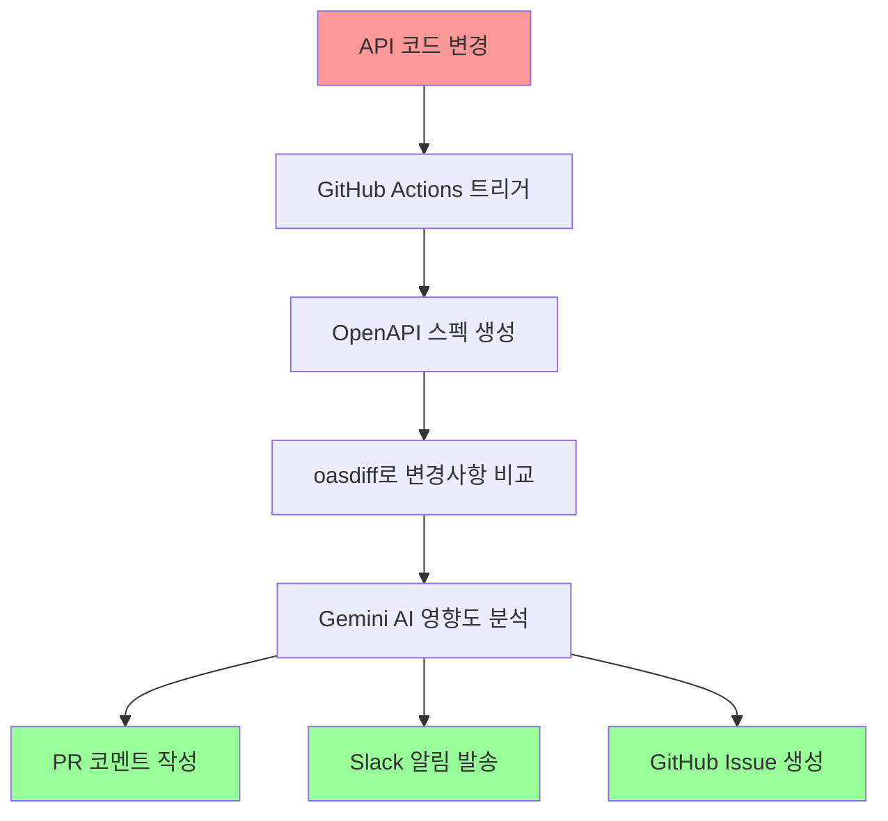

# API 변경 자동화 시스템 구현 계획

> **상태**: 계획 완료 (2025-01-29)  
> **목적**: API 변경 시 프론트엔드와 백엔드 팀 간의 소통을 최대한 자동화  
> **대상**: 3인 개발팀 (풀스택 1명, 프론트엔드 2명)

---

## 🎯 시스템 개요

### 핵심 목표
**API 변경에 따른 프론트와 백엔드의 소통을 최대한 자동화하고 줄이는 것**

현재 CotePT 프로젝트는 이미 우수한 OAS 클라이언트 자동 생성 시스템을 갖추고 있습니다. 이 기반 위에 변경 감지, AI 분석, 자동 알림 시스템을 추가하여 개발팀의 커뮤니케이션 오버헤드를 최소화합니다.

### 기대 효과
- **90% 이상** 수동 API 변경 알림 제거
- **실시간** Breaking Changes 감지 및 즉시 알림
- **자동 생성된** 마이그레이션 가이드로 프론트엔드 작업 시간 단축
- **체계적인** 변경사항 추적 및 문서화

---

## 🏗️ 시스템 아키텍처

### 전체 워크플로우


### 4단계 자동화 프로세스

#### Phase 1: 변경 감지 및 스펙 생성
- **트리거**: `apps/api/src/**/*.ts`, `apps/api/src/**/*.dto.ts` 경로 변경 시
- **실행**: 새로운 OpenAPI 스펙 자동 생성 (`pnpm openapi:export`)
- **준비**: 기존 스펙과의 비교를 위한 데이터 준비

#### Phase 2: 변경사항 분석
- **도구**: oasdiff를 사용한 OpenAPI 스펙 비교
- **분류**: Breaking Changes 감지 및 변경사항 분류 (Critical/High/Medium/Low)
- **상세화**: 추가/수정/삭제된 엔드포인트, 파라미터, 응답 스키마 분석

#### Phase 3: AI 기반 영향도 분석
- **AI 모델**: Gemini AI를 활용한 프론트엔드 영향도 분석
- **생성물**: 마이그레이션 가이드, 코드 예시, 수정 방안 제시
- **우선순위**: 변경사항별 작업량 추정 및 우선순위 분류

#### Phase 4: 자동화된 알림 및 문서화
- **PR 코멘트**: 상세한 변경사항 리포트 및 AI 분석 결과
- **Slack 알림**: Breaking Changes 발생 시 즉시 팀 알림
- **GitHub Issue**: 중요 변경사항에 대한 추적 이슈 자동 생성

---

## 🔧 기술 스택

### GitHub Actions 도구
- **oasdiff/oasdiff-action@main**: OpenAPI 스펙 비교 및 Breaking Changes 감지
- **slackapi/slack-github-action@v1**: 공식 Slack 알림 액션
- **Custom JavaScript 스크립트**: Gemini AI 통합 및 복합 분석

### AI 및 분석 기능
- **Gemini AI API**: 
  - 변경사항 영향도 분석
  - 마이그레이션 가이드 자동 생성
  - 코드 예시 및 수정 방안 제시
- **oasdiff CLI**: 
  - Breaking Changes 감지
  - 상세 diff 리포트 생성
  - 변경사항 분류 및 우선순위 설정

### 기존 시스템 활용
- **CotePT OAS 시스템**: 이미 구축된 OpenAPI 자동 생성 파이프라인
- **Turborepo**: 모노레포 빌드 시스템 활용
- **pnpm workspace**: 패키지 관리 시스템

---

## 📊 팀별 혜택 분석

### 풀스택 개발자 (1명)
#### 현재 상황
- API 변경 시 수동으로 프론트엔드 팀에 알림
- 변경사항 설명 및 마이그레이션 가이드 작성
- 프론트엔드 팀의 질문 대응

#### 자동화 후 혜택
- **90% 알림 업무 자동화**: 시스템이 자동으로 변경사항 알림
- **AI 생성 가이드**: Gemini AI가 마이그레이션 가이드 자동 생성
- **우선순위 집중**: Breaking Changes만 수동 대응 필요

### 프론트엔드 개발자 (2명)
#### 현재 상황
- API 변경사항 파악을 위한 커뮤니케이션 필요
- 변경사항 영향도 수동 분석
- 마이그레이션 계획 수립 시간 소요

#### 자동화 후 혜택
- **실시간 변경사항 파악**: Slack/PR 코멘트를 통한 즉시 알림
- **AI 분석 보고서**: 변경사항의 프론트엔드 영향도 자동 분석
- **준비된 마이그레이션 가이드**: 코드 예시와 수정 방안 제공

---

## 🚀 구현 로드맵

### Week 1: 핵심 인프라 구축 (High Priority)
#### Day 1-2: GitHub Actions 기본 워크플로우
- API 변경 감지 워크플로우 생성
- OpenAPI 스펙 자동 생성 파이프라인 연동
- 기본 트리거 및 조건 설정

#### Day 3-4: oasdiff 통합
- OpenAPI 스펙 비교 시스템 구축
- Breaking Changes 감지 로직 구현
- 변경사항 분류 및 우선순위 설정

#### Day 5: 기본 알림 시스템
- PR 코멘트 자동 생성 기능
- 기본적인 변경사항 리포트 템플릿

### Week 2: AI 분석 및 고도화 (Medium Priority)
#### Day 1-3: Gemini AI 통합
- Gemini AI API 연동 및 인증 설정
- 프론트엔드 영향도 분석 로직 구현
- 마이그레이션 가이드 자동 생성 기능

#### Day 4-5: Slack 통합
- Slack webhook 설정 및 알림 템플릿 구성
- Breaking Changes 즉시 알림 시스템
- 팀별 알림 채널 분리

### Week 3: 최적화 및 운영 준비 (Low Priority)
#### Day 1-2: GitHub Issue 자동화
- 중요 변경사항에 대한 추적 이슈 자동 생성
- 이슈 템플릿 및 라벨링 시스템 구축

#### Day 3-4: 모니터링 및 디버깅
- 워크플로우 실패 시 알림 시스템
- 로그 수집 및 분석 도구 구성

#### Day 5: 문서화 및 팀 교육
- 운영 가이드 작성
- 팀 온보딩 세션 진행

---

## ⚙️ 설정 가이드

### 1. GitHub Secrets 설정
다음 시크릿들을 GitHub 저장소에 설정해야 합니다:

```bash
# Gemini AI 설정
GEMINI_API_KEY=your_gemini_api_key_here

# Slack 설정  
SLACK_WEBHOOK_URL=your_slack_webhook_url_here
SLACK_BOT_TOKEN=your_slack_bot_token_here

# GitHub 설정 (자동 생성되는 토큰 사용)
GITHUB_TOKEN=${{ secrets.GITHUB_TOKEN }}
```

### 2. 환경 변수 구성
```yaml
# .github/workflows/api-change-monitor.yml
env:
  NODE_ENV: local
  EXPORT_OPENAPI: true
  API_SPEC_PATH: packages/api-client/openapi-spec.yaml
  PREVIOUS_SPEC_PATH: .github/cache/previous-openapi-spec.yaml
```

### 3. 디렉토리 구조
```
.github/
├── workflows/
│   ├── api-change-monitor.yml      # 메인 워크플로우
│   └── api-spec-diff.yml          # 스펙 비교 전용
├── scripts/
│   ├── api-change-analyzer.js     # 변경사항 분석
│   ├── gemini-reviewer.js         # Gemini AI 통합
│   └── slack-notifier.js          # Slack 알림
├── templates/
│   ├── pr-comment.md              # PR 코멘트 템플릿
│   ├── slack-message.json         # Slack 메시지 템플릿
│   └── issue-template.md          # GitHub Issue 템플릿
└── cache/
    └── previous-openapi-spec.yaml  # 이전 스펙 캐시
```

---

## 📋 운영 및 유지보수

### 일상적인 모니터링
- **워크플로우 실행 상태**: GitHub Actions 탭에서 주기적 확인
- **알림 정확성**: Slack 알림과 실제 변경사항 일치도 검증
- **AI 분석 품질**: Gemini AI 생성 가이드의 정확성 피드백

### 정기적인 최적화
- **월 1회**: AI 프롬프트 튜닝 및 분석 품질 개선
- **분기별**: 알림 임계값 조정 및 우선순위 재정의
- **반기별**: 새로운 도구 및 기능 업데이트 검토

### 문제 해결 프로세스
1. **워크플로우 실패**: GitHub Actions 로그 확인 및 재실행
2. **잘못된 알림**: 필터링 조건 재조정
3. **AI 분석 오류**: Gemini AI 프롬프트 수정 및 재학습

---

## 🎯 성공 지표

### 정량적 지표
- **알림 자동화율**: 90% 이상
- **Breaking Changes 감지율**: 100%
- **마이그레이션 가이드 정확도**: 85% 이상
- **팀 커뮤니케이션 시간 단축**: 70% 이상

### 정성적 지표
- **개발자 만족도**: 자동화 시스템에 대한 팀 피드백
- **대응 속도**: Breaking Changes 발견부터 수정까지 시간
- **문서 품질**: AI 생성 가이드의 실용성 평가

---

## 🔗 관련 문서

- [GitHub Actions 설정 가이드](./GITHUB_ACTIONS_SETUP.md)
- [oasdiff 통합 방법](./OASDIFF_INTEGRATION.md)
- [Gemini AI 설정 가이드](./GEMINI_AI_SETUP.md)
- [Slack 알림 시스템](./SLACK_NOTIFICATIONS.md)
- [팀 워크플로우 가이드](./TEAM_WORKFLOW.md)
- [문제 해결 가이드](./TROUBLESHOOTING.md)

---

## 📝 업데이트 이력

- **2025-01-29**: 초기 계획 작성 및 전체 시스템 설계 완료
- **향후 계획**: 구현 진행에 따라 세부 사항 업데이트 예정

---

> 💡 **핵심 메시지**: "API 변경에 따른 팀 간 소통을 최대한 자동화"하여 3인 개발팀의 생산성을 극대화하고, 수동 커뮤니케이션 오버헤드를 최소화하는 것이 이 시스템의 궁극적인 목표입니다.