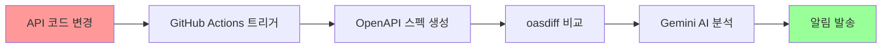

# 3인 개발팀 워크플로우 가이드

> **상태**: 구현 준비 완료 (2025-01-29)  
> **대상**: CotePT 3인 개발팀 (풀스택 1명, 프론트엔드 2명)  
> **목적**: API 변경사항에 대한 효율적인 팀 협업 프로세스 정립

---

## 👥 팀 구성 및 역할

### 팀 구성
- **풀스택 개발자** 1명: API 설계, 백엔드 개발, DevOps
- **프론트엔드 개발자 A** 1명: 사용자 인터페이스, 사용자 경험
- **프론트엔드 개발자 B** 1명: 컴포넌트 라이브러리, 성능 최적화

### 기존 커뮤니케이션 문제점
1. **수동 알림**: API 변경 시 수동으로 팀에게 알림
2. **정보 누락**: 변경사항의 프론트엔드 영향도 파악 어려움
3. **지연된 대응**: 변경사항 발견 후 늦은 대응으로 인한 일정 지연
4. **중복 업무**: 각자 API 변경사항을 개별적으로 분석

---

## 🔄 자동화된 워크플로우

### Phase 1: API 변경 감지 (자동화)



**자동 실행 단계:**
1. **트리거**: `apps/api/src/**/*.ts` 파일 변경 시 자동 실행
2. **스펙 생성**: 새로운 OpenAPI 스펙 자동 생성
3. **변경 비교**: 이전 스펙과 비교하여 Breaking Changes 감지
4. **AI 분석**: Gemini AI가 프론트엔드 영향도 자동 분석
5. **알림 발송**: Slack + PR 코멘트로 즉시 알림

### Phase 2: 팀 대응 프로세스 (수동)

#### 2.1 풀스택 개발자 역할

**즉시 대응 (Critical Changes)**
- [ ] Slack 알림 확인 (5분 이내)
- [ ] PR 코멘트에서 AI 분석 결과 검토
- [ ] Critical 변경사항의 기술적 타당성 확인
- [ ] 프론트엔드 팀에게 추가 상황 설명 (필요시)

**일반 대응 (High/Medium Changes)**
- [ ] 일 2회 (오전 10시, 오후 3시) 알림 확인
- [ ] 변경사항의 배경 및 목적 문서화
- [ ] 프론트엔드 팀 질문 대응
- [ ] 필요시 API 스펙 수정 또는 롤백 결정

**주간 계획**
- [ ] 월요일: 주간 API 변경 계획 공유
- [ ] 금요일: 주간 변경사항 리뷰 및 다음 주 계획

#### 2.2 프론트엔드 개발자 A 역할 (사용자 기능 담당)

**알림 대응**
- [ ] Slack #api-changes 채널 모니터링
- [ ] 사용자 관련 API (`/users`, `/auth`) 변경사항 우선 확인
- [ ] 영향받는 사용자 기능 식별 및 우선순위 설정

**작업 분담**
- **담당 영역**: 사용자 인증, 프로필 관리, 사용자 목록
- **API 경로**: `/users/*`, `/auth/*`, `/profile/*`
- **주요 파일**: 
  - `src/features/user/`
  - `src/features/auth/`
  - `src/shared/auth/`

**대응 프로세스**
1. **Critical/High Changes** 발생 시:
   - [ ] 1시간 이내 영향도 분석 완료
   - [ ] 수정 계획 수립 및 팀 공유
   - [ ] 당일 수정 작업 시작
   
2. **Medium/Low Changes** 발생 시:
   - [ ] 2일 이내 분석 완료
   - [ ] 다음 스프린트 계획에 반영

#### 2.3 프론트엔드 개발자 B 역할 (공통 컴포넌트 담당)

**알림 대응**
- [ ] Slack #api-changes 채널 모니터링
- [ ] 공통 API (`/mail`, `/common`) 및 타입 변경사항 우선 확인
- [ ] 컴포넌트 라이브러리 영향도 분석

**작업 분담**
- **담당 영역**: 공통 컴포넌트, API 클라이언트, 타입 정의
- **API 경로**: `/mail/*`, `/common/*`, 공통 타입들
- **주요 파일**:
  - `src/shared/api/`
  - `src/shared/components/`
  - `packages/api-client/`

**대응 프로세스**
1. **API 클라이언트 업데이트**:
   - [ ] `pnpm gen:api` 실행 후 타입 변경사항 확인
   - [ ] 공통 서비스 클래스 업데이트
   - [ ] 타입 호환성 검증

2. **컴포넌트 영향도 분석**:
   - [ ] 공통 컴포넌트의 API 의존성 확인
   - [ ] Props 인터페이스 업데이트 필요성 판단

---

## 📋 우선순위별 대응 가이드

### P0 (Critical) - 즉시 대응

**발생 조건:**
- 필수 API 엔드포인트 삭제
- 인증 시스템 변경
- 필수 파라미터 제거

**대응 시간:** 1시간 이내
**담당자:** 풀스택 + 해당 영역 프론트엔드

**대응 절차:**
1. **10분 이내**: 풀스택 개발자 상황 파악 및 롤백 필요성 판단
2. **30분 이내**: 프론트엔드 개발자 영향도 확인 및 수정 계획 수립
3. **1시간 이내**: 수정 작업 시작 또는 API 롤백 결정

### P1 (High) - 당일 대응

**발생 조건:**
- 주요 API 파라미터 타입 변경
- 응답 구조 변경
- 새로운 필수 파라미터 추가

**대응 시간:** 1일 이내
**담당자:** 해당 영역 프론트엔드 (풀스택 지원)

**대응 절차:**
1. **2시간 이내**: 상세 영향도 분석 및 작업량 추정
2. **4시간 이내**: 수정 계획 수립 및 일정 조정
3. **당일**: 수정 작업 완료 및 테스트

### P2 (Medium) - 3일 이내 대응

**발생 조건:**
- 선택적 파라미터 변경
- 응답 필드 추가
- API 경로 변경 (비호환성 없음)

**대응 시간:** 3일 이내
**담당자:** 해당 영역 프론트엔드

**대응 절차:**
1. **1일차**: 영향도 분석 및 우선순위 설정
2. **2일차**: 수정 작업 진행
3. **3일차**: 테스트 및 배포

### P3 (Low) - 다음 스프린트

**발생 조건:**
- 새로운 API 엔드포인트 추가
- 문서 변경
- 선택적 기능 개선

**대응 시간:** 다음 스프린트
**담당자:** 스프린트 계획 시 결정

---

## 🔄 일상적인 워크플로우

### 매일 오전 (10:00 AM)

**풀스택 개발자:**
- [ ] API 변경 알림 확인
- [ ] 금일 예정된 API 변경사항 팀 공유
- [ ] Critical/High 이슈 우선순위 점검

**프론트엔드 개발자들:**
- [ ] Slack 알림 확인 및 담당 영역 변경사항 점검
- [ ] 금일 대응할 작업 목록 정리
- [ ] 필요시 풀스택 개발자와 기술 논의

### 매일 오후 (3:00 PM)

**전체 팀:**
- [ ] 오전 이후 발생한 API 변경사항 확인
- [ ] 진행 중인 작업 상태 공유 (5분 이내)
- [ ] 블로커 또는 질문사항 논의

### 주간 계획 (매주 월요일 오전)

**전체 팀 회의 (30분):**
1. **지난 주 API 변경사항 리뷰** (10분)
   - 대응 완료된 변경사항 확인
   - 미완료 작업 이유 분석
   - 프로세스 개선사항 논의

2. **이번 주 예정 변경사항 공유** (10분)
   - 풀스택 개발자가 계획된 API 변경사항 설명
   - 프론트엔드 영향도 사전 분석
   - 작업 분담 및 일정 조정

3. **이슈 및 개선사항 논의** (10분)
   - 자동화 시스템 개선 포인트
   - 커뮤니케이션 문제점 해결
   - 도구 또는 프로세스 개선 제안

### 주간 리뷰 (매주 금요일 오후)

**개별 정리 (15분):**
- [ ] 이번 주 처리한 API 변경사항 정리
- [ ] 소요 시간 대비 예상 시간 분석
- [ ] 다음 주 계획할 작업 목록 작성

**팀 공유 (15분):**
- [ ] 주요 성과 및 배운 점 공유
- [ ] 다음 주 우선순위 작업 확인
- [ ] 휴가 또는 일정 변경사항 공유

---

## 🛠️ 도구 및 채널 활용법

### Slack 채널 활용

#### `#api-critical` (Critical 전용)
- **용도**: P0 수준의 즉시 대응 필요 알림
- **멤버**: 전체 개발팀 + PM
- **알림 설정**: 24시간 알림 ON
- **대응 시간**: 1시간 이내

#### `#api-changes` (일반 변경사항)
- **용도**: P1, P2 수준의 일반적인 API 변경 알림
- **멤버**: 전체 개발팀
- **알림 설정**: 업무 시간 알림 ON
- **대응 시간**: 당일~3일 이내

#### `#dev-team` (정보 공유)
- **용도**: P3 수준의 정보성 알림, 일반 논의
- **멤버**: 전체 개발팀
- **알림 설정**: 일반 알림
- **대응 시간**: 스프린트 계획 시

### GitHub 활용

#### PR 리뷰 프로세스
1. **자동 코멘트**: AI 분석 결과가 PR에 자동 코멘트로 추가
2. **수동 리뷰**: 팀원들이 AI 분석을 바탕으로 추가 의견 제시
3. **승인 조건**: Critical 변경 시 전체 팀 승인 필요

#### Issue 추적
- **Critical Changes**: 자동으로 GitHub Issue 생성
- **라벨링**: `api-breaking-change`, `critical`, `frontend-impact`
- **담당자 자동 배정**: 영향받는 영역별 담당자 배정

### 문서화

#### `CLAUDE.md` 업데이트
```markdown
## 최근 API 변경사항
- **2025-01-29**: User API 인증 방식 변경 (P1)
- **2025-01-28**: Mail API 새 파라미터 추가 (P2)

## 대응 상태
- [ ] P0: 없음
- [x] P1: User API 수정 완료 (담당: Frontend A)
- [ ] P2: Mail API 수정 진행 중 (담당: Frontend B)
```

---

## 📊 성과 측정 및 개선

### 주요 지표 (KPI)

#### 효율성 지표
- **알림 대응 시간**: Critical 1시간, High 1일, Medium 3일 이내
- **커뮤니케이션 시간**: 주간 API 관련 회의 시간 (목표: 1시간 이내)
- **수동 알림 빈도**: 자동 알림으로 해결되지 않은 경우 (목표: 월 2회 이하)

#### 품질 지표
- **변경사항 누락률**: 놓친 API 변경사항 비율 (목표: 0%)
- **롤백 빈도**: API 변경으로 인한 긴급 롤백 (목표: 월 1회 이하)
- **버그 발생률**: API 변경으로 인한 프로덕션 버그 (목표: 월 2개 이하)

#### 만족도 지표
- **팀 만족도**: 월간 팀 피드백 점수 (목표: 4.0/5.0 이상)
- **업무 부담**: API 변경 관련 업무 부담 인식 (목표: 3.0/5.0 이하)

### 월간 리뷰 프로세스

#### 데이터 수집 (매월 마지막 주)
```bash
# GitHub Actions 로그에서 자동 수집
- 총 API 변경 감지 건수
- 우선순위별 분류 결과
- 평균 대응 시간
- 알림 발송 성공률
```

#### 팀 회의 (매월 첫째 주)
1. **지표 리뷰** (15분): KPI 달성도 확인 및 분석
2. **프로세스 개선** (20분): 비효율적인 부분 식별 및 개선 방안 논의
3. **도구 개선** (10분): 자동화 시스템 개선 포인트 논의
4. **다음 달 목표** (5분): 개선 목표 설정 및 책임자 지정

### 지속적인 개선 방안

#### 프로세스 최적화
- **자동화 확대**: 반복적인 수작업을 추가 자동화
- **알림 정교화**: 팀 피드백 바탕으로 알림 기준 조정
- **문서 개선**: 가이드라인 업데이트 및 새로운 시나리오 추가

#### 팀 역량 강화
- **교육 세션**: 분기별 API 설계 및 영향도 분석 교육
- **경험 공유**: 복잡한 변경사항 대응 사례 공유
- **도구 활용**: 새로운 도구 도입 및 활용법 공유

---

## 🎯 성공 시나리오 예시

### Scenario 1: Critical Breaking Change

**상황**: 사용자 인증 API에서 필수 파라미터 제거

**자동화 대응:**
1. **0분**: GitHub Actions가 변경 감지
2. **2분**: oasdiff가 Breaking Change 확인
3. **3분**: Gemini AI가 Critical 수준으로 분류
4. **4분**: #api-critical 채널에 긴급 알림 발송
5. **5분**: PR에 상세 분석 코멘트 추가

**팀 대응:**
1. **10분**: 풀스택 개발자 알림 확인 및 상황 파악
2. **20분**: 프론트엔드 A (인증 담당) 영향도 분석 시작
3. **30분**: 팀 긴급 논의 (Slack 스레드)
4. **45분**: 수정 계획 수립 완료
5. **60분**: API 롤백 vs 프론트 수정 결정
6. **3시간**: 선택된 방안 구현 완료
7. **4시간**: 테스트 및 배포 완료

**결과**: 4시간 내 해결, 사용자 영향 최소화

### Scenario 2: Medium Impact Change

**상황**: 사용자 목록 API에 선택적 필터 파라미터 추가

**자동화 대응:**
1. **0분**: GitHub Actions가 변경 감지
2. **2분**: oasdiff가 Non-Breaking 확인
3. **3분**: Gemini AI가 Medium 수준으로 분류
4. **4분**: #api-changes 채널에 일반 알림 발송

**팀 대응:**
1. **2시간**: 프론트엔드 A가 알림 확인 (점심 식사 후)
2. **당일**: AI 분석 결과 검토 및 활용 계획 수립
3. **다음날**: 새 필터 기능 구현 시작
4. **3일 후**: 구현 완료 및 배포

**결과**: 계획적인 대응으로 기능 개선 기회 활용

---

## 🔗 관련 문서

- [API 변경 자동화 시스템](./API_CHANGE_AUTOMATION.md)
- [GitHub Actions 설정](./GITHUB_ACTIONS_SETUP.md)
- [Slack 알림 시스템](./SLACK_NOTIFICATIONS.md)
- [문제 해결 가이드](./TROUBLESHOOTING.md)

---

## 📝 업데이트 이력

- **2025-01-29**: 3인 개발팀 워크플로우 초기 가이드 작성
- **향후 계획**: 팀 피드백 반영 및 프로세스 지속 개선

---

> 💡 **핵심 원칙**: "자동화는 도구, 소통은 사람" - 자동화 시스템이 정보를 제공하지만, 최종 의사결정과 실행은 팀원 간의 원활한 소통을 통해 이루어집니다.