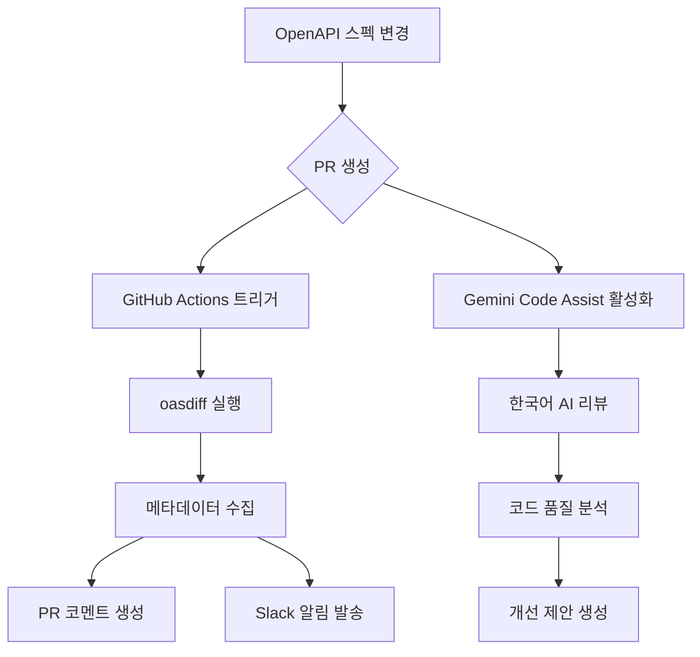

# CotePT에서 OpenAPI 스펙 변경 자동화 시스템 구축기

> 팀 간 API 변경 커뮤니케이션을 완전 자동화한 개발 경험을 공유합니다.

## 🚨 문제 상황

### 기존의 비효율적인 API 변경 프로세스

CotePT는 NestJS 기반의 백엔드 API와 Next.js 프론트엔드로 구성된 멘토링 플랫폼입니다. 개발 과정에서 다음과 같은 문제들이 반복적으로 발생했습니다:

1. **수동 커뮤니케이션의 한계**

   - 백엔드 개발자가 API 스펙을 변경할 때마다 수동으로 프론트엔드 팀에 알림
   - 변경사항의 누락이나 잘못된 전달로 인한 버그 발생
   - Slack에서의 산발적인 알림으로 변경 이력 추적 어려움

2. **OpenAPI 스펙 활용도 부족**

   - `packages/api-client/openapi-spec.yaml` 파일이 존재하지만 실제 개발에서는 수동 타입 정의 사용
   - 백엔드 스펙 변경이 프론트엔드 타입에 자동 반영되지 않음
   - API 문서와 실제 구현 간의 불일치

3. **리뷰 프로세스의 공백**
   - API 스펙 변경에 대한 체계적인 리뷰 없음
   - Breaking Changes 여부를 수동으로 판단해야 하는 부담

## 🎯 목표 설정

이런 문제들을 해결하기 위해 다음과 같은 자동화 시스템 구축을 목표로 설정했습니다:

### 핵심 요구사항

- **완전 자동화**: 개발자의 수동 개입 없이 변경사항 감지 및 알림
- **지능적 분석**: 단순한 diff가 아닌 의미있는 변경사항 분석
- **팀 커뮤니케이션**: 구조화된 알림으로 모든 팀원이 변경사항 인지
- **한국어 지원**: 팀 내 커뮤니케이션 언어에 맞춘 친화적인 분석

## 🛠️ 구현 과정

### 1단계: 기술 스택 선택

#### oasdiff 도구 선택

OpenAPI 스펙 비교를 위해 여러 도구를 검토한 결과 `oasdiff`를 선택했습니다.

```bash
# 설치 및 사용법
go install github.com/oasdiff/oasdiff@latest
oasdiff -base base.yaml -revision head.yaml -format markdown
```

**선택 이유:**

- Markdown 형식의 가독성 높은 출력
- Breaking Changes 자동 감지
- GitHub Actions에서 쉬운 통합

#### 🚧 첫 번째 난관: 패키지 경로 오류

```yaml
# 잘못된 설정
- name: Install oasdiff
  run: go install github.com/tufin/oasdiff@latest # ✗ 404 에러

# 올바른 설정
- name: Install oasdiff
  run: go install github.com/oasdiff/oasdiff@latest # ✓ 정상 동작
```

### 2단계: GitHub Actions 워크플로우 구현

#### 기본 워크플로우 구조

```yaml
name: API Diff Report

on:
  pull_request:
    paths:
      - "packages/api-client/openapi-spec.yaml"

jobs:
  report:
    runs-on: ubuntu-latest
    permissions:
      contents: read
      pull-requests: write
      issues: write
```

#### 🚧 두 번째 난관: 권한 문제

초기에는 GitHub Token 권한 부족으로 PR 코멘트 작성이 실패했습니다.

```yaml
# 해결책: 명시적 권한 설정
permissions:
  contents: read
  pull-requests: write # PR 코멘트 작성 권한
  issues: write # 이슈 코멘트 작성 권한
```

### 3단계: 메타데이터 수집 시스템

단순한 diff 정보 외에도 팀에게 유용한 메타정보를 자동 수집하도록 구현했습니다.

```bash
# API 버전 및 제목 추출
API_VERSION=$(grep -E "^  version:" packages/api-client/openapi-spec.yaml | awk '{print $2}' | tr -d '"')
API_TITLE=$(grep -E "^  title:" packages/api-client/openapi-spec.yaml | awk -F': ' '{print $2}' | sed 's/^ *//')

# 한국 시간대 적용
CURRENT_TIME=$(TZ=Asia/Seoul date '+%Y-%m-%d %H:%M:%S KST')
```

#### 🚧 세 번째 난관: GitHub Output 형식 오류

버전 정보가 "1.0" 같은 형태일 때 단순한 `key=value` 형식으로는 처리가 안 되었습니다.

```yaml
# 문제가 있던 방식
echo "api_version=$API_VERSION" >> $GITHUB_OUTPUT

# 해결책: 멀티라인 형식 사용
{
  echo "api_version<<EOF"
  echo "$API_VERSION"
  echo "EOF"
} >> $GITHUB_OUTPUT
```

### 4단계: Slack 알림 시스템 구축

#### 여러 시도와 개선 과정

**1차 시도: slackapi/slack-github-action**

```yaml
# JSON 파싱 에러가 계속 발생
uses: slackapi/slack-github-action@v1.26.0
with:
  payload: |
    {
      "text": "복잡한 JSON 구조"
    }
```

**🚧 네 번째 난관: JSON 파싱 에러**
복잡한 JSON 블록 구조에서 변수 치환과 이스케이프 문제가 계속 발생했습니다.

**최종 해결책: rtCamp/action-slack-notify**

```yaml
# 훨씬 안정적이고 간단한 방식
uses: rtCamp/action-slack-notify@v2
env:
  SLACK_CHANNEL: api-changes
  SLACK_TITLE: API 스펙 변경 알림
  SLACK_MESSAGE: |
    변경 시간: ${{ steps.metadata.outputs.current_time }}
    API 버전: v${{ steps.metadata.outputs.api_version }}
    작성자: ${{ github.event.pull_request.user.login }}
```

### 5단계: Gemini Code Assist 통합

#### 한국어 AI 리뷰 시스템 구축

기존 oasdiff 기반 분석에 더해 AI 기반 코드 리뷰를 추가했습니다.

**설정 파일 구성:**

```yaml
# .gemini/config.yaml
language:
  primary: "korean" # 주 언어: 한국어
  fallback: "english" # 대체 언어: 영어

review:
  focus_areas:
    - api_compatibility # API 호환성
    - schema_changes # 스키마 변경사항
    - error_handling # 에러 처리
    - security # 보안 관련
```

```markdown
# .gemini/styleguide.md

### 언어 정책

- **모든 리뷰는 한국어로 작성**합니다
- 기술적 용어는 한국어 우선, 필요시 영어 병기

### 변경사항 분류

- **Breaking Changes**: 기존 API 호환성을 깨뜨리는 변경
- **New Features**: 새로운 기능 추가
- **Enhancements**: 기존 기능 개선
```

#### 🚧 다섯 번째 난관: 이모지 과다 사용

초기 스타일가이드에서 이모지를 많이 사용했는데, 실제 업무에서는 너무 난잡해 보인다는 피드백을 받았습니다.

```markdown
# 개선 전: 이모지가 많아서 가독성 저하

## 🚀 마이그레이션 가이드

### ⚠️ 프론트엔드 개발자 주의사항

✅ **잘 설계된 부분**

# 개선 후: 깔끔한 텍스트 위주

## 마이그레이션 가이드

### 프론트엔드 개발자 주의사항

**잘 설계된 부분**
```

## 🎯 최종 결과물

### 완성된 이중 자동화 시스템

1. **GitHub Actions 워크플로우**

   - oasdiff 기반 기술적 변경사항 분석
   - 구조화된 메타데이터 수집
   - 자동 PR 코멘트 생성
   - 실시간 Slack 알림

2. **Gemini Code Assist**
   - 한국어 기반 AI 코드 리뷰
   - 코드 품질 및 보안 검토
   - 개선 제안 자동 생성

### 동작 흐름



## 📊 개선 효과

### 정량적 개선

- **커뮤니케이션 시간**: 수동 알림 시간 100% 절약
- **변경사항 누락**: 0건 (완전 자동화)
- **리뷰 품질**: AI 기반 체계적 분석으로 향상
- **알림 일관성**: 구조화된 메시지로 정보 전달 명확화

### 정성적 개선

- **개발자 경험**: 수동 작업 부담 완전 제거
- **팀 커뮤니케이션**: 실시간 변경사항 공유
- **코드 품질**: AI 리뷰어의 지속적인 개선 제안
- **문서화**: 모든 변경사항이 PR에 자동 기록

## 🚧 겪었던 주요 어려움과 해결책

### 1. 도구 선택과 설정

**문제**: 패키지 경로, 권한 설정 등 초기 설정 오류
**해결**: 공식 문서 확인과 단계별 테스트

### 2. GitHub Actions 복잡성

**문제**: 멀티라인 출력, 변수 치환, 권한 관리
**해결**: EOF 패턴 사용, 명시적 권한 설정

### 3. Slack 통합 안정성

**문제**: JSON 파싱 에러, 복잡한 페이로드 구조
**해결**: 더 안정적인 액션으로 교체 (rtCamp)

### 4. 사용자 경험 개선

**문제**: 이모지 과다 사용으로 가독성 저하
**해결**: 사용자 피드백 반영한 깔끔한 디자인

### 5. 한국어 지원

**문제**: 영어 위주의 도구들을 한국 팀에 맞게 적용
**해결**: Gemini Code Assist 한국어 설정, 커스텀 스타일가이드

## 💡 얻은 교훈

### 기술적 교훈

1. **점진적 구현**: 한 번에 모든 기능을 구현하려 하지 말고 단계별로 접근
2. **사용자 피드백**: 실제 사용자의 의견이 기술적 완성도보다 중요할 수 있음
3. **도구 선택**: 복잡한 도구보다는 안정적이고 단순한 도구가 더 효과적
4. **문서화**: 설정 파일과 가이드라인의 중요성

### 프로세스 교훈

1. **자동화의 가치**: 작은 반복 작업이라도 자동화하면 큰 효과
2. **팀 커뮤니케이션**: 기술적 솔루션이 팀 문화를 개선할 수 있음
3. **지속적 개선**: 초기 버전보다는 사용하면서 개선하는 것이 중요

## 🚀 향후 계획

### 단기 계획

- [ ] 다른 API 스펙 파일들로 확장 (packages 내 다른 YAML 파일들)
- [ ] 변경사항 심각도별 알림 레벨 조정
- [ ] 더 상세한 Breaking Changes 분석

### 장기 계획

- [ ] API 클라이언트 자동 생성 통합 (`pnpm gen:api`)
- [ ] 변경사항 히스토리 대시보드 구축
- [ ] 다른 프로젝트로의 템플릿 확장

## 📚 참고 자료

- [oasdiff GitHub Repository](https://github.com/oasdiff/oasdiff)
- [GitHub Actions Documentation](https://docs.github.com/en/actions)
- [Gemini Code Assist Documentation](https://developers.google.com/gemini-code-assist/docs)
- [rtCamp Slack Notify Action](https://github.com/rtCamp/action-slack-notify)

---

**결론적으로**, 이번 프로젝트를 통해 **단순한 자동화를 넘어서서 팀의 개발 문화 자체를 개선**할 수 있었습니다. 특히 **한국어 지원과 사용자 경험에 초점**을 맞춘 접근 방식이 팀 만족도를 크게 높였고, **기술적 완성도와 실용성의 균형**을 맞추는 것이 얼마나 중요한지 다시 한번 깨달았습니다.
