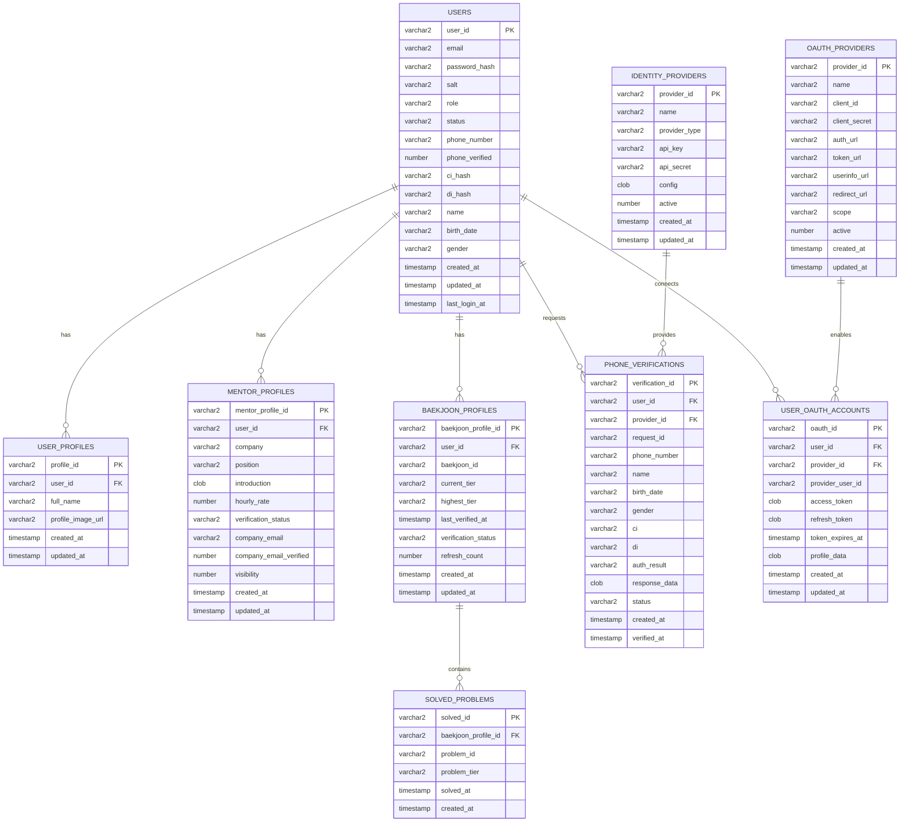
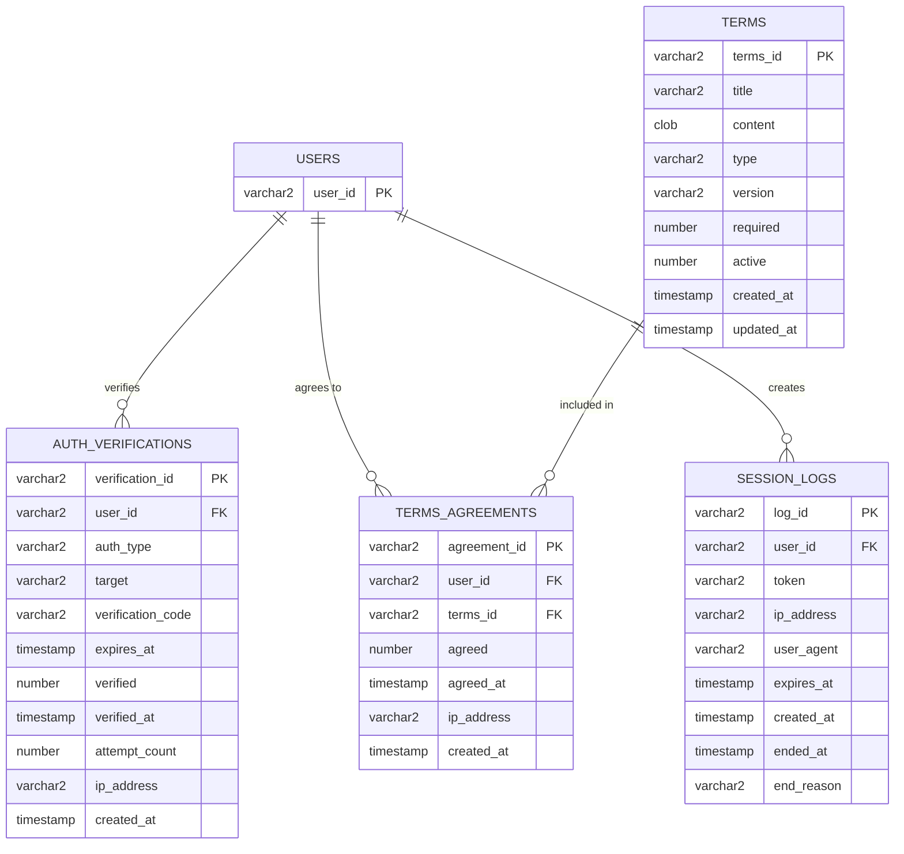
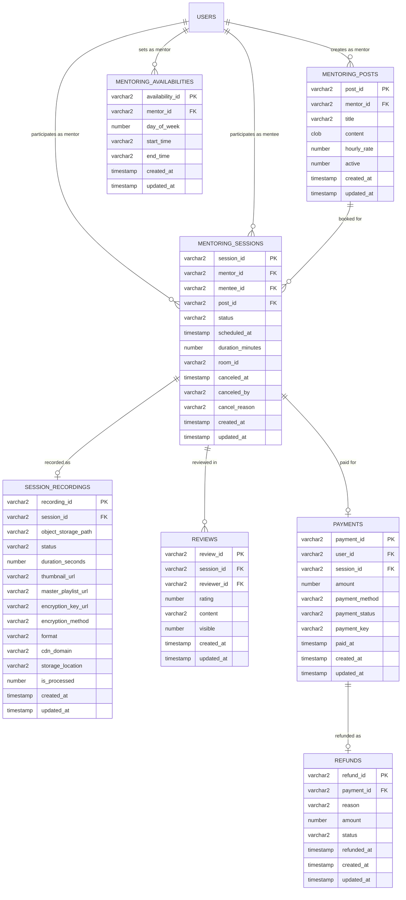
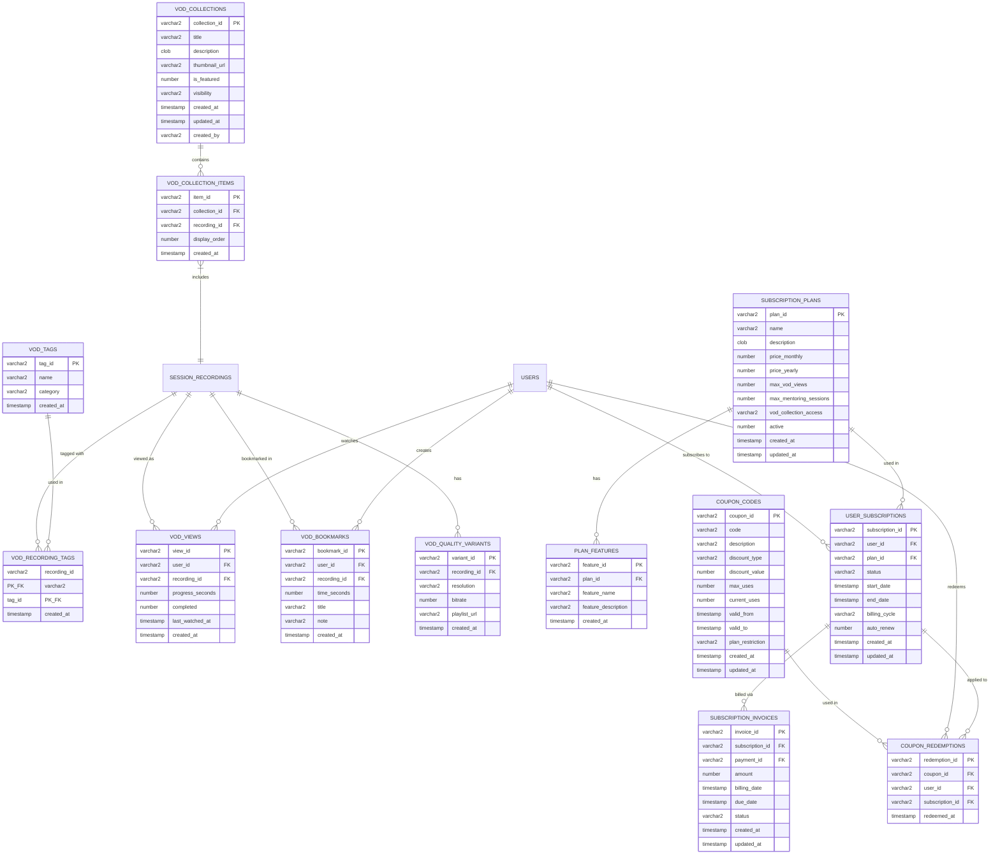
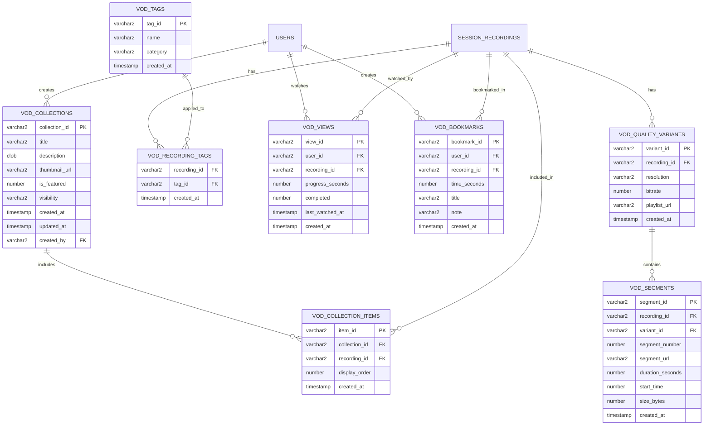

# 코테피티(Cotept) 데이터베이스 설계 문서

## 1. 개요

코테피티는 코딩테스트를 준비하는 개발자 취준생을 위한 1:1 멘토링 서비스입니다. 이 문서는 코테피티 서비스의 데이터베이스 설계와 인증 시스템 구현에 관한 내용을 다룹니다.

### 1.1 주요 기능

- 실시간 코드 공유 협업 에디터와 WebRTC 음성 통화를 사용한 멘토링
- 멘토링 세션 녹화 및 VOD 다시보기 제공
- 백준 ID 연동을 통한 멘토 자격 검증 (Platinum 3 이상)
- 소셜 로그인 및 한국 PASS 본인인증 지원
- 구독 기반 VOD 서비스 제공
- 구독 기반 VOD 서비스 제공

### 1.2 데이터베이스 기술 스택

- **관계형 데이터베이스**: Oracle 19c
- **NoSQL 데이터베이스**: OCI NoSQL
- **세션 관리**: Redis
- **ORM**: TypeORM (NestJS)
- **스토리지**: S3 (VOD 저장)

## 2. 데이터베이스 스키마 설계 전략

### 2.1 스키마 분리 전략

코테피티 서비스의 데이터베이스는 기능별로 다음과 같이 스키마를 분리합니다:

- **COTEPT_APP**: 애플리케이션 핵심 데이터
  - 사용자, 멘토링, 결제 등의 비즈니스 로직 관련 테이블
  - 데이터 무결성이 중요한 트랜잭션 데이터
  
- **COTEPT_AUTH**: 인증 관련 데이터
  - 인증, 세션, 권한 관련 테이블
  - 보안이 중요한 민감 정보
  
- **COTEPT_SYSTEM**: 시스템 관련 데이터
  - 로그, 설정, 통계 등 시스템 운영 관련 테이블
  - 주로 읽기 전용이거나 대용량 로그 데이터

### 2.2 하이브리드 DB 접근법

서비스의 특성에 맞게 Oracle 19와 OCI NoSQL을 결합하여 사용합니다:

**Oracle 19 (관계형 DB)에 적합한 데이터:**
- 사용자 계정 정보 (User)
- 멘토/멘티 프로필 (Profile)
- 결제 및 정산 정보 (Payment)
- 멘토링 세션 메타데이터 (Session)
- 백준 ID 연동 정보 (BaekjoonProfile)
- 리뷰 및 평점 정보
- 구독 플랜 및 결제 정보

**OCI NoSQL에 적합한 데이터:**
- 실시간 코드 편집 기록
- 채팅 메시지 로그
- 세션 로그 및 이벤트 
- VOD 메타데이터 (썸네일 위치, 세그먼트 정보)
- 사용자 활동 로그
- 백준 문제 풀이 데이터 (JSON 형식)
- VOD 시청 분석 데이터

## 3. 엔티티 관계 다이어그램 (ERD)

_참고: VOD 및 구독 플랜 관련 테이블은 아래 섹션 9에서 별도로 다룹니다._

### 3.1 사용자 관리 영역



### 3.2 인증 및 검증 영역



### 3.3 멘토링 및 결제 영역



### 3.4 VOD 및 구독 영역



### 3.5 OCI NoSQL 컬렉션 설계

```mermaid
erDiagram
    session_codes {
        string session_id "Partition Key"
        timestamp timestamp "Sort Key"
        string user_id
        string code_snapshot
        string language
    }
    
    session_chats {
        string session_id "Partition Key"
        timestamp timestamp "Sort Key"
        string user_id
        string message
        boolean read
    }
    
    media_segments {
        string recording_id "Partition Key"
        number segment_number "Sort Key"
        string segment_path
        number duration
        number start_time
    }
    
    user_activities {
        string user_id "Partition Key"
        timestamp timestamp "Sort Key"
        string activity_type
        object details
        string ip_address
    }
    
    user_solved_problems {
        string user_id "Partition Key"
        string baekjoon_id
        number updated_at
        number problem_count
        object tier_stats
        array problems
    }
    
    vod_analytics {
        string recording_id "Partition Key"
        string date "Sort Key"
        number views_count
        number complete_views_count
        number average_watch_time
        number completion_rate
        object viewer_demographics
    }
    
    user_watch_history {
        string user_id "Partition Key"
        number timestamp "Sort Key"
        string recording_id
        number duration_seconds
        boolean completed
        object device_info
    }
```



## 4. 인증 시스템 설계

### 4.1 인증 방식 요약

코테피티 서비스는 다양한 인증 방식을 지원합니다:

1. **자체 이메일/비밀번호 인증**
   - 이메일 인증 필수
   - 비밀번호 해싱 및 솔팅 (bcrypt)

2. **소셜 로그인**
   - Google, Kakao, Naver, GitHub 지원
   - OAuth 2.0 인증 흐름 사용

3. **한국 PASS 본인인증**
   - 휴대폰 번호 기반 본인 확인
   - CI/DI를 통한 중복 가입 방지

### 4.2 세션 관리 전략

Redis를 활용한 세션 관리:

1. **토큰 기반 인증**
   - JWT + Redis 결합 접근법
   - 토큰 무효화 지원

2. **세션 구조**
   ```json
   // 키: "session:{token}"
   {
     "user_id": "uuid-here",
     "username": "user123",
     "roles": ["MENTEE"],
     "permissions": ["sessions:read", "posts:read"],
     "ip_address": "192.168.1.1",
     "user_agent": "Mozilla/5.0...",
     "created_at": "2025-03-23T12:34:56Z",
     "last_active_at": "2025-03-23T13:45:12Z"
   }
   ```

3. **보안 강화**
   - 모든 세션 활동 로깅
   - IP 기반 의심 활동 탐지
   - 사용자별 세션 관리 (다중 기기 지원)

### 4.3 백준 ID 연동 및 검증

1. **연동 프로세스**
   - 백준 ID 입력
   - solved.ac API를 통한 정보 조회
   - 티어 및 문제 풀이 이력 확인

2. **멘토 자격 검증**
   - Platinum 3 이상 티어 확인
   - 최근 3개월 내 Platinum 5 이상 문제 풀이 확인
   - 정기적인 티어 정보 갱신 (24시간마다)

3. **문제 풀이 데이터 관리**
   - Oracle: 핵심 메타데이터 저장 (멘토 자격 검증용)
   - OCI NoSQL: 전체 문제 풀이 데이터 저장 (JSON 형식)

## 5. 구현 가이드

### 5.1 TypeORM 엔티티 클래스 작성

사용자 및 인증 관련 엔티티 예시:

```typescript
// src/users/entities/user.entity.ts
import { Entity, Column, PrimaryColumn, CreateDateColumn, UpdateDateColumn, OneToMany } from 'typeorm';
import { v4 as uuidv4 } from 'uuid';

@Entity({ name: 'USERS' })
export class User {
  @PrimaryColumn({ name: 'user_id', type: 'varchar2', length: 36 })
  id: string = uuidv4();

  @Column({ name: 'email', unique: true, length: 100 })
  email: string;

  @Column({ name: 'password_hash', length: 255, select: false })
  passwordHash: string;

  @Column({ name: 'salt', length: 100, select: false })
  salt: string;

  @Column({ name: 'role', length: 20 })
  role: 'MENTEE' | 'MENTOR' | 'ADMIN';

  @Column({ name: 'status', length: 20, default: 'ACTIVE' })
  status: 'ACTIVE' | 'SUSPENDED' | 'DEACTIVATED';

  @Column({ name: 'phone_number', length: 20, nullable: true })
  phoneNumber: string;

  @Column({ name: 'phone_verified', type: 'number', default: 0 })
  phoneVerified: number;

  @Column({ name: 'ci_hash', length: 255, nullable: true, select: false })
  ciHash: string;

  @Column({ name: 'di_hash', length: 255, nullable: true, select: false })
  diHash: string;

  @Column({ name: 'name', length: 100, nullable: true })
  name: string;

  @Column({ name: 'birth_date', length: 10, nullable: true })
  birthDate: string;

  @Column({ name: 'gender', length: 1, nullable: true })
  gender: string;

  @CreateDateColumn({ name: 'created_at' })
  createdAt: Date;

  @UpdateDateColumn({ name: 'updated_at' })
  updatedAt: Date;

  @Column({ name: 'last_login_at', nullable: true })
  lastLoginAt: Date;

  // Relationships
  @OneToMany(() => UserOAuthAccount, oauthAccount => oauthAccount.user)
  oauthAccounts: UserOAuthAccount[];
}
```

### 5.2 NestJS 인증 모듈 구현

인증 모듈 구조:

```
src/auth/
├── auth.module.ts            # 인증 모듈 정의
├── auth.controller.ts        # 인증 API 엔드포인트
├── auth.service.ts           # 인증 비즈니스 로직
├── session.service.ts        # Redis 세션 관리
├── baekjoon.service.ts       # 백준 ID 연동 로직
├── strategies/
│   ├── jwt.strategy.ts       # JWT 인증 전략
│   ├── google.strategy.ts    # Google OAuth 전략
│   ├── kakao.strategy.ts     # Kakao OAuth 전략
│   └── ... 
├── guards/
│   ├── jwt-auth.guard.ts     # JWT 인증 가드
│   ├── roles.guard.ts        # 역할 기반 접근 제어
│   └── ...
└── decorators/
    ├── current-user.ts       # 현재 사용자 데코레이터
    ├── roles.decorator.ts    # 역할 지정 데코레이터
    └── ...
```

### 5.3 다음 단계

1. **DB 스키마 생성 및 초기 데이터 설정**
   - Oracle 19c 환경 구성
   - 스키마 및 테이블 생성
   - 초기 데이터 삽입 (약관, 인증 제공자 등)

2. **OCI NoSQL 컬렉션 생성**
   - 컬렉션 스키마 정의
   - 인덱싱 설정
   - TTL 정책 설정

3. **Redis 설정**
   - 세션 관리 환경 설정
   - 보안 설정
   - 모니터링 구성

4. **인증 서비스 구현**
   - NestJS 백엔드 모듈 개발
   - 소셜 로그인 연동
   - PASS 본인인증 연동
   - 백준 ID 검증 로직 구현

5. **테스트 및 보안 검토**
   - 유닛 테스트 작성
   - 통합 테스트 수행
   - 보안 취약점 검토

## 9. VOD 및 구독 관련 확장 테이블

### 9.1 VOD 관련 테이블



### 9.2 구독 플랜 관련 테이블

```mermaid
erDiagram
    SUBSCRIPTION_PLANS {
        varchar2 plan_id PK
        varchar2 name
        clob description
        number price_monthly
        number price_yearly
        number max_vod_views
        number max_mentoring_sessions
        varchar2 vod_collection_access
        number active
        timestamp created_at
        timestamp updated_at
    }
    
    PLAN_FEATURES {
        varchar2 feature_id PK
        varchar2 plan_id FK
        varchar2 feature_name
        varchar2 feature_description
        timestamp created_at
    }
    
    USER_SUBSCRIPTIONS {
        varchar2 subscription_id PK
        varchar2 user_id FK
        varchar2 plan_id FK
        varchar2 status
        timestamp start_date
        timestamp end_date
        varchar2 billing_cycle
        number auto_renew
        timestamp created_at
        timestamp updated_at
    }
    
    SUBSCRIPTION_INVOICES {
        varchar2 invoice_id PK
        varchar2 subscription_id FK
        varchar2 payment_id FK
        number amount
        timestamp billing_date
        timestamp due_date
        varchar2 status
        timestamp created_at
        timestamp updated_at
    }
    
    COUPON_CODES {
        varchar2 coupon_id PK
        varchar2 code
        varchar2 description
        varchar2 discount_type
        number discount_value
        number max_uses
        number current_uses
        timestamp valid_from
        timestamp valid_to
        varchar2 plan_restriction FK
        timestamp created_at
        timestamp updated_at
    }
    
    COUPON_REDEMPTIONS {
        varchar2 redemption_id PK
        varchar2 coupon_id FK
        varchar2 user_id FK
        varchar2 subscription_id FK
        timestamp redeemed_at
    }
    
    SUBSCRIPTION_PLANS ||--o{ PLAN_FEATURES : has
    SUBSCRIPTION_PLANS ||--o{ USER_SUBSCRIPTIONS : purchased_as
    USERS ||--o{ USER_SUBSCRIPTIONS : subscribes_to
    USER_SUBSCRIPTIONS ||--o{ SUBSCRIPTION_INVOICES : billed_as
    PAYMENTS ||--o{ SUBSCRIPTION_INVOICES : paid_with
    SUBSCRIPTION_PLANS ||--o{ COUPON_CODES : restricted_to
    COUPON_CODES ||--o{ COUPON_REDEMPTIONS : redeemed_as
    USERS ||--o{ COUPON_REDEMPTIONS : redeems
    USER_SUBSCRIPTIONS ||--o{ COUPON_REDEMPTIONS : applied_to
```



### 9.3 HLS 스트리밍을 위한 구성

S3에 업로드된 VOD를 HLS 프로토콜로 스트리밍하기 위해 다음과 같은 요소들이 고려되었습니다:

1. **마스터 플레이리스트 관리**
   - 다양한 해상도/비트레이트 옵션을 포함하는 마스터 .m3u8 파일 URL 저장
   - SESSION_RECORDINGS 테이블에 master_playlist_url 필드 추가

2. **품질 변형(Variants) 관리**
   - VOD_QUALITY_VARIANTS 테이블로 다양한 해상도 버전(1080p, 720p 등) 관리
   - 각 품질별 스트림의 플레이리스트 URL 및 비트레이트 메타데이터 저장
   - 플레이어 UI에서 품질 선택 옵션 제공 및 적응형 스트리밍 지원

3. **세그먼트 관리**
   - VOD_SEGMENTS 테이블로 세부 .ts 파일 세그먼트 정보 추적
   - 각 세그먼트의 URL, 길이, 시퀀스 번호 등 저장
   - 구간 재생, 분석, CDN 최적화에 활용

4. **보안 기능**
   - 암호화를 위한 메타데이터(키 URL, 암호화 방식) 저장
   - 접근 제어를 위한 JWT 토큰 및 서명된 URL 사용

5. **CASCADE 옵션 활용**
   - 녹화본 삭제 시 관련 품질 변형, 세그먼트, 시청 이력 등 자동 삭제
   - 데이터 무결성 보장 및 관리 용이성 제공

이 설계를 통해 확장 가능하고 사용자 친화적인 VOD 스트리밍 서비스 구현이 가능합니다.
