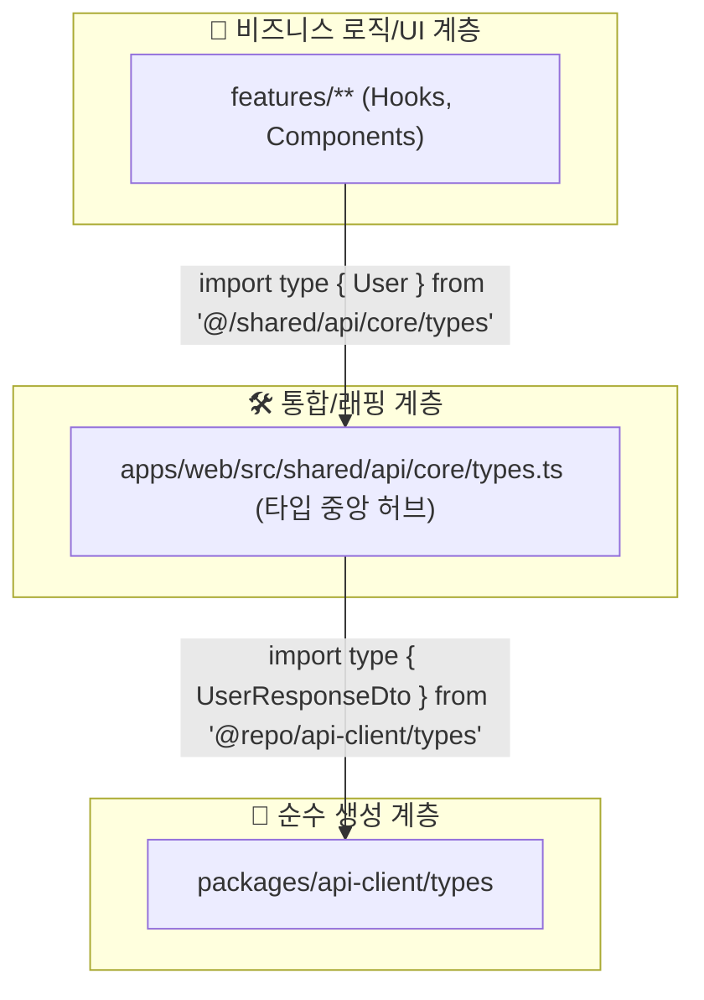

# API 클라이언트 타입 처리 전략

> **상태**: 제안 완료. "중앙 허브를 통한 타입 재-export" 전략 채택

---

## 1. 문제 정의: 자동 생성된 타입은 어떻게 다룰 것인가?

API 호출 함수는 인증/에러 처리 등 추가적인 동작(Behavior)을 입히기 위해 **래핑(Wrapping)**이 필요합니다. 하지만 타입(Type/Interface)은 순수한 데이터 구조(Structure)에 대한 정의일 뿐, 동작을 가지지 않습니다.

따라서 타입은 래핑할 필요 없이, **백엔드가 정의한 구조를 그대로 따르는 것이 가장 정확하고 안전합니다.**

이 문서는 자동 생성된 타입을 어떻게 하면 격리 원칙을 지키면서 가장 효율적으로 애플리케이션 전체에 공급할 수 있는지에 대한 전략을 정의합니다.

## 2. 핵심 전략: 중앙 허브(Central Hub)를 통한 재-export

우리는 **`apps/web/src/shared/api/core/types.ts`** 파일을 API 관련 타입의 **유일한 공급원(Single Source of Truth)**으로 만듭니다. 애플리케이션의 다른 모든 부분은 오직 이 파일을 통해서만 API 타입을 참조하게 됩니다.



이 구조에서 `types.ts` 파일은 **타입 어댑터(Type Adapter)** 또는 **타입 퍼사드(Type Façade)** 역할을 수행합니다.

## 3. 구현 전략

### 1단계: `shared/api/core/types.ts`에서 타입 통합

이 파일에서 자동 생성된 모든 DTO 타입을 `import` 한 후, 애플리케이션에서 사용할 이름으로 `export` 합니다.

```typescript
// apps/web/src/shared/api/core/types.ts

// --- 1. 기존의 공통 응답/에러 타입은 그대로 유지합니다. ---
export interface ApiResponse<T = any> { /* ... */ }
export interface PaginatedResponse<T> { /* ... */ }
// ...

// --- 2. 🤖 자동 생성된 타입을 여기서 모두 import 합니다. ---
import type { 
  UserResponseDto, 
  CreateUserRequestDto,
  UpdateUserRequestDto,
  // ... 필요한 다른 모든 DTO 타입들
} from '@repo/api-client/types';

// --- 3. 🎯 애플리케이션 전체에서 사용할 타입으로 재-export 합니다. ---

// 방법 A: 더 명확한 이름으로 별칭(alias)을 만들어 export
export type User = UserResponseDto;
export type CreateUserInput = CreateUserRequestDto;
export type UpdateUserInput = UpdateUserRequestDto;

// 방법 B: 이름이 이미 명확하다면 그대로 export
export { type UserResponseDto, type Role as UserRole } from '@repo/api-client/types';

// --- 4. 🔄 점진적 마이그레이션을 위해 기존 타입을 교체합니다. ---
/*
// 기존에 수동으로 만들었던 User 타입을 주석 처리하거나 삭제합니다.
export interface User extends BaseEntity { 
  email: string;
  name: string;
}
*/
```

### 2단계: 애플리케이션에서 중앙 허브를 통해 타입 사용

이제 `features` 계층의 모든 컴포넌트, 훅, 유틸리티 함수 등은 오직 `shared/api/core/types.ts` 파일로부터만 타입을 가져와야 합니다. **`@repo/api-client`에서 직접 타입을 가져오는 것은 금지됩니다.**

```typescript
// apps/web/src/features/users/components/UserProfile.tsx

// 👍 올바른 방법: 중앙 허브(@/shared/api/core/types)에서 타입을 가져옵니다.
import type { User } from '@/shared/api/core/types';

// 👎 잘못된 방법: 생성된 패키지에서 직접 타입을 가져오지 않습니다.
// import type { UserResponseDto } from '@repo/api-client/types'; // 금지!

interface UserProfileProps {
  user: User; // 타입 에러 없이 완벽하게 동작합니다.
}

export const UserProfile = ({ user }: UserProfileProps) => {
  return (
    <div>
      <h1>{user.name}</h1>
      <p>{user.email}</p>
    </div>
  );
};
```

## 4. 기대 효과

1.  **단일 진실 공급원 (Single Source of Truth)**
    - 백엔드 API의 데이터 구조가 변경되면, `pnpm gen:api` 한 번으로 `UserResponseDto`가 업데이트됩니다. 이 타입을 사용하는 `User`와 모든 컴포넌트에서 즉시 타입 에러가 발생하여, **런타임 버그를 컴파일 타임에 예방**할 수 있습니다.

2.  **완벽한 격리 및 디커플링**
    - `features` 계층은 `@repo/api-client`라는 패키지의 존재 자체를 알 필요가 없습니다. 나중에 OAS 생성기를 교체하거나 `api-client`의 내부 구조가 변경되어도, `shared/api/core/types.ts` 어댑터 파일만 수정하면 되므로 **애플리케이션 코드는 전혀 영향을 받지 않습니다.**

3.  **유연한 타입 확장**
    - 자동 생성된 `UserResponseDto`에 프론트엔드에서만 사용하는 추가적인 필드(e.g., `displayName`)가 필요할 경우, `types.ts`에서 쉽게 확장할 수 있습니다.
    ```typescript
    import type { UserResponseDto } from '@repo/api-client/types';

    export type User = UserResponseDto & {
      displayName: string; // 프론트엔드 전용 필드 추가
    };
    ```
