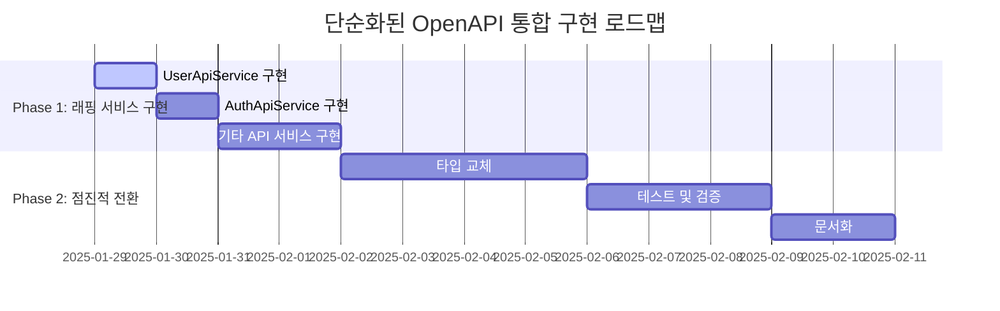

# 구현 로드맵 - 단순화된 2-3주 실행 계획 (업데이트: 2025-01-29)

> **상태**: 4-6주 계획에서 2-3주로 대폭 단축
> **근거**: 복잡한 인프라 구축 불필요, 직접 래핑 방식으로 단순화

## 🎯 전체 로드맵 개요

**총 기간**: 2-3주 (기존 4-6주에서 50% 단축)  
**접근법**: 점진적 마이그레이션 (Zero Downtime)  
**핵심 원칙**: 기존 시스템 100% 보존하면서 단순한 래핑



## 🚀 Phase 1: 래핑 서비스 구현 (4-5일)

### Day 1: UserApiService 구현

#### **1.1 기본 구조 설정**

```typescript
// apps/web/src/shared/api/services/user-api.service.ts
import { UserApiFp } from '@repo/api-client'
import type { 
  UserListResponseWrapper,
  GetUsersParams,
  UserResponseDto,
  CreateUserRequestDto,
  UpdateUserRequestDto,
  ChangePasswordRequestDto
} from '@repo/api-client/types'
import { BaseApiService } from '../core/base-api-service'
import { apiClient } from '../core/axios'

export class UserApiService extends BaseApiService {
  constructor() {
    super('/users')
  }

  // 기본 CRUD 메서드들
  async getAllUsers(params?: GetUsersParams) {
    try {
      const fn = UserApiFp.getAllUsers(params)
      const response = await fn(apiClient.instance)
      return this.transformToAppFormat(response.data)
    } catch (error) {
      throw this.handleError(error)
    }
  }

  async getUserById(id: string) {
    try {
      const fn = UserApiFp.getUserById({ id })
      const response = await fn(apiClient.instance)
      return this.transformToAppFormat(response.data)
    } catch (error) {
      throw this.handleError(error)
    }
  }

  async createUser(data: CreateUserRequestDto) {
    try {
      const fn = UserApiFp.createUser({ createUserRequestDto: data })
      const response = await fn(apiClient.instance)
      return this.transformToAppFormat(response.data)
    } catch (error) {
      throw this.handleError(error)
    }
  }

  async updateUser(id: string, data: UpdateUserRequestDto) {
    try {
      const fn = UserApiFp.updateUser({ id, updateUserRequestDto: data })
      const response = await fn(apiClient.instance)
      return this.transformToAppFormat(response.data)
    } catch (error) {
      throw this.handleError(error)
    }
  }

  async deleteUser(id: string, data: DeleteUserRequestDto) {
    try {
      const fn = UserApiFp.deleteUser({ id, deleteUserRequestDto: data })
      const response = await fn(apiClient.instance)
      return this.transformToAppFormat(response.data)
    } catch (error) {
      throw this.handleError(error)
    }
  }

  async changePassword(id: string, data: ChangePasswordRequestDto) {
    try {
      const fn = UserApiFp.changePassword({ id, changePasswordRequestDto: data })
      const response = await fn(apiClient.instance)
      return this.transformToAppFormat(response.data)
    } catch (error) {
      throw this.handleError(error)
    }
  }
}

export const userApiService = new UserApiService()
```

**체크리스트:**
- [ ] UserApiService 클래스 구현
- [ ] 모든 User API 엔드포인트 래핑
- [ ] 기존 BaseApiService 패턴 준수
- [ ] 에러 처리 및 응답 변환 로직 적용

### Day 2: AuthApiService 구현

#### **1.2 인증 API 특수 처리**

```typescript
// apps/web/src/shared/api/services/auth-api.service.ts
import { AuthApiFp } from '@repo/api-client'
import type { 
  LoginRequestDto,
  RefreshTokenRequestDto,
  SendVerificationCodeRequestDto,
  VerifyCodeRequestDto,
  ValidateTokenRequestDto,
  FindIdRequestDto,
  ResetPasswordRequestDto
} from '@repo/api-client/types'
import { BaseApiService } from '../core/base-api-service'
import { apiClient } from '../core/axios'
import axios from 'axios' // 인증 없는 요청용

export class AuthApiService extends BaseApiService {
  private unauthenticatedAxios: AxiosInstance

  constructor() {
    super('/auth')
    // 인증이 필요 없는 API용 별도 axios 인스턴스
    this.unauthenticatedAxios = axios.create({
      baseURL: process.env.NEXT_PUBLIC_API_URL,
      timeout: 10000,
    })
  }

  // 로그인 (토큰 없이 호출)
  async login(data: LoginRequestDto) {
    try {
      const fn = AuthApiFp.login({ loginRequestDto: data })
      const response = await fn(this.unauthenticatedAxios)
      return this.transformToAppFormat(response.data)
    } catch (error) {
      throw this.handleError(error)
    }
  }

  // 로그아웃 (인증 필요)
  async logout() {
    try {
      const fn = AuthApiFp.logout()
      const response = await fn(apiClient.instance)
      return this.transformToAppFormat(response.data)
    } catch (error) {
      throw this.handleError(error)
    }
  }

  // 토큰 갱신 (특별 처리)
  async refreshToken(data: RefreshTokenRequestDto) {
    try {
      const fn = AuthApiFp.refreshToken({ refreshTokenRequestDto: data })
      const response = await fn(this.unauthenticatedAxios)
      return this.transformToAppFormat(response.data)
    } catch (error) {
      throw this.handleError(error)
    }
  }

  // 기타 인증 관련 메서드들...
}

export const authApiService = new AuthApiService()
```

**체크리스트:**
- [ ] AuthApiService 클래스 구현
- [ ] 인증 유무에 따른 axios 인스턴스 분리
- [ ] 로그인/로그아웃/토큰 갱신 등 핵심 메서드 구현
- [ ] 소셜 로그인 API 래핑

### Day 3-4: 기타 핵심 API 서비스

#### **1.3 MailApiService 구현**

```typescript
// apps/web/src/shared/api/services/mail-api.service.ts
import { MailApiFp, MailAuditApiFp } from '@repo/api-client'
import type { 
  MailRequestDto,
  GetMailAuditRequestDto 
} from '@repo/api-client/types'
import { BaseApiService } from '../core/base-api-service'
import { apiClient } from '../core/axios'

export class MailApiService extends BaseApiService {
  constructor() {
    super('/mail')
  }

  async sendMail(data: MailRequestDto) {
    try {
      const fn = MailApiFp.sendMail({ mailRequestDto: data })
      const response = await fn(apiClient.instance)
      return this.transformToAppFormat(response.data)
    } catch (error) {
      throw this.handleError(error)
    }
  }

  async getMailAudit(params: GetMailAuditRequestDto) {
    try {
      const fn = MailAuditApiFp.getMailAudit(params)
      const response = await fn(apiClient.instance)
      return this.transformToAppFormat(response.data)
    } catch (error) {
      throw this.handleError(error)
    }
  }
}

export const mailApiService = new MailApiService()
```

#### **1.4 BaekjoonApiService 구현**

```typescript
// apps/web/src/shared/api/services/baekjoon-api.service.ts
import { BaekjoonApiFp } from '@repo/api-client'
import type { 
  StartVerificationRequestDto,
  CompleteVerificationRequestDto,
  GetProfileRequestDto,
  GetTagStatisticsRequestDto
} from '@repo/api-client/types'
import { BaseApiService } from '../core/base-api-service'
import { apiClient } from '../core/axios'

export class BaekjoonApiService extends BaseApiService {
  constructor() {
    super('/baekjoon')
  }

  async startVerification(data: StartVerificationRequestDto) {
    try {
      const fn = BaekjoonApiFp.startVerification({ startVerificationRequestDto: data })
      const response = await fn(apiClient.instance)
      return this.transformToAppFormat(response.data)
    } catch (error) {
      throw this.handleError(error)
    }
  }

  async completeVerification(data: CompleteVerificationRequestDto) {
    try {
      const fn = BaekjoonApiFp.completeVerification({ completeVerificationRequestDto: data })
      const response = await fn(apiClient.instance)
      return this.transformToAppFormat(response.data)
    } catch (error) {
      throw this.handleError(error)
    }
  }

  // 기타 Baekjoon 관련 메서드들...
}

export const baekjoonApiService = new BaekjoonApiService()
```

**체크리스트:**
- [ ] MailApiService 구현 및 테스트
- [ ] BaekjoonApiService 구현 및 테스트
- [ ] 각 서비스별 단위 테스트 작성
- [ ] 모든 API 엔드포인트 정상 작동 확인

## 🔄 Phase 2: 점진적 전환 (7-9일)

### Day 5-8: 타입 점진적 교체

#### **2.1 Import 문 업데이트 우선순위**

**1순위: User 관련 코드**
```typescript
// Before
import type { User, GetUsersParams } from '@/shared/api/types'

// After
import type { UserResponseDto, GetUsersParams } from '@repo/api-client/types'
```

**2순위: Auth 관련 코드**
```typescript
// Before
import type { LoginData, TokenResponse } from '@/shared/auth/types'

// After
import type { LoginRequestDto, TokenResponseDto } from '@repo/api-client/types'
```

**3순위: 기타 API 타입들**

#### **2.2 Features 레벨 코드 업데이트**

**User Features 업데이트:**
```typescript
// apps/web/src/features/user/apis/queries.ts
import { userApiService } from '@/shared/api/services/user-api.service'
import type { GetUsersParams, UserResponseDto } from '@repo/api-client/types'

// 기존 쿼리 정의는 그대로, 타입만 변경
export const userQueries = {
  list: (params: GetUsersParams) => ({
    queryKey: userKeys.list(params).queryKey,
    queryFn: () => userApiService.getAllUsers(params),
  }),
  // ...
}
```

**체크리스트:**
- [ ] User 관련 타입 교체 완료
- [ ] Auth 관련 타입 교체 완료  
- [ ] Mail 관련 타입 교체 완료
- [ ] Baekjoon 관련 타입 교체 완료
- [ ] 컴파일 에러 없음 확인

### Day 9-11: 테스트 및 검증

#### **2.3 기능 테스트**

```typescript
// tests/api-integration.test.ts
describe('API Integration Tests', () => {
  describe('UserApiService', () => {
    it('should fetch users successfully', async () => {
      const users = await userApiService.getAllUsers()
      expect(users).toBeDefined()
      expect(Array.isArray(users.data)).toBe(true)
    })

    it('should create user successfully', async () => {
      const userData = {
        email: 'test@example.com',
        name: 'Test User',
        password: 'password123'
      }
      const result = await userApiService.createUser(userData)
      expect(result.data).toHaveProperty('id')
    })
  })

  describe('AuthApiService', () => {
    it('should login successfully', async () => {
      const loginData = {
        email: 'test@example.com',
        password: 'password123'
      }
      const result = await authApiService.login(loginData)
      expect(result.data).toHaveProperty('accessToken')
    })
  })
})
```

#### **2.4 타입 안전성 검증**

```bash
# TypeScript 컴파일 체크
pnpm type-check

# ESLint 체크  
pnpm lint

# 단위 테스트 실행
pnpm test

# E2E 테스트 실행
pnpm test:e2e
```

#### **2.5 성능 영향 측정**

```typescript
// utils/performance-test.ts
export async function measureApiPerformance() {
  const startTime = performance.now()
  
  // 기존 방식
  const oldResult = await oldUserService.getUsers()
  const oldTime = performance.now() - startTime
  
  const newStartTime = performance.now()
  
  // 새로운 방식
  const newResult = await userApiService.getAllUsers()
  const newTime = performance.now() - newStartTime
  
  console.log(`Old API: ${oldTime}ms, New API: ${newTime}ms`)
  console.log(`Performance difference: ${((newTime - oldTime) / oldTime * 100).toFixed(2)}%`)
}
```

**체크리스트:**
- [ ] 모든 API 엔드포인트 기능 테스트 통과
- [ ] 타입 안전성 100% 확인
- [ ] 성능 저하 없음 확인 (기준: 5% 이내)
- [ ] 기존 기능 모두 정상 작동
- [ ] 에러 처리 정상 작동 확인

### Day 12-13: 문서화

#### **2.6 개발자 가이드 작성**

```markdown
# API 서비스 사용 가이드

## 새로운 API 추가 방법

1. OAS에서 API 스펙 정의
2. `pnpm gen:api`로 클라이언트 코드 생성
3. 해당 서비스 클래스에 메서드 추가:

```typescript
async newMethod(params: NewMethodParams) {
  try {
    const fn = GeneratedApiFp.newMethod(params)
    const response = await fn(apiClient.instance)
    return this.transformToAppFormat(response.data)
  } catch (error) {
    throw this.handleError(error)
  }
}
```

4. Features 레벨에서 기존과 동일하게 사용
```

#### **2.7 마이그레이션 가이드**

```markdown
# 기존 코드에서 새 API로 마이그레이션

## 타입 import 변경
- Before: `import type { User } from '@/shared/api/types'`
- After: `import type { UserResponseDto } from '@repo/api-client/types'`

## 서비스 import 변경  
- Before: `import { userService } from '@/shared/api/services/user.service'`
- After: `import { userApiService } from '@/shared/api/services/user-api.service'`

## 메서드 호출은 동일
- `userApiService.getAllUsers(params)` (변경 없음)
```

**체크리스트:**
- [ ] 개발자 가이드 문서 작성
- [ ] 마이그레이션 가이드 작성
- [ ] API 참조 문서 업데이트
- [ ] README 파일 업데이트
- [ ] 팀 공유 세션 준비

## 📋 각 Phase별 성공 기준

### Phase 1 성공 기준
- ✅ 모든 핵심 API 서비스 구현 완료
- ✅ BaseApiService 패턴 준수
- ✅ 인증 시스템 정상 연동
- ✅ 기본 CRUD 동작 확인

### Phase 2 성공 기준
- ✅ 모든 타입 교체 완료 (컴파일 에러 없음)
- ✅ 기존 기능 100% 정상 작동
- ✅ 성능 저하 없음 (5% 이내)
- ✅ 문서화 완료도 95% 이상

## ⚠️ 리스크 관리 (단순화로 대폭 감소)

### 주요 리스크 요소 (기존 대비 크게 줄어듦)

#### **1. 타입 불일치 (낮은 리스크)**
- **리스크**: 생성된 타입과 기존 타입 간 약간의 차이
- **대응책**: 점진적 교체, 컴파일러 체크
- **완화**: 메서드 시그니처는 유지하여 영향 최소화

#### **2. 응답 형식 차이 (낮은 리스크)**
- **리스크**: OAS 응답과 기존 응답 형식 차이
- **대응책**: transformToAppFormat 메서드에서 변환
- **완화**: BaseApiService 패턴 유지로 처리 로직 통일

### 롤백 전략 (매우 간단)

```typescript
// 문제 발생 시 즉시 롤백 가능
// 1. Import 문을 기존으로 되돌림
// 2. 서비스 인스턴스만 교체
// 3. 기존 코드 그대로 복원

// 예시: User 서비스 롤백
// import { userService } from '@/shared/api/services/user.service' // 기존 서비스로 복원
// queryFn: () => userService.getUsers(params) // 메서드 호출은 동일
```

## 📊 프로젝트 추적

### 주간 리포트 템플릿 (단순화)

```markdown
## Week 1 진행 상황 (Phase 1)

### 완료된 작업
- [x] UserApiService 구현 (Day 1)
- [x] AuthApiService 구현 (Day 2)
- [x] MailApiService 구현 (Day 3)
- [ ] BaekjoonApiService 구현 (Day 4)

### 다음 주 계획 (Phase 2)
- [ ] 타입 점진적 교체 시작
- [ ] User 관련 코드 먼저 전환

### 메트릭
- 구현 완료율: 75%
- 컴파일 에러: 0개
- 테스트 통과율: 100%
```

## 🎯 최종 목표

**2-3주 후 달성 상태:**
- ✅ 모든 API가 OAS 자동 생성 코드 사용
- ✅ 타입 안전성 100% 보장
- ✅ 기존 개발 패턴 완전 보존
- ✅ 성능 저하 없음
- ✅ 개발팀 학습 비용 제로
- ✅ 향후 API 추가 시 자동화된 워크플로우

이 단순화된 로드맵을 통해 **복잡한 아키텍처 설계 없이도** **기존 시스템의 모든 장점을 유지**하면서 **OAS 자동 생성의 이점**을 빠르고 안전하게 도입할 수 있습니다.

## 🔗 관련 문서
- [통합_솔루션_전략.md](./통합_솔루션_전략.md) - 단순화된 래핑 방식 상세 설명
- [4가지_핵심문제_분석.md](./4가지_핵심문제_분석.md) - 해소된 문제점들 분석